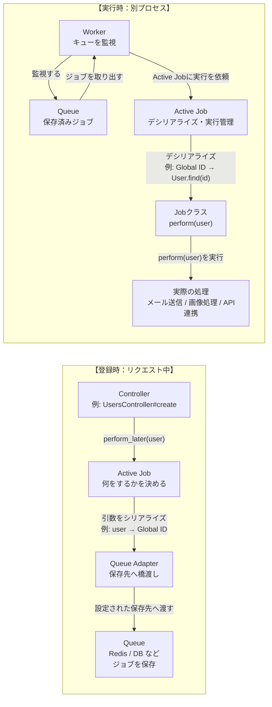

# Active Job基礎マップ

> **このMOCで分かること**: Active Jobのジョブ登録・実行・引数の受け渡しの仕組みを整理できる

---

## サマリー

| # | 項目 | 概要 | ノート |
|---|------|------|--------|
| 1 | enqueue | ジョブをキューに登録して後で実行する操作 | [[note-insight-active-job-enqueue]] |
| 2 | perform_later | ジョブをenqueueするメソッド | [[note-insight-active-job-perform-later]] |
| 3 | perform_now | ジョブを即時実行するメソッド | [[note-insight-active-job-perform-now]] |
| 4 | シリアライズ | ジョブ引数をキューに保存できる形式に変換する | [[note-insight-active-job-serialize]] |
| 5 | デシリアライズ | キューからジョブを取り出すときに引数を復元する | [[note-insight-active-job-deserialize]] |
| 6 | Global ID | Active RecordオブジェクトをJobに渡すための仕組み | [[note-insight-active-job-global-id]] |

---

## セクション1: ジョブの登録と実行

[[note-insight-active-job-enqueue]]
[[note-insight-active-job-perform-later]]
[[note-insight-active-job-perform-now]]

**ポイント**:
- `perform_later` はジョブをキューに積む（非同期）
- `perform_now` はその場で実行する（同期）
- enqueue は「予約」、perform は「実行」と覚える

---

## セクション2: 引数の保存と復元

[[note-insight-active-job-serialize]]
[[note-insight-active-job-deserialize]]
[[note-insight-active-job-global-id]]

**ポイント**:
- Active Recordオブジェクトはそのままキューに保存できない
- Global IDを使ってオブジェクトをIDに変換して保存する
- 実行時にIDからオブジェクトを復元（デシリアライズ）する

---

## 未決事項（Open Questions）

| 項目 | 期限 | 担当 | ノート |
|------|------|------|--------|
| perform_later と perform_now の使い分け基準は？ | - | - | [[note-insight-active-job-perform-later]] |
| Global IDでオブジェクトが削除されていた場合の挙動は？ | - | - | [[note-insight-active-job-global-id]] |

---

## 関連リンク

- [[note-insight-active-job-enqueue]]
- [[note-insight-active-job-perform-later]]
- [[note-insight-active-job-perform-now]]
- [[note-insight-active-job-serialize]]
- [[note-insight-active-job-deserialize]]
- [[note-insight-active-job-global-id]]
- [[map-rails-active-job-email-flow]] — 非同期メール送信の全フロー（シーケンス図）
- [[map-rails-basics]]
