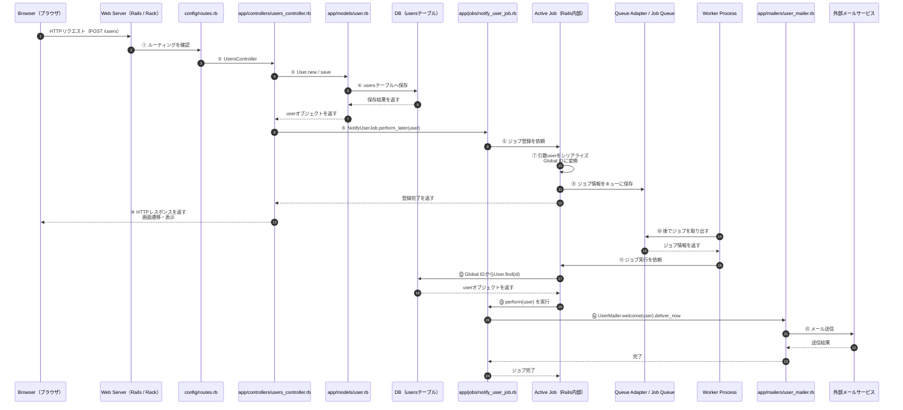

# Rails Active Job メール送信フローマップ

> **このMOCで分かること**: ユーザー登録後に Active Job で非同期メール送信する一連の流れを、シーケンス図と段階別の解説で整理できる

---

## シーケンス図



---

## フロー概要

| 番号  | 一言でいうと                                                      | 関連ノート                                                                         |
| --- | ----------------------------------------------------------- | ----------------------------------------------------------------------------- |
| ①〜② | ブラウザから来たリクエストを、Rails がコントローラへ振り分ける                          | -                                                                             |
| ③〜④ | コントローラが `User` を作り、DB の `users` テーブルに保存する                   | -                                                                             |
| ⑤〜⑥ | `perform_later` で Active Job にジョブ登録を依頼する                    | [[note-insight-active-job-perform-later]] [[note-insight-active-job-enqueue]] |
| ⑦〜⑧ | Active Job が引数を Global ID に変換し、キューに保存する                     | [[note-insight-active-job-serialize]] [[note-insight-active-job-global-id]]   |
| ⑨   | メール送信を待たずに、ブラウザへレスポンスを返す                                    | [[note-insight-active-job-perform-later]]                                     |
| ⑩〜⑪ | Worker がキューからジョブを取り出す                                       | -                                                                             |
| ⑫〜⑬ | Active Job が Global ID から `User` を復元し、`perform(user)` を実行する | [[note-insight-active-job-deserialize]] [[note-insight-active-job-global-id]] |
| ⑭〜⑮ | ジョブ内で Mailer を呼び、外部メールサービスへメール送信する                          | -                                                                             |

---

## ①〜② ルーティング

**Browser → Web Server → routes.rb → UsersController**

HTTPリクエストを受け取り、どのコントローラを動かすか決める段階。

```ruby
# config/routes.rb
Rails.application.routes.draw do
  resources :users, only: [:new, :create]
end
```

- `POST /users` が来たとき、`UsersController#create` に処理を渡す
- この段階ではユーザー登録もジョブ登録も行われない

---

## ③〜④ モデル保存

**UsersController → Userモデル → DB**

コントローラがフォームの入力値を受け取り、DB の `users` テーブルへ保存する段階。

```ruby
# app/controllers/users_controller.rb
class UsersController < ApplicationController
  def create
    @user = User.new(user_params)

    if @user.save
      NotifyUserJob.perform_later(@user)
      redirect_to root_path, notice: "ユーザー登録が完了しました"
    else
      render :new, status: :unprocessable_entity
    end
  end

  private

  def user_params
    params.require(:user).permit(:name, :email)
  end
end
```

- `@user.save` で DB に保存。SQL 発行は Rails 内部で行われる
- **DB 保存が成功してからジョブを登録している**点が重要
- `NotifyUserJob.perform_later(@user)` — `@user` を引数にジョブをキューへ登録する。この時点ではメール送信は行われず、Worker が後で実行する（[[note-insight-active-job-perform-later]]）
- `@user` はそのまま保存されるのではなく、Active Job が Global ID に変換してキューに保存する（[[note-insight-active-job-serialize]]）

### NotifyUserJob とは

開発者が自分で書くジョブクラス。`ApplicationJob` を継承することで Active Job の機能を使える。

```ruby
# app/jobs/notify_user_job.rb
class NotifyUserJob < ApplicationJob
  queue_as :default

  def perform(user)
    UserMailer.welcome(user).deliver_now
  end
end
```

- `ApplicationJob` を継承することで Active Job の機能を使えるようになる
- `queue_as :default` — どのキューに積むかを指定する
- `perform(user)` — Worker が実行するときに呼ばれるメソッド。ここにやりたい処理を書く
- この例では「ユーザーにウェルカムメールを送る」という処理が定義されている

---

## ⑤〜⑥ ジョブ登録

**UsersController → NotifyUserJob → Active Job**

`perform_later` によって「今すぐ実行」ではなく「後で実行」として登録する段階。

[[note-insight-active-job-perform-later]]
[[note-insight-active-job-enqueue]]

```ruby
# app/jobs/notify_user_job.rb
class NotifyUserJob < ApplicationJob
  queue_as :default

  def perform(user)
    UserMailer.welcome(user).deliver_now
  end
end
```

- `perform_later` はジョブをキューに積む非同期の呼び出し
- `perform(user)` の中身はこの時点ではまだ実行されない

**`perform(user)` の引数が `@user` でなくてよい理由**

- `user` — メソッドの引数（ローカル変数）。そのメソッド内だけで使える
- `@user` — インスタンス変数。コントローラでビューへ値を渡すために使う

`perform` はビューを持たないため `@user` にする理由がない。`user` として受け取るだけで十分。

---

## ⑦〜⑧ シリアライズ・キュー保存

**Active Job → Queue Adapter / Job Queue**

`@user` を Global ID に変換し、ジョブ情報をキューに保存する段階。

[[note-insight-active-job-serialize]]
[[note-insight-active-job-global-id]]

```ruby
# config/application.rb または config/environments/production.rb
config.active_job.queue_adapter = :solid_queue
```

内部的に保存されるジョブ情報のイメージ:

```ruby
{
  job_class: "NotifyUserJob",
  queue_name: "default",
  arguments: [
    { "_aj_globalid" => "gid://app/User/1" }
  ]
}
```

- `@user` オブジェクトそのものではなく、Global ID として保存される
- この段階はフレームワーク内部で起きる処理

**キューアダプタと実際の保存場所の関係**

Queue Adapter は橋渡し役でデータは持たない。実際のジョブ情報は Queue Backend に書き込まれる。

```
Active Job
  → Queue Adapter（橋渡し・接続設定）
    → 実際の保存場所（Queue Backend）
```

| Queue Adapter の設定 | 実際の保存場所 |
|---|---|
| `:solid_queue` | アプリの DB（solid_queue_jobs テーブルなど） |
| `:sidekiq` | Redis（別サーバー） |
| `:async` | メモリ内 |

「キューに保存する」= Queue Adapter を経由して Redis や DB にジョブ情報が書き込まれること。

---

**なぜ Global ID に変換する必要があるか**

理由は2つある。

1. **キューはRubyオブジェクトを直接保存できない** — キュー（Redis やDBなど）に保存できるのは文字列・数値・JSONなどの単純なデータだけ。`@user` はメモリ上のRubyオブジェクトなのでそのまま保存できない
2. **オブジェクト全体を保存すると古くなる** — enqueue から実行までの間にDBのレコードが更新されると、コピーした情報が古いままになる

Global ID（`gid://app/User/1`）は「User の id=1 を参照せよ」という指示だけを保存する。実行時に `User.find(1)` でDBから取り直すため、常に最新の状態を使える。

```
@user（Rubyオブジェクト）→ そのまま保存できない
         ↓
gid://app/User/1（文字列）→ キューに保存できる
         ↓
Worker 実行時に User.find(1) → 最新のレコードを取得
```

---

## ⑨ レスポンス返却

**UsersController → Browser**

ジョブ登録が終わったら、メール送信完了を待たずにブラウザへ返す段階。

```ruby
if @user.save
  NotifyUserJob.perform_later(@user)
  redirect_to root_path, notice: "ユーザー登録が完了しました"
end
```

- `perform_later` はキューへの登録だけなので、即座に `redirect_to` が実行される
- `deliver_now` との大きな違いがここに現れる

---

## ⑩〜⑪ Worker によるジョブ取り出し

**Worker Process → Queue Adapter / Job Queue → Active Job**

Worker がキューを監視し、実行待ちのジョブを取り出す段階。

```bash
# Sidekiq の場合
bundle exec sidekiq
```

- Web サーバーとは別プロセスで Worker が動く
- どのコマンドで起動するかはアダプタ（Sidekiq / Solid Queue 等）によって異なる

**Worker が取り出す「ジョブ」とは**

Global ID だけではなく、以下の情報をまとめたパッケージ全体のこと。

```ruby
{
  job_class: "NotifyUserJob",      # どのジョブクラスを実行するか
  queue_name: "default",           # どのキューか
  arguments: [
    { "_aj_globalid" => "gid://app/User/1" }  # perform に渡す引数（Global ID はここ）
  ]
}
```

- Global ID は「`@user` を復元するための手がかり」として arguments の中に含まれている
- Worker はジョブ全体を取り出し、その中の Global ID を使って `User.find(id)` し直す

**Worker Process・Queue Adapter・Active Job の関係**

| 名前 | 役割 |
|---|---|
| **Active Job** | Railsが用意したフレームワーク層。ジョブのシリアライズ・デシリアライズ・実行を担う |
| **Queue Adapter** | Active Job とキューの保存場所をつなぐ橋渡し役。`config.active_job.queue_adapter` で指定する |
| **Worker Process** | Webサーバーとは別に動くプロセス。キューを監視してジョブを取り出し実行する |

```
【登録時】
Active Job
  → Queue Adapter（橋渡し）
    → Queue（保存場所 / Redis や DB）

【実行時】
Worker Process がキューを監視
  → Queue からジョブを取り出す
    → Active Job にデシリアライズ・実行を依頼
      → perform(user) が動く
```

- **Active Job** — 何をするかを決める（Rails側）
- **Queue Adapter** — どこに保存するかをつなぐ（設定）
- **Worker** — いつ実行するかを決める（別プロセス）

---

## ⑫〜⑬ デシリアライズ・perform 実行

**Active Job → DB → NotifyUserJob#perform**

Global ID から `User` を復元し、`perform(user)` を実行する段階。

[[note-insight-active-job-deserialize]]
[[note-insight-active-job-global-id]]

```ruby
# app/jobs/notify_user_job.rb
class NotifyUserJob < ApplicationJob
  queue_as :default

  def perform(user)
    UserMailer.welcome(user).deliver_now
  end
end
```

- `perform(user)` に渡ってくる `user` は Active Job がデシリアライズした後のオブジェクト
- ジョブ実行時に `User.find(id)` し直している
- enqueue から実行までの間に対象レコードが削除されると `ActiveJob::DeserializationError` が発生する

```text
Global ID → User.find(id) → 見つからない → ActiveJob::DeserializationError
```

---

## ⑭〜⑮ Mailer・メール送信

**NotifyUserJob → UserMailer → 外部メールサービス**

ジョブの中でメール送信処理を呼ぶ段階。

```ruby
# app/mailers/user_mailer.rb
class UserMailer < ApplicationMailer
  def welcome(user)
    @user = user
    mail(to: @user.email, subject: "登録ありがとうございます")
  end
end
```

```erb
<%# app/views/user_mailer/welcome.html.erb %>
<p><%= @user.name %>さん、登録ありがとうございます。</p>
```

- Worker の中で実行されるため、`deliver_now` でもブラウザの表示は待たされない
- 送信先は SMTP / SendGrid / Amazon SES など（設定による）

---

## 関連リンク

- [[note-insight-active-job-perform-later]]
- [[note-insight-active-job-enqueue]]
- [[note-insight-active-job-serialize]]
- [[note-insight-active-job-global-id]]
- [[note-insight-active-job-deserialize]]
- [[note-insight-active-job-perform-now]]
- [[map-active-job-basics]]
- [[map-rails-basics]]
