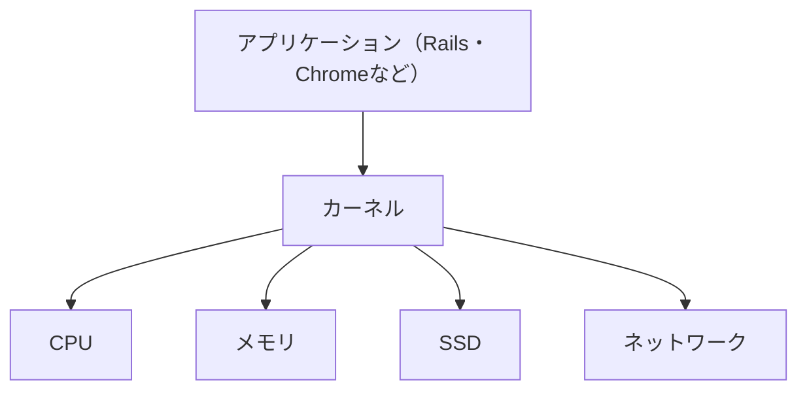

## Tags
#kernel #linux #os #infrastructure

## 背景

コンピュータには、CPU・メモリ・ストレージ・キーボード・ネットワークなど、さまざまな部品があります。

しかし、もしアプリケーション（例：ChromeやRailsアプリ）がこれらの部品を直接操作できてしまうと、次のような問題が起こります。

* 他のアプリが使っているメモリを勝手に書き換えてしまう
* 同時にCPUを独占してしまう
* ディスク上の重要なファイルを壊してしまう
* ハードウェアごとに操作方法が違い、アプリの開発が非常に難しくなる

この問題を解決するために生まれたのが**カーネル（Kernel）**です。

カーネルは、**OS（Operating System）の中心部分**として、ハードウェアを安全かつ効率よく管理し、アプリケーションが必要な機能を利用できるように仲介する役割を担っています。

つまり、**Linux全体がOSであり、その中心で実際にハードウェアを管理しているのがカーネル**です。

## 結論

**カーネルとは、OSの中心となり、CPU・メモリ・ディスクなどのハードウェアを管理するプログラムです。**

## 理由

カーネルの主な仕事は次の4つです。

### ① CPUの管理

CPUは一度に限られた数の処理しかできません。カーネルはChrome・VS Code・Railsサーバーなど複数のプログラムが公平にCPUを使えるように切り替えています。

### ② メモリの管理

各アプリに安全なメモリ領域を割り当てます。カーネルがなければアプリ同士がメモリを書き換えてクラッシュする事故が起こります。

### ③ ファイル管理

ファイルの保存・読み込み・削除のとき、実際にディスクへアクセスしているのはカーネルです。アプリは「このファイルを読みたい」とお願いしているだけです。

### ④ ハードウェア管理

キーボード・マウス・SSD・ネットワークなどを制御しています。アプリは「キーボードから文字を取得したい」とお願いするだけで済みます。



## 具体例

### ① 日常生活で例えると

カーネルは**ホテルの支配人**です。

```text
宿泊客（アプリ）
    ↓
ホテル支配人（カーネル）
    ↓
部屋・設備（CPU・メモリ）
```

支配人が部屋を割り当て・トラブルを防ぎ・設備を管理することでホテルが安全に運営されます。カーネルも同じ役割です。

### ② Dockerでの利用例

Dockerコンテナは、ホストOSのLinuxカーネルを共有して動作します。

```text
Mac → Docker Desktop → Linuxカーネル → コンテナA / コンテナB / コンテナC
```

仮想マシンはOSごと持ちますが、DockerはLinuxカーネルを共有するため軽量です。

### ③ 学習中に確認できる例

```bash
uname -r   # 現在動いているカーネルのバージョンを表示
```

例えば `6.8.0-60-generic` のように表示されます。

## まとめ

**つまりカーネルとは、OSの中心としてハードウェアを管理し、アプリケーションが安全にコンピュータを利用できるようにする仕組みです。**

## 関連用語

| 用語 | 説明 |
|---|---|
| Linux | カーネルを中心としたOS全体 |
| OS | コンピュータ全体を管理する基本ソフト |
| シェル | ユーザーの命令をカーネルへ伝えるプログラム |
| ターミナル | コマンドを入力する画面 |
| システムコール | アプリがカーネルへ仕事を依頼する仕組み |
| ドライバ | カーネルがハードウェアを操作するためのプログラム |
| Docker | Linuxカーネルを共有してコンテナを動かす技術 |

## よくある勘違い

### Linux＝カーネルではない
Linux全体はOSであり、カーネルはその中心部分です。シェル・コマンド・ライブラリなども含めてLinuxと呼びます。

### カーネルは普段操作するものではない
`ls`・`cd`・`pwd` などはシェルを通じて実行されます。ユーザーが直接カーネルを操作することはほとんどありません。

### カーネルはアプリではない
ChromeやVS Codeのようなアプリではなく、コンピュータを動かすための土台です。

## 次の学習

1. シェルとは何か
2. ターミナルとは何か
3. システムコールとは何か
4. プロセスとは何か
5. メモリ管理（仮想メモリ）とは何か
6. デバイスドライバとは何か
7. ファイルシステムとは何か
8. Linuxの基本コマンド
9. DockerがLinuxカーネルを共有できる理由
10. ユーザーモードとカーネルモードの違い

## Links
- [[note-insight-linux]]
- [[note-insight-os]]

## 言語化

結論：カーネルとは、OSの中心部分であり、アプリケーションとハードウェアの仲介役として、CPU・メモリ・ディスクなどを管理する仕組みです

理由：アプリケーションがハードウェアを直接操作すると、メモリの破壊やCPUの取り合いなどの問題が発生します。そのため、カーネルが間に入り、CPUの割り当て・メモリの管理・ファイルの読み書き・ネットワーク通信・機器の制御を行い、アプリケーションが安全にコンピュータを利用できるようにしています

具体例：Railsアプリでファイルを保存するとき、Railsが直接SSDへ書き込んでいるわけではありません。Railsは「このファイルを保存してください」とカーネルに依頼し、実際にSSDへ安全に書き込む処理はカーネルが行います

結論（まとめ）：つまり、カーネルとは、OSの中心としてアプリケーションとハードウェアの仲介役を担い、コンピュータを安全に動かすための仕組みです
