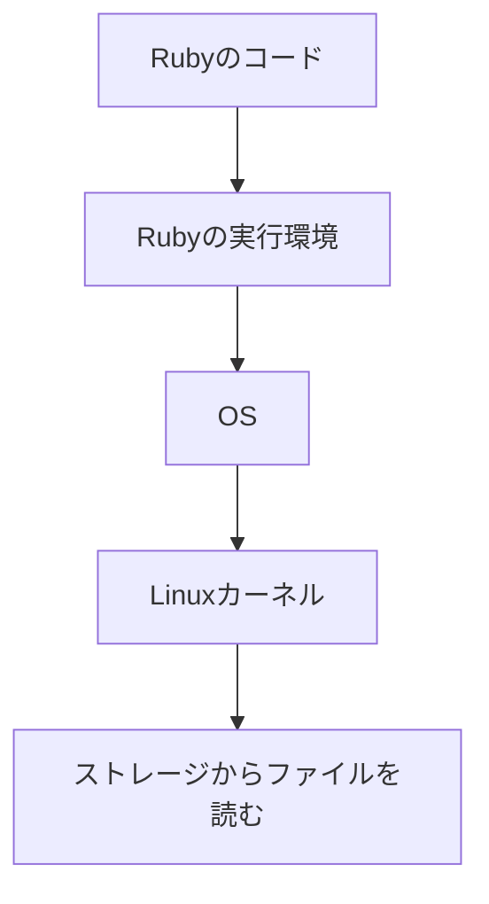
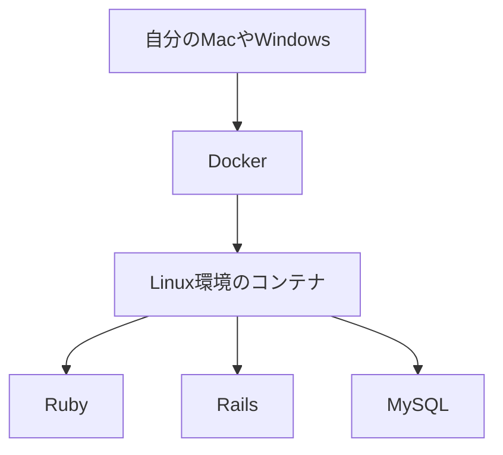

## Tags
#linux #os #infrastructure

## 背景

コンピュータを使うには、アプリだけではなく、コンピュータ本体を管理する仕組みが必要です。

たとえば、パソコンやサーバーの中では、次のようなものが動いています。

* CPU
* メモリ
* ストレージ
* ファイル
* ネットワーク
* キーボードや画面などの機器

これらを、毎回人間やアプリが直接細かく操作するのは大変です。

そこで必要になるのが **OS** です。OSとは、コンピュータ全体を管理する基本ソフトです。

Linuxは、このOSの中心部分である **カーネル** として生まれました。カーネルとは、OSの中でも特に重要な中核部分です。CPU、メモリ、ファイル、ネットワークなどを管理します。

Linuxは、Linus Torvaldsによって作られたUnix系OSのクローンです。厳密にはLinuxはカーネルを指しますが、一般的にはLinuxカーネルと周辺ソフトを組み合わせたOS全体を「Linux」と呼ぶことが多いです。

## 結論

> Linuxとは、コンピュータを動かすためのOSの土台であり、特にサーバーや開発環境でよく使われる仕組みです。

## 理由

Linuxが重要なのは、アプリや開発環境を動かすための土台になるからです。

アプリは、CPUやメモリを直接自由に使っているわけではありません。

たとえば、Rubyでファイルを読むとします。

```ruby
text = File.read("memo.txt")
```

この1行を書くと、Rubyがファイルを読んでくれます。しかし、実際には裏側でOSが働いています。



つまり、RubyやRailsのコードを書いているときも、裏側ではOSの機能を使っています。

### 日常生活にたとえると

Linuxは、建物の**管理人さん**のような存在です。アプリは建物の住人です。

住人が「部屋を使いたい」「荷物を置きたい」「外と連絡したい」「電気を使いたい」と思ったとき、管理人さんがルールに従って調整します。Linuxも同じように、アプリが安全にコンピュータの機能を使えるように管理しています。

## 具体例

### 例1：日常生活の例

Linuxは、学校やマンションの**管理人さん**に近いです。アプリケーションが「ファイルを読みたい」「ネットワーク通信したい」「メモリを使いたい」と思ったとき、Linuxが間に入って管理します。

もし管理人さんがいなければ、住人同士が勝手に部屋を使ったり、荷物を置いたりして混乱します。コンピュータでも同じで、アプリが好き勝手にCPUやメモリを使うと他のアプリに悪影響が出ます。

### 例2：開発・学習で使う場面

Dockerでは、コンテナという小さな実行環境を使います。Rails学習では、Dockerコンテナの中にLinux環境があり、その中でRuby・Rails・MySQLなどが動いていることがあります。



### 例3：コマンドで確認できる例

```bash
pwd
```
今いる場所を表示します。

```bash
ls
```
今いる場所にあるファイルやフォルダを一覧表示します。

```bash
cd app
```
`app` というフォルダに移動します。

## まとめ

> つまりLinuxとは、アプリや開発環境を動かすために、コンピュータの資源を管理する土台です。

## 関連用語

| 用語 | 説明 |
|---|---|
| OS | コンピュータ全体を管理する基本ソフト |
| カーネル | OSの中心部分で、CPUやメモリなどを管理する部分 |
| Unix | Linuxが参考にしたOSの系統 |
| GNU | Linuxと組み合わせて使われる多くの基本ソフトウェア群 |
| GNU/Linux | LinuxカーネルとGNUなどのソフトを組み合わせたOS環境 |
| ディストリビューション | Linuxカーネルと周辺ソフトをまとめたOSパッケージ |
| Ubuntu | 初心者や開発環境でもよく使われるLinuxディストリビューション |
| Debian | 安定性を重視したLinuxディストリビューションの一つ |
| ターミナル | コマンドを入力して操作する画面 |
| シェル | 入力されたコマンドをOSに伝える仕組み |
| コマンド | コンピュータに指示を出すための短い命令 |
| ファイルシステム | ファイルやフォルダを管理する仕組み |
| 権限 | 誰がファイルを読めるか、書けるか、実行できるかを決める仕組み |
| プロセス | 実行中のプログラム |
| Docker | アプリを動かす環境をコンテナとしてまとめる技術 |
| サーバー | 他のコンピュータに機能やデータを提供するコンピュータ |

## Links
- [[note-insight-os]]
- [[note-insight-linux-distribution]]

## よくある勘違い

### LinuxはWindowsやMacと同じように画面操作だけで使うもの
Linuxにも画面操作できる環境はあります。ただし、Web開発やサーバー管理では、ターミナルでコマンドを使う場面が多いです。

### Linuxはカーネルだけを指すので、OSとは呼べない
厳密にはLinuxはカーネルを指しますが、日常会話ではUbuntuやDebianのようなOS全体を「Linux」と呼ぶことも多いです。

| 見方 | 意味 |
|---|---|
| 厳密な意味 | Linux = カーネル |
| 一般的な意味 | Linux = Linuxカーネルを使ったOS環境 |

### RailsだけならLinuxは関係ない
Railsのコードを書く段階では深く知らなくても進められますが、Docker・デプロイ・ログ確認・権限エラー・環境変数の設定などではLinuxの知識が必要になります。

## 次の学習

1. OSとは何か
2. カーネルとは何か
3. ターミナルとシェル
4. Linux基本コマンド
5. ファイルとディレクトリ
6. パス
7. ファイル権限
8. プロセス
9. 環境変数
10. Docker
11. Webサーバー
12. Railsのデプロイ

## 言語化

結論：
理由：
具体例：
結論（まとめ）：
