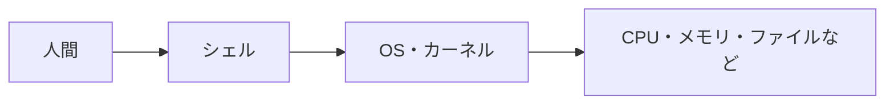

## Tags
#shell #linux #os #infrastructure

## 背景

コンピュータを使うとき、人間は「ファイルを開きたい」「フォルダを移動したい」「プログラムを実行したい」と考えます。

しかし、コンピュータの中心である**カーネル**は、人間の言葉をそのまま理解できません。

そこで、人間が入力した命令を受け取り、OSに伝えるための仕組みが必要になりました。その役割を持つのが**シェル**です。

## 結論

**シェルとは、人間が入力したコマンドを受け取り、OSに伝えて実行してくれる窓口のようなプログラムです。**

## 理由

シェルが必要な理由は、人間とOSの間に**命令を翻訳して伝える役割**が必要だからです。



例えば、ターミナルで `ls` と入力したとき、シェルは次のように動きます。

| 流れ | 内容 |
|---|---|
| 1 | 人間が `ls` と入力する |
| 2 | シェルがその文字を読み取る |
| 3 | シェルが「ファイル一覧を表示する命令だ」と解釈する |
| 4 | OSに実行を依頼する |
| 5 | 結果を画面に表示する |

## 具体例

### ① 日常生活で例えると

シェルは**レストランの店員さん**のような存在です。

| レストラン | コンピュータ |
|---|---|
| 客 | 人間 |
| 店員さん | シェル |
| 厨房 | OS・カーネル |
| 料理 | 実行結果 |

客が厨房に直接入るのではなく、店員さんを通して注文します。シェルも同じように、人間の命令を受け取りOSへ伝えます。

### ② Linux学習で使う場面

```bash
pwd     # 今いるフォルダの場所を表示
ls      # 今いるフォルダの中身を表示
cd      # 別のフォルダへ移動
mkdir   # 新しいフォルダを作成
```

これらのコマンドを受け取って実行してくれるのがシェルです。初心者が最初に触れる「黒い画面」は**ターミナル**であり、その中で動いている命令の受付役が**シェル**です。

### ③ Rails・Git・Dockerで使う場面

```bash
bin/rails server   # Railsサーバーを起動
git status         # Gitの変更状況を表示
docker compose up  # Dockerコンテナを起動
```

Rails・Git・Dockerを使うときも、シェルを通して命令を出しています。

## まとめ

**つまり、シェルとは、人間が入力したコマンドを読み取り、OSやプログラムに伝えて実行してくれる命令の窓口です。**

## 関連用語

| 用語 | 説明 |
|---|---|
| OS | コンピュータ全体を管理する基本ソフト |
| カーネル | OSの中心部分で、CPU・メモリ・ファイルなどを管理する |
| ターミナル | シェルを操作するための画面 |
| コマンド | コンピュータに出す命令 |
| Bash | Linuxでよく使われる代表的なシェルの一つ |
| Zsh | macOSで標準的に使われることが多いシェル |
| プロンプト | コマンド入力を待っている表示 |
| シェルスクリプト | シェルで実行する命令をまとめたファイル |

## よくある勘違い

### ターミナルとシェルは同じではない

| 用語 | 役割 |
|---|---|
| ターミナル | コマンドを入力するための画面 |
| シェル | 入力されたコマンドを解釈して実行するプログラム |

ターミナルは「受付カウンター」、シェルは「受付担当者」です。

### シェルはLinuxだけのものではない
macOSでもシェルは使われます。WindowsにもPowerShellやコマンドプロンプトがあります。「文字でコンピュータに命令するための仕組み」と考えると分かりやすいです。

### コマンドを覚えることだけが目的ではない
大事なのは `ls` や `cd` を暗記することではなく、「シェルを通してOSやプログラムに命令している」という仕組みを理解することです。

## 次の学習

1. ターミナルとは？
2. コマンドとは？
3. Linuxコマンドの基本
4. パスとは？
5. カレントディレクトリとは？
6. 環境変数とは？
7. 標準入力・標準出力・標準エラー出力
8. パイプとリダイレクト
9. シェルスクリプト
10. BashとZshの違い
11. Dockerコマンド
12. Gitコマンド

## Links
- [[note-insight-linux]]
- [[note-insight-kernel]]
- [[note-insight-os]]

## 言語化

結論：シェルとは、ユーザーが入力した命令を受け取り、OSに伝えて実行してもらうための窓口となるプログラムです

理由：コンピュータの中心には、CPU・メモリ・ストレージを管理するカーネルがあります。しかし、ユーザーがカーネルへ直接命令することはほとんどありません。そのため、シェルが間に入り、ユーザーの入力を受け取り・コマンドを解釈し・OSへ処理を依頼し・結果を画面に表示するという役割を担っています。つまり、シェルはユーザーとOSの間に立つ仲介役です

具体例：ターミナルを開くと `$` というプロンプトが表示され、シェルがコマンド入力を待っています。そこで `ls` と入力すると、シェルが「ファイル一覧を表示する命令」と解釈し、OSに処理を依頼し、結果が画面に表示されます。ターミナルは「文字を入力・表示する画面」、シェルは「コマンドを解釈してOSに伝えるプログラム」で別物です

結論（まとめ）：つまり、シェルとは、ユーザーが入力したコマンドを解釈し、OSへ伝えて実行してもらうための仲介役です
