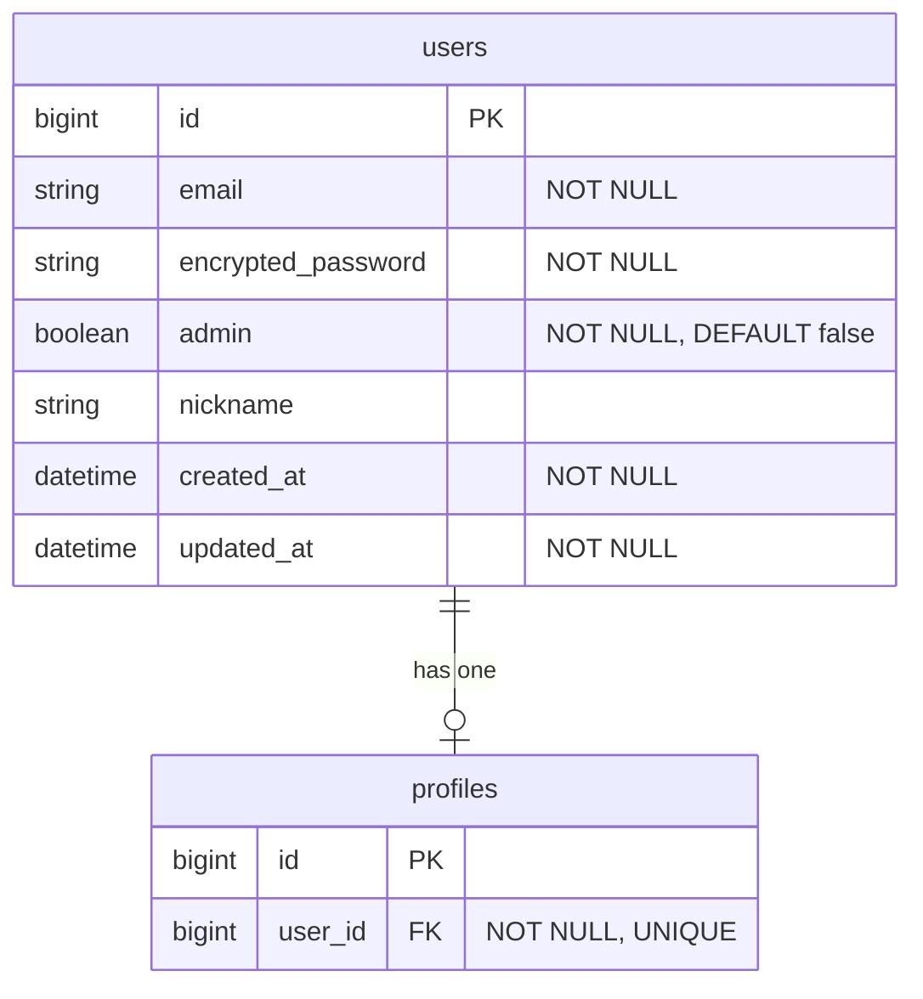
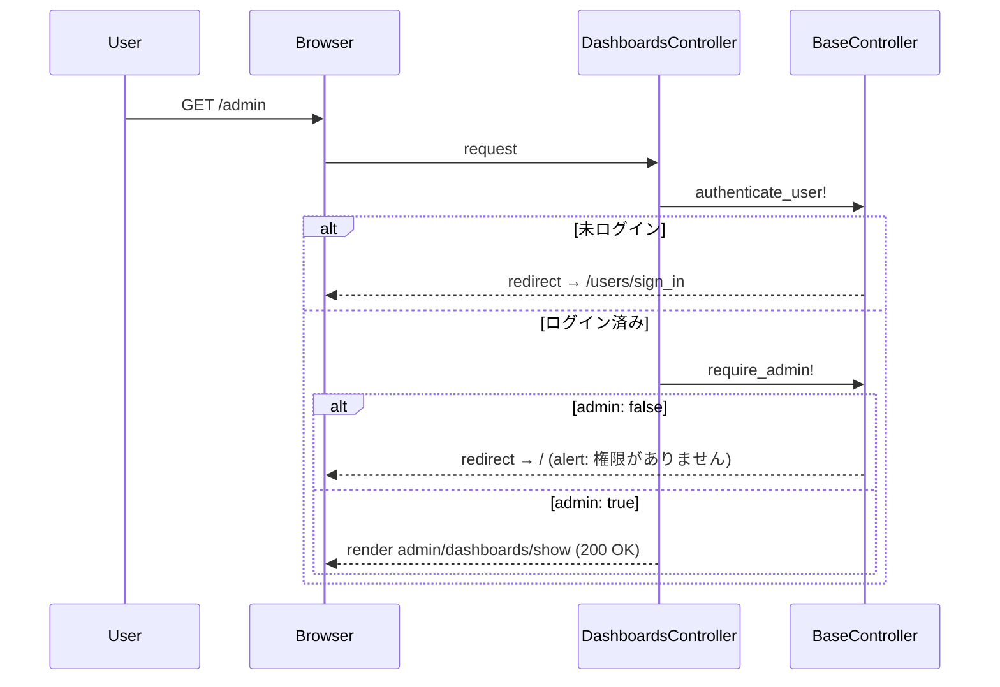

# 管理画面の基盤（admin権限 + レイアウト）設計書

**日付:** 2026-04-02
**Issue:** #170
**ステータス:** 合意済み

---

## 1. この設計で作るもの

本 Issue では、管理画面の基盤として以下を構築する。

- `users.admin` カラムの追加
- `Admin::BaseController` による認証・認可の共通化
- `Admin::DashboardsController` の追加
- `/admin` ルーティングの追加
- 管理画面専用レイアウトの追加

これは、後続 Issue である**未分類タグ管理画面（#171）**を安全に実装するための前提基盤である。

---

## 2. 目的

- 管理者専用画面へ一般ユーザーが入れないようにする
- 今後 `Admin::TagsController` などの管理機能を追加しやすい土台を作る

---

## 3. スコープ

### 含むもの

- `users` テーブルへの `admin` カラム追加
- 管理者専用コントローラ基盤の追加
- 管理画面トップページの追加
- 管理画面用レイアウトの追加
- 管理画面ルーティングの追加

### 含まないもの

- 未分類タグ管理そのものの実装
- 管理者作成 UI
- 複数ロール対応（moderator, editor など）
- 管理操作ログ機能

---

## 4. 設計方針

### なぜ `boolean` カラムを採用するか

管理者権限の実装方法には、大きく次の 2 案がある。

| 方式 | 実装コスト | 拡張性 | 現状との相性 |
|---|---|---|---|
| `boolean` カラム | 低い | 低い | 高い |
| role ベース（enum / 別テーブル） | 高い | 高い | 低い |

現時点の要件は「管理者か否か」の 2 値判定のみである。
複数ロールを前提にした設計は過剰であり、YAGNI の観点から `boolean` を採用する。

### 将来の拡張について

将来的に `moderator` や `editor` など複数権限が必要になった場合は、その時点で `role` ベースへ移行する。
現段階では必要最小限の設計を優先する。

---

## 5. データ設計

### 変更内容

```ruby
add_column :users, :admin, :boolean, null: false, default: false
```

### 設計意図

- `default: false` により、既存ユーザーは自動的に非管理者になる
- `null: false` により、`nil` が混入して認可判定が不安定になるのを防ぐ
- Rails は boolean カラムから `admin?` を自動生成するため、モデル側の追加実装は不要

### DB 制約

| カラム | 制約 | 理由 |
|---|---|---|
| `users.admin` | `null: false` | `nil` 混入による認可ロジックの不安定化を防ぐ |
| `users.admin` | `default: false` | 新規ユーザーが誤って管理者になる事故を防ぐ |
| index | 不要 | 現状は一覧検索用途がなく、単一レコード参照のみ |

### ER 図

> 列の構成: `型` | `カラム名` | `キー` | `制約・備考`



---

## 6. 画面・アクセス制御の流れ

管理画面へのアクセスは、次の順で判定する。

1. 未ログインならログイン画面へリダイレクト
2. ログイン済みでも非管理者ならトップページへリダイレクト
3. 管理者なら管理画面を表示

### アクセスシーケンス



---

## 7. アプリケーション設計

### コントローラ構成

```ruby
# app/controllers/admin/base_controller.rb
class Admin::BaseController < ApplicationController
  before_action :authenticate_user!
  before_action :require_admin!

  private

  def require_admin!
    redirect_to root_path, alert: "権限がありません" unless current_user.admin?
  end
end

# app/controllers/admin/dashboards_controller.rb
class Admin::DashboardsController < Admin::BaseController
  def show
  end
end
```

### 設計意図

- `Admin::BaseController` に認証・認可を集約することで、今後の管理系コントローラが共通ルールを継承できる
- 各コントローラへ同じ `before_action` を重複記述せずに済む
- 認可漏れを構造的に防げる
- `authenticate_user!` を先に実行することで、未ログイン時に `current_user.admin?` を呼んで `NoMethodError` になるのを防ぐ

---

## 8. ルーティング設計

```ruby
namespace :admin do
  root "dashboards#show"
end
```

### 設計意図

- `/admin` を管理画面の入口として固定する
- 今後 `Admin::TagsController` などを同じ namespace 配下へ自然に追加できる

---

## 9. レイアウト設計

**採用案：ヘッダーナビ形式**

現時点のスコープはダッシュボード 1 画面のみであり、サイドバーは過剰。
既存の `application.html.erb` もヘッダーナビ構成であり、一貫性がある。

管理機能のメニュー項目が **5 項目を超えた段階**でサイドバーへの移行を検討する。

---

## 10. クエリ・性能面

- `current_user` は Devise により取得済み（追加クエリなし）
- 管理者チェックは `current_user.admin?` の 1 属性参照のみ
- 今回のダッシュボードは静的表示であり、N+1 の発生源はない
- 追加インデックスは不要

---

## 11. トランザクション / Service 分離

**トランザクション：** 不要。DB 操作はマイグレーション（DDL）のみ。アプリケーション上の複数テーブル更新を伴わない。

**Service 分離：** 不要。今回の責務は認証・認可・ルーティング・レイアウトであり、独立したビジネスロジックは存在しない。将来、管理操作ログや複雑な権限制御が発生した場合に検討する。

---

## 12. 実装対象一覧

| # | 対象 | 内容 |
|---|---|---|
| 1 | Migration | `users.admin boolean, null: false, default: false` |
| 2 | Model | 変更なし（`admin?` は自動生成） |
| 3 | Controller | `Admin::BaseController`（`authenticate_user!` + `require_admin!`） |
| 4 | Controller | `Admin::DashboardsController`（`show` のみ） |
| 5 | Routes | `namespace :admin { root "dashboards#show" }` |
| 6 | Layout | `layouts/admin.html.erb`（ダーク系テーマ + ヘッダーナビ） |
| 7 | View | `admin/dashboards/show.html.erb`（最小限のダッシュボード） |

---

## 13. 受入条件

- [ ] `users.admin` カラムが追加されている（boolean, null: false, default: false）
- [ ] `/admin` に admin ユーザーのみアクセスできる
- [ ] 非 admin ユーザーはトップページへリダイレクト（alert あり）
- [ ] 未ログインユーザーはログイン画面へリダイレクト
- [ ] 管理画面ダッシュボードが表示される
- [ ] RSpec / RuboCop 全通過

---

## 14. この設計の結論

本設計では**最小コストで安全な管理画面基盤を作ること**を優先し、`users.admin` による単純明快な認可方式を採用する。
現時点では十分な構成であり、将来の要件増加に応じて role ベースへ拡張する。
