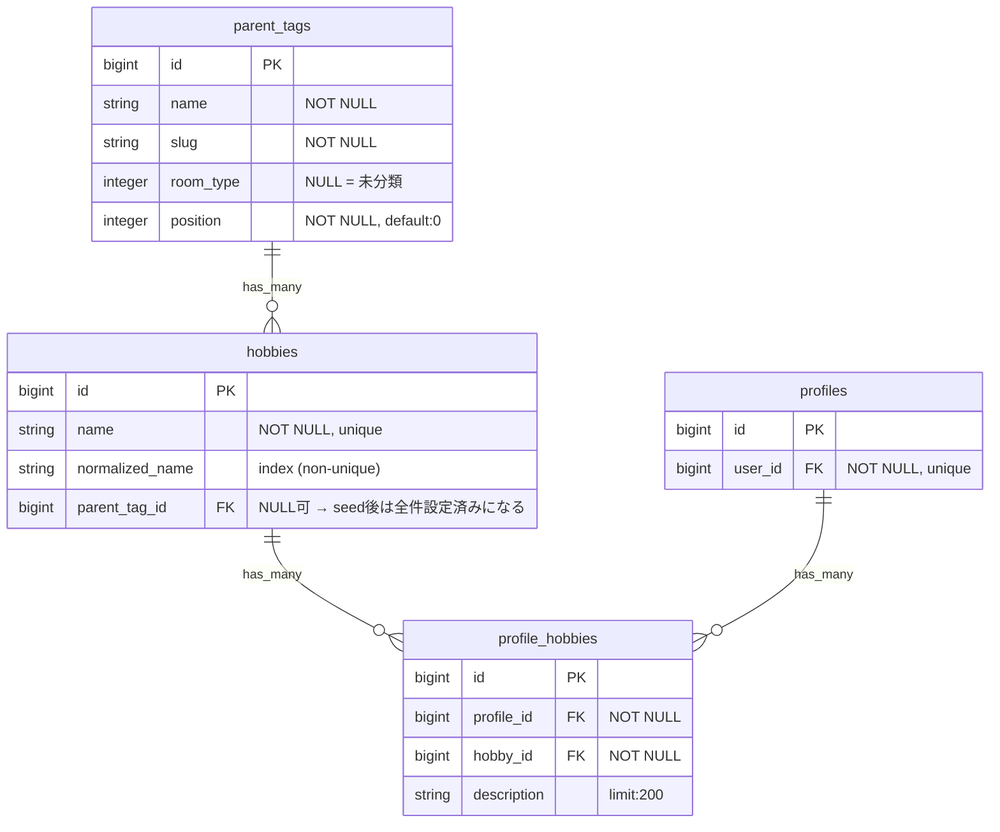
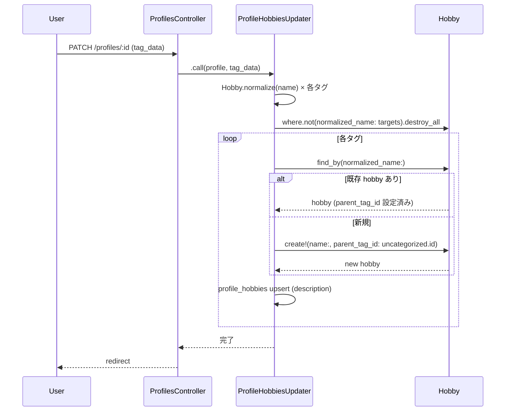

# 子タグ辞書設定と未分類運用 設計書

**日付:** 2026-04-03
**Issue:** #169
**ステータス:** 合意済み

---

## 1. この設計で作るもの

- `seeds.rb` に辞書定数を追加し、既存 hobbies に `parent_tag_id` を一括設定する
- `ProfileHobbiesUpdater` の正規化を `Hobby.normalize` に統一し、`normalized_name` で検索・新規 hobby に未分類を自動設定する
- **後続依存:** #171（未分類タグ管理画面）は本 Issue 完了が前提

---

## 2. 目的

- `hobbies.parent_tag_id` が全件 `nil` の状態を解消し、タグを親タグへ紐付ける
- 新規タグ入力時に自動で親タグを設定（辞書ヒット or 未分類）し、未分類が際限なく増えることを防ぐ
- `ProfileHobbiesUpdater` の正規化を `Hobby.normalize` に統一し、表記ゆれを吸収する

---

## 3. スコープ

### 含むもの
- `db/seeds.rb` — 辞書定数の追加 + 既存 hobbies への `parent_tag_id` 一括設定（冪等）
- `app/services/profile_hobbies_updater.rb` — 正規化統一・`normalized_name` 検索・未分類自動設定
- `spec/services/profile_hobbies_updater_spec.rb` — 新規テスト追加

### 含まないもの
- 高度な名寄せ・自然言語処理（将来対応）
- 管理画面での統合機能（#171 で対応）
- バッチ分類（複数タグの一括操作）

---

## 4. 設計方針

| 方式 | 実装コスト | 冪等性 | 既存との相性 |
|---|---|---|---|
| A: seed に辞書を追加（採用） | 低 | ✅ `parent_tag_id.nil?` 条件で制御 | 既存 seed に自然に追記できる |
| B: Rake タスクを別途作成 | 中 | ✅ | seed をクリーンに保てるが管理箇所が増える |
| C: migration 内のデータ操作 | 低 | ❌ 再実行不可 | 一回限りのため冪等でない |

**採用理由:** 案Aは `db:reset` 時にも自動再投入でき、管理箇所が最小。

---

## 5. データ設計

**変更なし。** カラム・テーブルはすべて #168 で追加済み。migration 不要。

**設計意図:** 既存スキーマで要件を満たせるため migration を追加しない。デプロイリスクを最小化。

### DB制約

| カラム | 制約 | 理由 |
|---|---|---|
| `hobbies.name` | unique index（既存） | 重複 hobby 防止 |
| `hobbies.normalized_name` | 通常 index（既存、non-unique） | 検索高速化。unique にしない理由: #171 の統合機能で重複が一時的に存在し得るため |
| `hobbies.parent_tag_id` | FK to `parent_tags`（既存） | 参照整合性 |

### ER図

> 列の構成: `型` | `カラム名` | `キー` | `制約・備考`



---

## 6. 画面・アクセス制御の流れ

今回は画面追加なし。既存のプロフィール編集画面（`PATCH /profiles/:id`）の内部ロジック変更のみ。

### シーケンス図



---

## 7. アプリケーション設計

### ProfileHobbiesUpdater（最終実装）

```ruby
class ProfileHobbiesUpdater
  # tag_data: [{ name: String, description: String }, ...]
  def self.call(profile, tag_data)
    normalized = tag_data
      .map { |t| { name: Hobby.normalize(t[:name]), description: t[:description].to_s } }
      .reject { |t| t[:name].blank? }
      .uniq { |t| t[:name] }

    # 辞書にない新規 Hobby に自動設定する未分類の親タグ
    uncategorized = ParentTag.find_by!(slug: "uncategorized", room_type: nil)

    ApplicationRecord.transaction do
      target_names = normalized.map { |t| t[:name] }

      # 不要なprofile_hobbiesを削除
      profile.profile_hobbies
             .joins(:hobby)
             .where.not(hobbies: { normalized_name: target_names })
             .destroy_all

      # N+1対策: 既存Hobbyをバッチロード
      existing_hobbies = Hobby.where(normalized_name: target_names).index_by(&:normalized_name)

      # N+1対策: 既存ProfileHobbyをバッチロード（destroy_all後に取得）
      existing_phs = profile.profile_hobbies
                            .includes(:hobby)
                            .index_by { |ph| ph.hobby.normalized_name }

      normalized.each do |tag|
        hobby = existing_hobbies[tag[:name]] ||
                Hobby.find_or_create_by!(normalized_name: tag[:name]) do |h|
                  h.name = tag[:name]
                  h.parent_tag_id = uncategorized.id
                end

        ph = existing_phs[tag[:name]] || ProfileHobby.new(profile:, hobby:)
        ph.description = tag[:description]
        ph.save!
      end
    end
  end
end
```

**設計意図:**
- `uncategorized` はループ前に1回だけ取得してキャッシュ（N+1回避）
- `find_or_create_by!` ブロック形式で Race Condition を回避（`find_by || create!` は非アトミック）
- `existing_hobbies` / `existing_phs` をループ前にバッチロードしてループ内の DB アクセスをゼロに
- `find_by(normalized_name:)` で表記ゆれを吸収（"Rails" → "rails" で既存 hobby を発見）
- 新規 hobby には必ず `parent_tag_id` を設定（未分類）

### seeds.rb 追加内容（イメージ）

```ruby
HOBBY_DICTIONARY = {
  "rails" => "programming", "ruby" => "programming",
  "javascript" => "programming", "sql" => "programming",
  "git" => "programming", "react" => "programming", "rubocop" => "programming",
  "figma" => "design", "ui/ux" => "design",
  "もくもく会" => "learning-style", "個人開発" => "learning-style", "アウトプット" => "learning-style",
  "アニメ" => "anime", "呪術廻戦" => "anime", "ワンピース" => "anime",
  "ガンダム" => "anime", "鬼滅の刃" => "anime", "漫画" => "anime",
  "マイクラ" => "game", "lol" => "game", "apex" => "game", "テラリア" => "game",
  "among us" => "coop", "モンハン" => "coop",
  "fps" => "versus",
  "エンジョイ勢" => "casual", "初心者歓迎" => "casual",
  "音楽鑑賞" => "music", "アニソン" => "music",
  "カフェ巡り" => "cafe", "コーヒー" => "cafe", "スタバ" => "cafe"
}.freeze

parent_tag_map = ParentTag.all.index_by(&:slug)
uncategorized = ParentTag.find_by!(slug: "uncategorized", room_type: nil)

Hobby.where(parent_tag_id: nil).find_each do |hobby|
  slug = HOBBY_DICTIONARY[hobby.normalized_name]
  parent_tag = slug ? parent_tag_map[slug] : uncategorized
  hobby.update_columns(parent_tag_id: parent_tag.id)
end
```

**設計意図:** `parent_tag_id.nil?` のみ対象にすることで冪等性を保証。`parent_tag_map` をメモリに展開してループ内の DB アクセスをゼロにする。

---

## 8. ルーティング設計

**変更なし。** 既存ルーティングで動作する。

---

## 9. レイアウト / UI 設計

**対象外。** 内部ロジックの変更のみで画面変更なし。

---

## 10. クエリ・性能面

| クエリ | 対策 |
|---|---|
| `ParentTag.find_by!` | ループ前に1回のみ実行、変数キャッシュ |
| `ParentTag.all.index_by(&:slug)` | seed 実行時のみ、全件 Hash 化でループ内 DB アクセスなし |
| `Hobby.where(normalized_name:).index_by` | ループ前にバッチロード → ループ内 DB アクセスゼロ |
| `profile_hobbies.includes(:hobby).index_by` | ループ前にバッチロード（destroy_all後に取得）→ ループ内 DB アクセスゼロ |
| `Hobby.find_or_create_by!(normalized_name:)` | バッチロードで miss した場合のみ実行（新規 hobby のみ） |
| `profile_hobbies.joins(:hobby).where.not(...)` | `hobby_id` に index 済み |

**追加インデックス:** 不要。

---

## 10-a. テスト実装上の注意（CI環境）

CI の `bin/rails db:prepare` は `db:schema:load` + `db:seed` を実行するため、テスト DB に seed で作成した `ParentTag` レコード（`uncategorized`・`programming` 等）が既に存在する状態でテストが実行される。

この状態で `create!` や FactoryBot の `create(:parent_tag, slug: "uncategorized", ...)` を呼ぶと、slug の uniqueness 制約違反（`RecordInvalid`）が発生する。

**対策:** seed で作成される slug を持つ `ParentTag` のテスト fixture には `find_or_create_by!` を使う。

```ruby
# NG（CI環境でseed済みの場合に失敗）
let!(:uncategorized) { create(:parent_tag, slug: "uncategorized", room_type: nil) }

# OK（冪等）
let!(:uncategorized) {
  ParentTag.find_or_create_by!(slug: "uncategorized", room_type: nil) { |pt| pt.name = "未分類"; pt.position = 0 }
}
```

**影響範囲:** seed に含まれる全 slug（`uncategorized`・`programming`・`design`・`anime` 等）が対象。

---

## 11. トランザクション / Service 分離

**トランザクション:** 必要。既存の `ApplicationRecord.transaction` を維持。削除・作成を1トランザクションで包むことで中途半端な状態を防ぐ。

**Service 分離:** 不要。`ProfileHobbiesUpdater` の拡張のみで、新たな Service を切り出すほどの複雑さはない。

---

## 12. 実装対象一覧

| # | 対象 | 内容 |
|---|---|---|
| 1 | `db/seeds.rb` | `HOBBY_DICTIONARY` 定数追加 + 既存 hobbies への `parent_tag_id` 一括設定 |
| 2 | `app/services/profile_hobbies_updater.rb` | 正規化を `Hobby.normalize` に統一・`normalized_name` 検索・未分類自動設定 |
| 3 | `spec/services/profile_hobbies_updater_spec.rb` | 全角→半角正規化・新規hobby未分類設定・既存hobby再利用のテスト追加 |

---

## 13. 受入条件

- [ ] 既存 hobbies に初期辞書の `parent_tag_id` が設定される
- [ ] 新規タグ入力時に `normalized_name` が自動設定される
- [ ] 辞書にあるタグは正しい親タグに紐付く
- [ ] 辞書にないタグは未分類に自動振り分けされる
- [ ] 全角→半角、半角カナ→全角カナの正規化が動作する
- [ ] 既存のプロフィール編集フローが壊れない
- [ ] RSpec / RuboCop 全通過

---

## 14. この設計の結論

`Hobby.normalize` への統一と `normalized_name` 検索への切り替えで、表記ゆれ吸収と自動分類を最小コストで実現する。将来の #171（管理画面統合）に向けて、`parent_tag_id` が全件設定された状態を seed で確立しておく。
