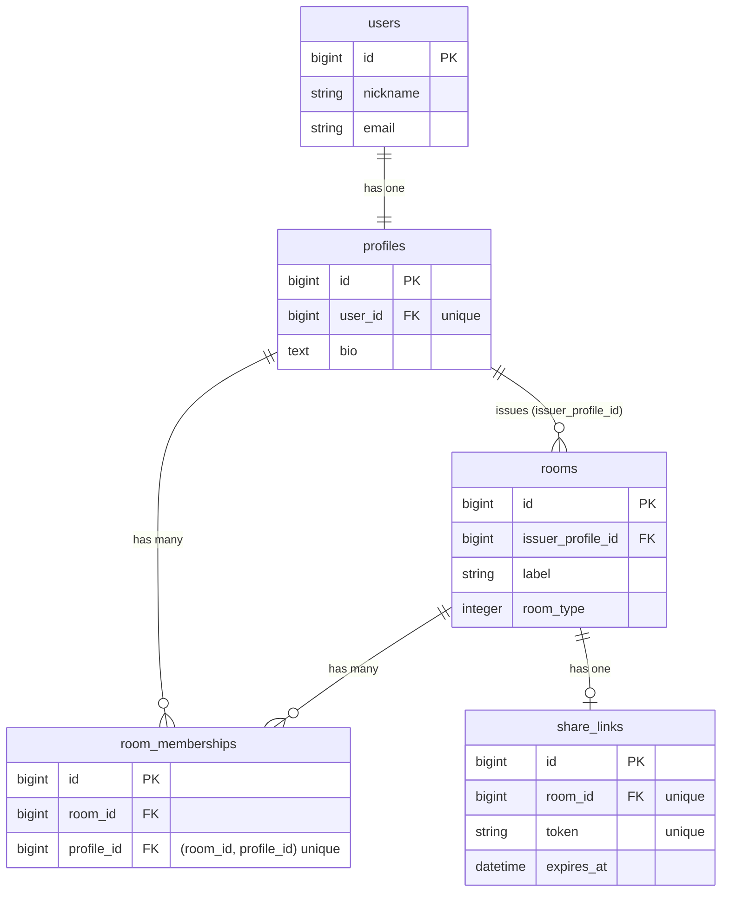
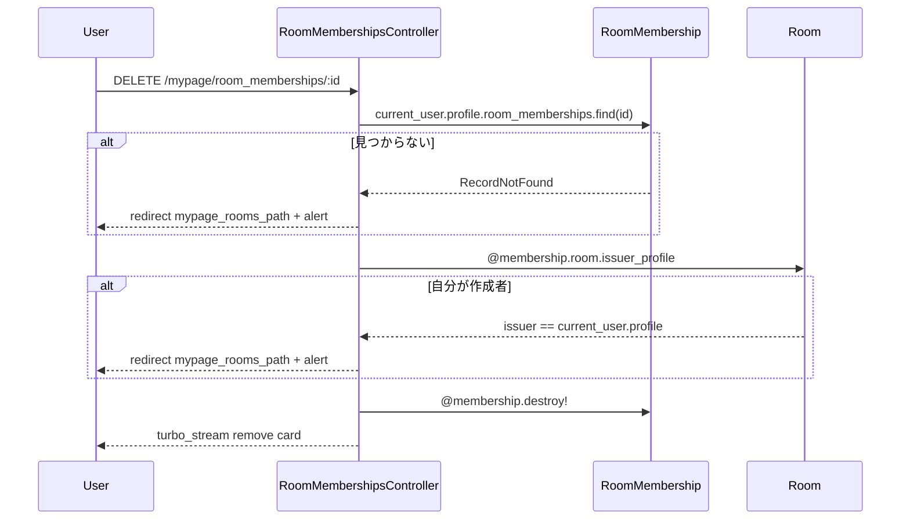

# 部屋管理UI更新（作成済み / 参加中の分割） 設計書

**日付:** 2026-04-03
**Issue:** #166
**ステータス:** 合意済み

---

## 1. この設計で作るもの

- `Mypage::RoomsController#index` に `@memberships`（参加中）クエリ追加
- `Mypage::RoomMembershipsController#destroy`（退出機能）新規作成
- `app/views/mypage/rooms/index.html.erb` を「作成済み」「参加中」2セクションに更新
- `app/views/mypage/rooms/_room.html.erb` に部屋タイプバッジ・「部屋を見る」リンク追加
- `app/views/mypage/rooms/_joined_room.html.erb` 新規作成（部屋名・部屋タイプバッジ・参加人数・作成者名・「部屋を見る」リンク・退出ボタン）
- `app/views/mypage/room_memberships/destroy.turbo_stream.erb` 新規作成
- ルーティングに `resources :room_memberships, only: [:destroy]` 追加

後続 Issue:
- **新 Issue A**: ロック機能（`rooms.locked` カラム追加）
- **新 Issue B**: 部屋作成フォーム改善（`rooms.description` カラム追加・有効期限選択）
- **新 Issue C**: 招待リンク再発行機能

---

## 2. 目的

- 「自分が作った部屋」と「招待で参加している部屋」を区別して管理できる
- 参加中の部屋から退出できる
- 「部屋を見る」で共有ページ（share_path）に飛べる

---

## 3. スコープ

### 含むもの

- 「作成済み」「参加中」の2セクション表示
- 部屋タイプバッジ（雑談/勉強/ゲーム）
- 参加中の部屋：部屋名・参加人数・作成者名（nickname）・「部屋を見る」・退出ボタン
- 退出後 turbo_stream でカード削除
- 空状態UI（0件時）
- 「部屋を見る」= `share_path(token)` リンク（作成済み・参加中の両方）
- 作成者が自分の部屋を退出しようとした場合のサーバー側ガード
- N+1 対策（preload）

### 含まないもの

- ロック機能（→ 新 Issue A）
- 部屋の説明・公開設定フォーム（→ 新 Issue B）
- 有効期限選択（→ 新 Issue B）
- 再発行機能（→ 新 Issue C）
- Room show ページ（「部屋を見る」は share_path で代替）

---

## 4. 設計方針

### 退出コントローラの配置

| 方式 | 責務の明確さ | ルーティングの自然さ | 現状との相性 |
|---|---|---|---|
| `RoomsController#leave` | △（部屋削除との混同） | △（member action が増える） | △ |
| `RoomMembershipsController#destroy` | ◎（membership の削除） | ◎（RESTful） | ◎ |

**採用理由:** 退出は「部屋本体の削除」ではなく「参加関係（RoomMembership）の削除」であるため、`RoomMembershipsController#destroy` が責務として自然。

### ビューに渡す変数

| 方式 | メリット | デメリット |
|---|---|---|
| `@joined_rooms`（Room配列） | シンプル | 退出ボタン用に Partial で membership ID を別途取得が必要 |
| `@memberships`（RoomMembership配列） | membership ID をそのまま使える | `membership.room.xxx` のアクセスになる |

**採用理由:** 退出ボタンの `DELETE /mypage/room_memberships/:id` に membership ID が必要なため、`@memberships` を渡す方が自然で N+1 も一括 includes で解決しやすい。

---

## 5. データ設計

**変更なし**（DB マイグレーション不要）

既存の `room_memberships` テーブルで「参加中」の定義が成立する：
- `joined_rooms`（参加中）: `room_memberships` に存在し、かつ `rooms.issuer_profile_id != current_user.profile.id`
- `issued_rooms`（作成済み）: `rooms.issuer_profile_id == current_user.profile.id`

### DB 制約（変更なし）

| カラム | 制約 | 理由 |
|---|---|---|
| `room_memberships(room_id, profile_id)` | unique | 既存制約で重複参加を防止 |
| `rooms.issuer_profile_id` | FK | 既存制約 |

### ER 図



---

## 6. 画面・アクセス制御の流れ

- 「作成済み」: `issuer_profile_id == current_user.profile.id` の部屋のみ表示
- 「参加中」: membership が存在し `issuer_profile_id != current_user.profile.id` の部屋のみ表示
- 退出: `current_user.profile.room_memberships.find(params[:id])` でガード（他者の membership は 404）
- 作成者退出ガード: サーバー側で `@membership.room.issuer_profile == current_user.profile` をチェック

### シーケンス図（退出フロー）



---

## 7. アプリケーション設計

### `Mypage::RoomsController#index`（既存変更）

```ruby
def index
  profile = current_user.profile
  unless profile
    @rooms = Room.none
    @memberships = RoomMembership.none
    return
  end

  @rooms = profile.issued_rooms
                  .includes(:share_link, :room_memberships)
                  .order(created_at: :desc)
  @memberships = profile.room_memberships
                        .joins(:room)
                        .where.not(rooms: { issuer_profile_id: profile.id })
                        .includes(room: [{ issuer_profile: :user }, :room_memberships, :share_link])
                        .order("rooms.created_at DESC")
end

def create
  issuer_profile = current_user.profile
  return redirect_to mypage_root_path unless issuer_profile
  # ... Room.transaction { ... }
end
```

**設計変更（REFACTOR時）:**
- `if profile ... else` のネスト → `unless profile ... return` のガード節に変更（可読性向上）
- `create` にプロフィール未作成ユーザーのガードを追加（422 例外防止）

### `Mypage::RoomMembershipsController`（新規）

```ruby
class Mypage::RoomMembershipsController < ApplicationController
  before_action :authenticate_user!
  before_action :set_membership

  def destroy
    if @membership.room.issuer_profile == current_user.profile
      redirect_to mypage_rooms_path, alert: "作成した部屋からは退出できません"
      return
    end
    @membership.destroy!
    respond_to do |format|
      format.turbo_stream { flash.now[:notice] = "部屋から退出しました" }
      format.html { redirect_to mypage_rooms_path, notice: "部屋から退出しました" }
    end
  end

  private

  def set_membership
    @membership = current_user.profile.room_memberships.find(params[:id])
  rescue ActiveRecord::RecordNotFound
    redirect_to mypage_rooms_path, alert: "参加している部屋が見つかりません"
  end
end
```

**設計意図:** `find` を `current_user.profile.room_memberships` のスコープ内で行うことで、他者の membership へのアクセスを 404 で自動的に拒否できる。

---

## 8. ルーティング設計

```ruby
namespace :mypage do
  resources :rooms, only: %i[index create edit update destroy]
  resources :room_memberships, only: [:destroy]   # 追加
end
```

生成されるパス: `DELETE /mypage/room_memberships/:id` → `mypage_room_membership_path(membership)`

**設計意図:** `rooms` にネストせず独立させることで、REST 的にシンプルなパスを維持する。

---

## 9. レイアウト / UI 設計

`index.html.erb` の構成（ワイヤーに基づく）:

```
# 部屋管理

[＋ 新しい部屋を作成]
  - 部屋名（任意）
  - タイプ選択（雑談 / 勉強 / ゲーム、デフォルト: 雑談）

## 管理中の部屋
自分が作成・管理する部屋です。編集や削除ができます。
（0件のとき：空状態UI）
[_room.html.erb × n]
  - [部屋タイプ] 部屋名
  - 参加人数
  - 招待URL / 有効期限 / 状態バッジ
  - [部屋を見る] [編集] [削除]

## 参加中の部屋
他のユーザーが作成した部屋に参加しています。退出できます。
（0件のとき：空状態UI）
[_joined_room.html.erb × n]
  - [部屋タイプ] 部屋名
  - 参加人数
  - 作成者アイコン + {nickname}
  - [部屋を見る] [退出する]
```

- 「部屋を見る」= `share_path(room.share_link.token)` (target: _blank)
- `_joined_room.html.erb` の turbo_frame ID = `dom_id(membership)`
- `destroy.turbo_stream.erb` で `turbo_stream.remove dom_id(@membership)`

---

## 10. クエリ・性能面

| クエリ対象 | preload |
|---|---|
| 作成済み部屋（`@rooms`） | `includes(:share_link, :room_memberships)` |
| 参加中（`@memberships`） | `includes(room: [{ issuer_profile: :user }, :room_memberships, :share_link])` |

追加インデックス不要（既存の `room_memberships(room_id, profile_id)` unique index で十分）。

---

## 11. トランザクション / Service 分離

**トランザクション:** 不要（単一レコード `room_membership` の削除のみ）
**Service 分離:** 不要（単一モデル操作、条件分岐も少ない）

---

## 12. 実装対象一覧

| # | 対象 | 内容 |
|---|---|---|
| 1 | Controller（既存変更） | `Mypage::RoomsController#index` に `@memberships` 追加・ガード節に変更 |
| 2 | Controller（既存変更） | `Mypage::RoomsController#create` にプロフィールガード追加・`room_params` 経由に修正 |
| 3 | Controller（新規） | `Mypage::RoomMembershipsController#destroy` |
| 4 | Helper（新規） | `app/helpers/rooms_helper.rb` — `room_type_badge` ヘルパー（雑談/勉強/ゲームのバッジ定義を一元管理） |
| 5 | View（既存変更） | `mypage/rooms/index.html.erb` を「管理中」「参加中」2セクションに更新・部屋タイプ選択セレクトボックス追加 |
| 6 | View（既存変更） | `mypage/rooms/_room.html.erb` に部屋タイプバッジ・「部屋を見る」追加 |
| 7 | View（新規） | `mypage/rooms/_joined_room.html.erb` |
| 8 | View（新規） | `mypage/room_memberships/destroy.turbo_stream.erb` |
| 9 | Routes | `resources :room_memberships, only: [ :destroy ]` 追加 |

---

## 13. 受入条件

- [ ] 「管理中の部屋」セクションに `issuer_profile = 自分` の部屋が表示される
- [ ] 「参加中の部屋」セクションに `issuer_profile != 自分` かつ `room_memberships` に存在する部屋が表示される
- [ ] 参加中の部屋には部屋名・部屋タイプバッジ・参加人数・作成者名（nickname）・「部屋を見る」リンク・退出ボタンが表示される
- [ ] 参加中の部屋には編集・削除ボタンが表示されない
- [ ] 「部屋を見る」は `share_path(token)` にリンクする（作成済み・参加中の両方）
- [ ] 退出後、turbo_stream で該当カードが削除される
- [ ] 空状態（0件）のとき空状態 UI が表示される
- [ ] 部屋タイプバッジ（雑談/勉強/ゲーム）が表示される
- [ ] 作成者が自分の部屋を退出しようとしたら alert でリダイレクトされる
- [ ] 他者の membership ID で直接アクセスしても 404（リダイレクト）になる
- [ ] N+1 が発生しない
- [ ] RSpec / RuboCop 全通過

---

## 14. この設計の結論

「参加関係の削除は RoomMembershipsController が責任を持つ」という RESTful な責務分割で、既存の DB 構造を変えずに実装できる。「部屋を見る」は現時点で共有ページ（share_path）への動線として機能させ、将来チャット等を作る際にリンク先を差し替えるだけでよい設計にする。
