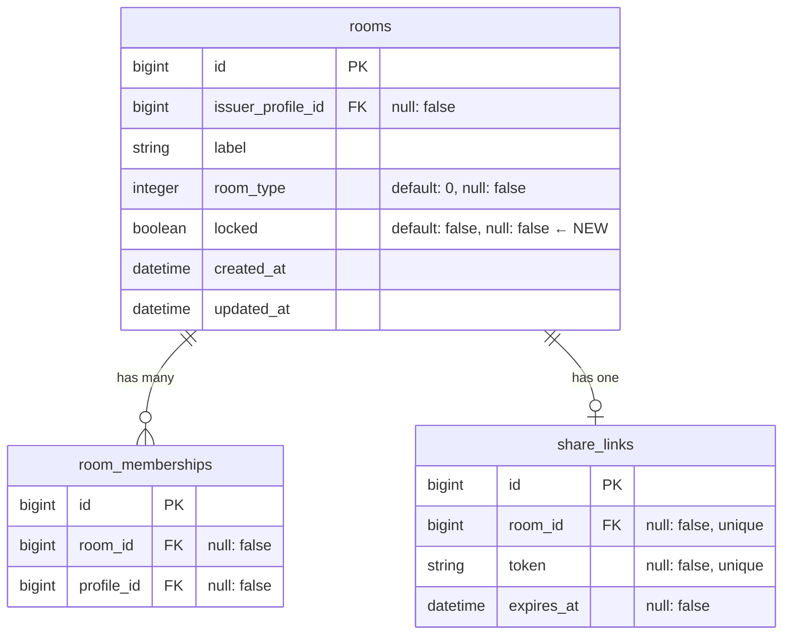

# ロック機能（公開状態の追加） 設計書

**日付:** 2026-04-05
**Issue:** #187
**ステータス:** 合意済み

---

## 1. この設計で作るもの

- rooms.locked boolean カラム（false=公開中 / true=ロック中）
- 管理中の部屋カードへの公開状態バッジ＋ロック/解除ボタン（turbo_stream）
- SharesController にロックチェック（未参加者かつ未オーナーは参加処理スキップ）
- 後続 Issue: #188（部屋作成フォーム改善）、#189（招待リンク再発行）

---

## 2. 目的

- 部屋オーナーが参加者流入を手動制御できるようにする
- ロック中でも既存参加者・オーナーは引き続き利用可能

---

## 3. スコープ

**含むもの**
- migration: rooms.locked 追加
- _room.html.erb: バッジ＋ロック/解除ボタン
- mypage/rooms に lock / unlock member action
- SharesController#show にロックチェック

**含まないもの**
- 参加済みメンバーへの通知（将来対応）
- 管理者によるロック解除（将来対応）

---

## 4. 設計方針

### ルーティング案の比較

| 方式 | 実装コスト | 意図の明確さ | 現状との相性 |
|---|---|---|---|
| A: lock / unlock 2アクション | 低 | 高（操作が明示的） | ◎ 既存 member action パターンと同じ |
| B: toggle_lock 1アクション | 低 | 中（副作用が不明確） | ○ |

**採用:** 案A。lock と unlock は意図が明確で、turbo_stream のレスポンスも個別に制御しやすい。

---

## 5. データ設計

rooms テーブルに locked カラムを追加する。

### DB 制約

| カラム | 制約 | 理由 |
|---|---|---|
| locked | boolean, default: false, null: false | 未設定による nil 混入防止 |

**設計意図:** null: false で nil.locked? の意図しない挙動を防ぐ。インデックスは不要（boolean の選択性は低く、rooms 単体での検索ユースケースもない）。

### ER 図



---

## 6. 画面・アクセス制御の流れ

### シーケンス図

```mermaid
sequenceDiagram
  participant U as User(Owner)
  participant RC as Mypage::RoomsController
  participant R as Room
  participant V as _room.html.erb

  U->>RC: PATCH /mypage/rooms/:id/lock
  RC->>R: room.update!(locked: true)
  R-->>RC: success
  RC-->>V: turbo_stream replace (locked状態)
  V-->>U: バッジ「ロック中」に更新

  participant G as Guest
  participant SC as SharesController

  G->>SC: GET /share/:token
  SC->>R: share_link.room (locked: true)
  SC->>SC: ロックチェック（未参加かつ未オーナー？）
  SC-->>G: render :show + flash.now[:alert]「ロック中」
           ※ find_or_create_by! はスキップ
```

---

## 7. アプリケーション設計

### Mypage::RoomsController

```ruby
before_action :set_room, only: %i[edit update destroy lock unlock]

def lock
  @room.update!(locked: true)
  respond_to do |format|
    format.turbo_stream
    format.html { redirect_to mypage_rooms_path }
  end
end

def unlock
  @room.update!(locked: false)
  respond_to do |format|
    format.turbo_stream
    format.html { redirect_to mypage_rooms_path }
  end
end
```

**turbo_stream テンプレート（lock.turbo_stream.erb / unlock.turbo_stream.erb）**
- 既存の update.turbo_stream.erb と同様に turbo_stream.replace でカードを差し替え

### SharesController#show（追加チェック）

```ruby
# @room = share_link.room の直後に挿入
if @room.locked?
  already_member = @viewer_profile && RoomMembership.exists?(room: @room, profile: @viewer_profile)
  is_owner       = @viewer_profile&.id == @room.issuer_profile_id

  unless already_member || is_owner
    flash.now[:alert] = "この部屋は現在ロック中のため参加できません"
    @memberships = @room.room_memberships
                        .includes(profile: [:user, { profile_hobbies: { hobby: :parent_tag } }])
                        .order(created_at: :asc)
    @jsmind_data = build_jsmind_data(@room, @memberships)
    render :show and return
  end
end
```

**設計意図:** ロックチェックは find_or_create_by! の前に置く。既存メンバー・オーナーは already_member || is_owner で通過し、未参加者のみ弾く。Service化不要（単一モデル更新、トランザクション境界なし）。

---

## 8. ルーティング設計

```ruby
namespace :mypage do
  resources :rooms, only: %i[index create edit update destroy] do
    member do
      patch :lock
      patch :unlock
    end
  end
end
```

**設計意図:** PATCH /mypage/rooms/:id/lock は状態遷移を表す動詞 URL で Rails の慣例に沿う。

---

## 9. レイアウト / UI 設計

_room.html.erb の部屋タイプバッジの隣に公開状態バッジを追加し、操作ボタン欄にロック/解除ボタンを追加する。

| 状態 | バッジ色 | ボタン表示 |
|---|---|---|
| 公開中 (locked: false) | 緑系 | 「ロックする」ボタン |
| ロック中 (locked: true) | 赤系 | 「解除する」ボタン |

---

## 10. クエリ・性能面

- locked は rooms テーブルのカラムなので追加クエリなし
- SharesController のロックチェックで RoomMembership.exists? を呼ぶが、既存の (room_id, profile_id) unique インデックスで高速（O(1)）

---

## 11. トランザクション / Service 分離

- トランザクション: 不要（Room#update! 単体）
- Service 分離: 不要（1モデル、条件分岐なし）

---

## 12. 実装対象一覧

| # | 対象 | 内容 |
|---|---|---|
| 1 | Migration | rooms.locked boolean default: false, null: false 追加 |
| 2 | Routes | lock / unlock member action 追加 |
| 3 | Controller | Mypage::RoomsController に lock / unlock action、before_action 更新 |
| 4 | View | _room.html.erb に公開状態バッジ＋ロック/解除ボタン追加 |
| 5 | turbo_stream | lock.turbo_stream.erb / unlock.turbo_stream.erb 作成 |
| 6 | Controller | SharesController#show にロックチェック追加 |
| 7 | Spec | Room model spec、Mypage::RoomsController request spec、SharesController request spec |

---

## 13. 受入条件

- [ ] rooms.locked カラムが追加されている
- [ ] 管理中の部屋カードに「公開中 / ロック中」バッジが表示される
- [ ] ロック / 解除ボタンで状態が turbo_stream で即時反映される
- [ ] ボタンはオーナー（管理中の部屋）のみ表示
- [ ] ロック中の共有リンクは閲覧可能。未参加・非オーナーがアクセスした場合は参加処理をスキップし、ページ上にエラーメッセージを表示する
- [ ] 既存参加者・オーナーはロック中でも利用制限なし
- [ ] RSpec / RuboCop 全通過

---

## 14. この設計の結論

rooms.locked boolean 1カラムで公開状態を管理し、SharesController のロックチェックと mypage/rooms の lock/unlock アクションで最小実装に収める。Service化・トランザクション不要。将来「参加申請機能」や「オーナー通知」を追加する場合は Service 化を検討する。
