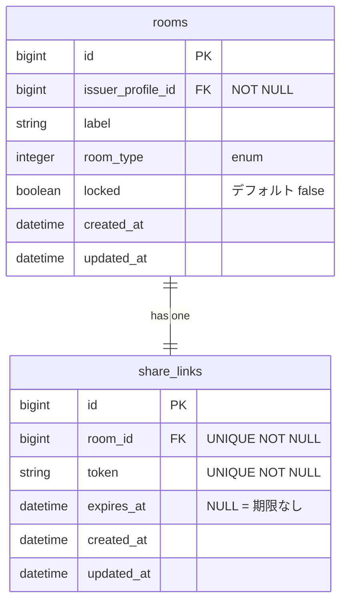
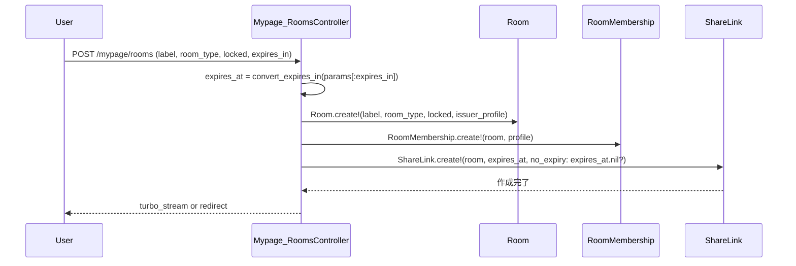

# 部屋作成フォーム改善 設計書

**日付:** 2026-04-06
**Issue:** #188
**ステータス:** 実装完了・PR #192

---

## 1. この設計で作るもの

- 部屋作成フォームに「公開設定 / 有効期限」2フィールドを追加
- `ShareLink` モデルの「期限なし」対応（コールバック拡張 + `expired?` nil安全化）
- `_room.html.erb` の nil 非安全箇所を修正

後続: #189（招待リンク再発行）では同 `expires_at` 変更UIを別途実装

## 2. 目的

- 部屋作成時に公開状態・有効期限を一度に設定できるようにする
- 現在 24h 固定のリンク期限をユーザーが選べるようにする

## 3. スコープ

### 含むもの
- `rooms.locked` を作成フォームに追加（カラムは既存）
- `expires_in` フォームフィールド → `share_links.expires_at` に変換

### 含まないもの
- `rooms.description`（ユーザー判断でスコープ除外。将来の別 Issue で検討）
- 作成後の有効期限変更UI（→ #189 で対応）

## 4. 設計方針

「期限なし」を `expires_at: nil` として保存するために、既存コールバック `set_expires_at` を拡張する。

| 方式 | 実装コスト | 既存への影響 | 安全性 |
|---|---|---|---|
| A: `attr_accessor :no_expiry` フラグ | 低 | なし（既存デフォルト維持） | ◎ |
| B: コールバック削除し常に明示渡し | 中 | spec 要修正 | ○ |

**採用理由:** 案Aを採用。既存の「引数なし作成 → 24h デフォルト」動作を壊さず、コントローラ側で `no_expiry: true` を明示する。

> **実装後の変更:** `no_expiry` フラグは後のリファクタで廃止。`expires_at` を直接渡す方式（案B）に近い形に統一した（`room_params` を create/update で分離）。

## 5. データ設計

DBマイグレーションなし。`locked` / `expires_at` はカラム既存。

### ER 図



## 6. 画面・アクセス制御の流れ

作成フォームで送信 → コントローラが `expires_in` を `expires_at` に変換 → トランザクション内で Room + RoomMembership + ShareLink を作成

### シーケンス図



## 7. アプリケーション設計

**`ShareLink` モデル変更**

```ruby
attr_accessor :no_expiry

def set_expires_at
  return if no_expiry
  self.expires_at ||= 24.hours.from_now
end

def expired?
  expires_at.present? && expires_at <= Time.current
end
```

**`Mypage::RoomsController` 変更**

```ruby
def create
  issuer_profile = current_user.profile
  return redirect_to mypage_root_path unless issuer_profile

  expires_at = convert_expires_in(params[:expires_in])

  Room.transaction do
    @room = Room.create!(room_params.merge(issuer_profile: issuer_profile))
    RoomMembership.create!(room: @room, profile: issuer_profile)
    ShareLink.create!(room: @room, expires_at: expires_at, no_expiry: expires_at.nil?)
  end
end

def room_params
  params.require(:room).permit(:label, :room_type, :locked)
end

def convert_expires_in(value)
  case value
  when "1h"  then 1.hour.from_now
  when "24h" then 24.hours.from_now
  when "3d"  then 3.days.from_now
  when "7d"  then 7.days.from_now
  else nil
  end
end
```

**`_room.html.erb` nil 安全修正**

```erb
<% if link.expires_at.present? && link.expires_at <= Time.current %>
```

## 8. ルーティング設計

変更なし。

## 9. レイアウト / UI 設計

既存フォームに2フィールドを追加（スタイルは既存の inline style に合わせる）：

| フィールド | 種別 | 備考 |
|---|---|---|
| locked | `select` | 公開 / ロック（値: `false` / `true`） |
| expires_in | `select` | 1時間 / 24時間 / 3日 / 7日 / 期限なし（デフォルト `24h`） |

## 10. クエリ・性能面

変更なし。N+1 なし。

## 11. トランザクション / Service 分離

**トランザクション:** 必要（既存の `Room.transaction` を継続使用）
**Service 分離:** 不要（既存コントローラ内で完結）

## 12. 実装対象一覧

| # | 対象 | 内容 |
|---|---|---|
| 1 | Model: ShareLink | `no_expiry` フラグ追加、`expired?` nil安全化 |
| 2 | Controller: Mypage::RoomsController | `room_params` に `locked` 追加、`expires_in` 変換、ShareLink 作成修正 |
| 3 | View: index.html.erb | 作成フォームに2フィールド追加 |
| 4 | View: _room.html.erb | `expires_at` nil チェック追加 |
| 5 | Spec: share_link_spec | `expired?` nil対応のテスト追加 |
| 6 | Spec: mypage/rooms_spec | locked/expires_at が保存されることを確認 |

## 13. 受入条件

- [x] 作成フォームで公開設定（公開 / ロック）を選択できる
- [x] 作成フォームで有効期限（1時間 / 24時間 / 3日 / 7日 / 期限なし）を選択できる
- [x] 期限なしで作成した場合 `share_links.expires_at` が `nil` で保存される
- [x] `_room.html.erb` の expires_at が nil でもエラーにならない
- [x] RSpec / RuboCop 全通過

## 14. この設計の結論

DBマイグレーション不要でフォームに2フィールドを追加する。`ShareLink` の `no_expiry` フラグにより後方互換を維持しつつ「期限なし」を実現する。#189（再発行）でも同パターンを再利用できる。
