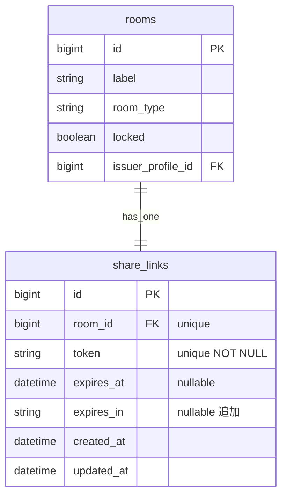
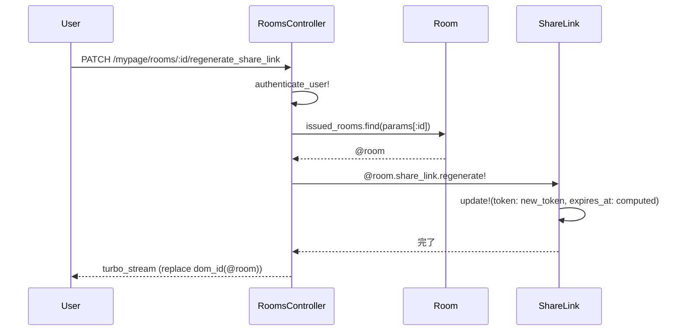

# 招待リンク再発行機能 設計書

**日付:** 2026-04-07
**Issue:** #189
**ステータス:** 合意済み

---

## 1. この設計で作るもの

- `share_links` に `expires_in` カラムを追加（元の有効期限設定を保存）
- `ShareLink#regenerate!` メソッド（token・expires_at を再生成）
- `Mypage::RoomsController#regenerate_share_link` アクション
- ルーティング追加（`patch :regenerate_share_link`）
- `_room.html.erb` に「再発行」ボタン追加
- `regenerate_share_link.turbo_stream.erb` で即時URL更新

## 2. 目的

- 期限切れ・漏洩した招待リンクを部屋オーナーが即座に無効化・再発行できるようにする
- 再発行時に元の有効期限設定（1h/24h/3d/7d または無期限）を自動引き継ぐ

## 3. スコープ

### 含むもの

- `share_links.expires_in` カラム追加マイグレーション
- `RoomsController#create` で `expires_in` を保存
- `ShareLink#regenerate!`
- 再発行ルート・アクション・Turbo Stream レスポンス
- 「再発行」ボタン（`_room.html.erb`）

### 含まないもの

- 再発行時の有効期限変更UI（Phase 0 で除外）
- 管理者による全リンク再発行

## 4. 設計方針

`expires_in` の保存場所について比較した。

| 方式 | 実装コスト | 正確性 | 現状との相性 |
|---|---|---|---|
| A. `share_links.expires_in` カラム追加 | 低（migration 1本） | 正確 | 高（既存 create フローへの追加のみ） |
| B. `expires_at - created_at` で逆算 | 低 | 低（clock drift・丸め誤差） | 低（近似値になる） |

**採用理由:** A案。正確に元の設定を再現でき、マイグレーション1本で済む。`convert_expires_in` のロジックは `ShareLink` モデルにも `EXPIRES_IN_MAP` 定数として持ち、コントローラと重複させない。

## 5. データ設計

**変更内容:** `share_links` テーブルに `expires_in` (string, nullable) を追加。

**設計意図:** 絶対日時だけでは再発行時の「元の設定」を再現できない。文字列で保存することで `EXPIRES_IN_MAP` と照合し正確に再計算できる。

### DB 制約

| カラム | 制約 | 理由 |
|---|---|---|
| `expires_in` | NULL可、チェック制約なし | `nil` = 無期限を表すため NULL 許容。値はモデルで管理 |

既存の `token` unique index・`room_id` unique index は変更なし。

### ER 図



## 6. 画面・アクセス制御の流れ

- `authenticate_user!` → `set_room`（`current_user.profile.issued_rooms.find` で自分の部屋のみ）
- 認可は既存の `set_room` で担保（他ユーザーの部屋は `ActiveRecord::RecordNotFound`）

### シーケンス図



## 7. アプリケーション設計

**ShareLink モデル**

```ruby
EXPIRES_IN_MAP = {
  "1h"  => 1.hour,
  "24h" => 24.hours,
  "3d"  => 3.days,
  "7d"  => 7.days
}.freeze

def regenerate!
  duration = EXPIRES_IN_MAP[expires_in]
  update!(
    token:      SecureRandom.urlsafe_base64(16),
    expires_at: duration ? duration.from_now : nil
  )
end
```

**設計意図:** token の生成と expires_at の再計算をモデルに閉じる。コントローラは `regenerate!` を呼ぶだけ。

**RoomsController（既存 create の変更）**

```ruby
ShareLink.create!(room: @room, expires_at: expires_at, expires_in: params[:expires_in])
```

`convert_expires_in` はコントローラに残す（`expires_at` 計算用）。`expires_in` の文字列はそのまま保存。

## 8. ルーティング設計

```ruby
resources :rooms, only: %i[index create edit update destroy] do
  member do
    patch :lock
    patch :unlock
    patch :regenerate_share_link  # 追加
  end
end
```

**設計意図:** `lock/unlock` と同じ member アクションパターンで統一。`regenerate` だけでは「何を再生成するか」が不明瞭なため `regenerate_share_link` と明示。

## 9. レイアウト / UI 設計

`_room.html.erb` の操作エリアに「再発行」ボタンを追加。`link.present?` の場合のみ表示。

```erb
<%= link_to "再発行",
    regenerate_share_link_mypage_room_path(room),
    data: { turbo_method: :patch, turbo_confirm: "招待リンクを再発行しますか？古いURLは無効になります。" },
    style: "color: #fbbf24; text-decoration: none;" %>
```

## 10. クエリ・性能面

- 既存 `index` で `includes(:share_link)` 済みのためN+1なし
- `regenerate!` は単一レコードの `UPDATE` のみ
- 追加インデックス不要（`token` は既存 unique index あり）

**設計意図:** 既存のeager loadingで対応済みのため追加対応不要。

## 11. トランザクション / Service 分離

**トランザクション:** 不要。`share_links` 単一レコードの更新のみ。

**Service 分離:** 不要。`ShareLink#regenerate!` モデルメソッドで完結。複数モデル跨ぎなし。

**設計意図:** 単一モデルの更新のみでトランザクション境界が不要。Serviceに切り出すほどの複雑性がない。

## 12. 実装対象一覧

| # | 対象 | 内容 |
|---|---|---|
| 1 | Migration | `share_links` に `expires_in` string カラム追加 |
| 2 | ShareLink model | `EXPIRES_IN_MAP` 定数 + `regenerate!` メソッド |
| 3 | RoomsController#create | `expires_in: params[:expires_in]` を ShareLink.create! に追加 |
| 4 | RoomsController#regenerate_share_link | 新規アクション追加 |
| 5 | routes.rb | `patch :regenerate_share_link` を member に追加 |
| 6 | _room.html.erb | 「再発行」ボタン追加 |
| 7 | regenerate_share_link.turbo_stream.erb | room パーシャルを置換 |
| 8 | spec/models/share_link_spec.rb | `regenerate!` のテスト |
| 9 | spec/requests/mypage/rooms_spec.rb | regenerate_share_link アクションのテスト |

## 13. 受入条件

- [ ] 再発行ボタンを押すと token と expires_at が新しい値に更新される
- [ ] Turbo Stream で招待URLが即座に更新される（ページリロード不要）
- [ ] 古いトークンでアクセスすると 404 になる
- [ ] 自分の部屋以外では再発行できない（`issued_rooms.find` で制御）
- [ ] RSpec / RuboCop 全通過

## 14. この設計の結論

`ShareLink#regenerate!` にロジックを閉じ、コントローラは呼び出すだけのシンプルな構成。`expires_in` カラム追加で元設定を正確に引き継げる。将来的に再発行時の期限変更UIが必要になった場合は `EXPIRES_IN_MAP` を共有リソースとして活用できる。
