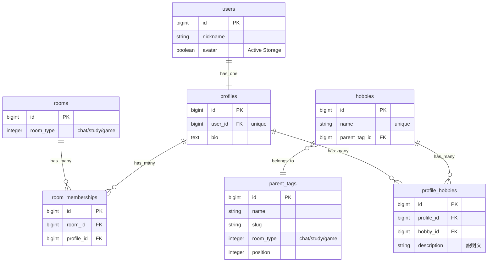
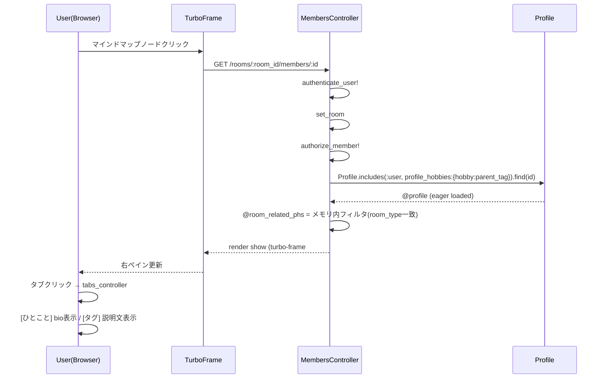

# 右ペインメンバー詳細タブ表示 設計書

**日付:** 2026-04-08
**Issue:** #173
**ステータス:** 合意済み

---

## 1. この設計で作るもの

- `Rooms::MembersController#show` のデータ取得ロジック変更（部屋共通趣味 → 親タグ一致の子タグ）
- `rooms/members/show.html.erb` のUI全面刷新（アバター・タブ・詳細リンク）
- 新規 Stimulus コントローラ `tabs_controller.js`
- 既存テスト（request spec・system spec）の更新

## 2. 目的

1. 子タグはマインドマップに表示されなくなったため、右ペインで補完する（#172 との連携）
2. ユーザーの具体的な関心事（部屋の文脈に関連する子タグ）を確認しやすくする
3. [ひとこと][タグ名...] のタブ形式でbio・タグ説明を切り替えられるようにする

## 3. スコープ

### 含むもの
- `MembersController#show` のクエリ変更
- `show.html.erb` の全面刷新（アバター・タブ・詳細リンク）
- `tabs_controller.js`（新規）
- request spec / system spec 更新

### 含まないもの
- プロフィールページからの「部屋に戻る」導線（別 Issue）
- `tag_toggle_controller.js` の変更（profiles/show での流用を維持）

## 4. 設計方針

### タブ実装の方式比較

| 方式 | 実装コスト | 既存への影響 | 再利用性 |
|---|---|---|---|
| 案A: `tag_toggle_controller.js` を拡張 | 中 | あり（他ページに影響リスク） | 低 |
| 案B: 新規 `tabs_controller.js` を作成 | 低 | なし | 高（汎用タブとして使い回せる） |

**採用: 案B** — `tag_toggle_controller.js` は `profiles/show` でも使われており変更リスクが高い。新規コントローラとして切り出した方が責務が明確で安全。

## 5. データ設計

変更なし（マイグレーション不要）

### N+1 対策

現行の `includes(:user, profile_hobbies: { hobby: :parent_tag })` をそのまま維持。

**変更点:**

```ruby
# 現行（DBクエリで room の全メンバー趣味と突合）
room_hobby_ids = Hobby.joins(:profiles).where(profiles: { id: @room.profile_ids }).select(:id).distinct
@shared_hobbies = @profile.hobbies.where(id: room_hobby_ids)  # 追加クエリ2本

# 新規（eager load 済みデータをメモリ内でフィルタ）
@room_related_phs = @profile.profile_hobbies.select do |ph|
  ph.hobby.parent_tag&.room_type == @room.room_type
end
# 追加クエリ 0本
```

**設計意図:** `room_type` は `Room` と `ParentTag` で同一enum（`{ chat: 0, study: 1, game: 2 }`）を使っているため、メモリ内比較で一致を取れる。eager load 済みなのでN+1は発生しない。

### ER 図



## 6. 画面・アクセス制御の流れ

### シーケンス図



## 7. アプリケーション設計

### MembersController

```ruby
def show
  @profile = Profile.includes(:user, profile_hobbies: { hobby: :parent_tag })
                    .find(params[:id])

  # 部屋の room_type に一致する親タグを持つ子タグのみ（メモリ内フィルタ）
  @room_related_phs = @profile.profile_hobbies.select do |ph|
    ph.hobby.parent_tag&.room_type == @room.room_type
  end
end
```

**設計意図:** 既存の `@profile_hobby_map` は不要になる（`@room_related_phs` が ProfileHobby オブジェクトを直接持つため）。

### tabs_controller.js（新規）

```javascript
import { Controller } from "@hotwired/stimulus"

export default class extends Controller {
  static targets = ["tab", "panel"]

  connect() {
    this.#activate(0)  // デフォルト: 最初のタブ（ひとこと）
  }

  switch(event) {
    const index = parseInt(event.currentTarget.dataset.tabsIndex)
    this.#activate(index)
  }

  // private
  #activate(index) {
    this.tabTargets.forEach((tab, i) => {
      tab.dataset.active = i === index ? "true" : "false"
    })
    this.panelTargets.forEach((panel, i) => {
      panel.classList.toggle("hidden", i !== index)
    })
  }
}
```

### show.html.erb（構造）

```
turbo-frame#member_detail
  ├─ アバター + ユーザー名（flex）
  ├─ tabs_controller
  │   ├─ タブボタン群
  │   │   ├─ [ひとこと] (index=0)
  │   │   └─ [タグ名...] (index=1,2,...)
  │   └─ パネル群
  │       ├─ bio (index=0)
  │       └─ 説明文... (index=1,2,...)
  └─ [詳細を見る] リンク
```

## 8. ルーティング設計

変更なし。既存の `get "/rooms/:room_id/members/:id"` をそのまま使用。

## 9. レイアウト / UI 設計

```
┌─────────────────────────────┐
│ 🖼  miyaRY777                │  アバター(small) + ニックネーム
│                              │
│ [ひとこと] [rails] [マイクラ]  │  タブ（アクティブ時に強調）
│─────────────────────────────│
│                              │
│  インドア派で...               │  選択タブの内容
│                              │
│            [詳細を見る]        │
└─────────────────────────────┘
```

- タブが0件（子タグなし）の場合: [ひとこと] タブのみ表示
- 子タグのタブをクリック → 説明文表示（未入力は「未入力」）

## 10. クエリ・性能面

| クエリ | 現行 | 新規 |
|---|---|---|
| profile + user + hobbies | 1回（includes） | 1回（includes、変更なし） |
| room_hobby_ids | 1回（JOIN） | **廃止** |
| shared_hobbies WHERE | 1回 | **廃止** |
| 合計 | 3回 | **1回** |

インデックス追加不要。

## 11. トランザクション / Service 分離

**トランザクション:** 不要（読み取りのみ）
**Service 分離:** 不要（単一プロフィールの取得・フィルタのみ、複数モデル横断なし）

## 12. 実装対象一覧

| # | 対象 | 内容 |
|---|---|---|
| 1 | Controller | `MembersController#show` のクエリ変更 |
| 2 | View | `rooms/members/show.html.erb` 全面刷新 |
| 3 | JS | `tabs_controller.js` 新規作成 |
| 4 | Spec | `members_show_spec.rb` 更新（`@shared_hobbies` → `@room_related_phs`） |
| 5 | Spec | `member_detail_tag_toggle_spec.rb` 更新（タブ動作に合わせて全面刷新） |

## 13. 受入条件

- [ ] ユーザーノードクリックで右ペインにアバター・ユーザー名が表示される
- [ ] [ひとこと][子タグ...] のタブが表示される（子タグは部屋の room_type に一致する親タグのもの）
- [ ] [ひとこと]タブ選択時に bio が表示される（未入力は「未入力」）
- [ ] 子タグタブ選択時にその説明文が表示される（未入力は「未入力」）
- [ ] 子タグが0件のユーザーは [ひとこと] タブのみ表示される
- [ ] [詳細を見る] リンクがプロフィールページへ遷移する
- [ ] 既存の Turbo Frame（`member_detail`）を活用している
- [ ] RSpec / RuboCop 全通過

## 14. この設計の結論

既存の `tag_toggle_controller` に手を加えず、新規 `tabs_controller.js` として切り出すことで影響範囲を最小化しつつ、UIをタブベースに刷新する。コントローラ側はDBクエリを3→1本に削減し、シンプルな設計で実現する。
