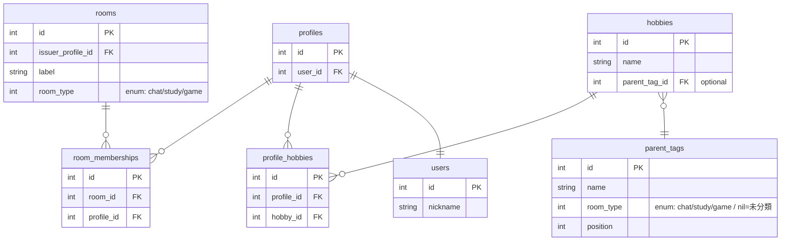
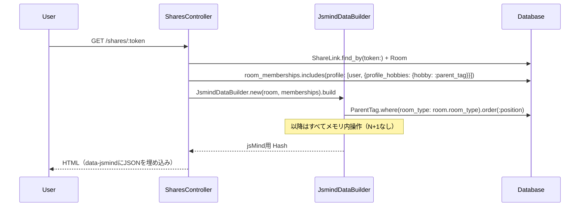

# マインドマップを親タグ中心の表示に変更 設計書

**日付:** 2026-04-08
**Issue:** #172
**ステータス:** 合意済み

---

## 1. この設計で作るもの

- `SharesController#build_jsmind_data` を `JsmindDataBuilder` サービスに切り出し
- マインドマップノード構造を「子タグ → ユーザー」から「親タグ → ユーザー」に変更
- 部屋タイプ不一致ユーザーを「その他」ノード（デフォルト折りたたみ）に表示
- 対応する RSpec を追加・更新

後続 Issue: #173（右ペインに子タグ一覧）は本Issue完了後に着手可。

## 2. 目的

- 子タグ（趣味名）が増えてもマインドマップが見やすい構造にする
- 全メンバーをマップに表示しつつ、部屋テーマに関係ないユーザーは折りたたみで整理する
- `build_jsmind_data` をコントローラから分離してテスタブルにする

## 3. スコープ

### 含むもの

- `SharesController#build_jsmind_data` の削除 → `JsmindDataBuilder` サービス新設
- マインドマップのノード構造変更（親タグ軸）
- 「その他」ノード（デフォルト折りたたみ、0人時は非表示）
- RSpec（サービス spec + リクエスト spec 更新）

### 含まないもの

- マインドマップのデザイン・テーマ変更
- 右ペインの子タグ一覧表示（#173 で対応）
- 「その他」ノードのラベル設定化（将来対応）

## 4. 設計方針

| 方式 | 実装コスト | テスタビリティ | コントローラの薄さ |
|---|---|---|---|
| A: コントローラ private メソッドのまま変更 | 低 | 低（リクエスト spec しか書けない） | 悪化 |
| B: `JsmindDataBuilder` サービスに切り出し | 中 | 高（単体 spec が書ける） | 維持 |

**採用理由:** `build_jsmind_data` は Room / ParentTag / Hobby / ProfileHobby / Profile / User の 6 モデルを跨ぐ。design.md の Service分離ポリシー（「2モデル以上を跨ぐ」「コントローラに置くとテストしづらい」）に完全に該当するため B を採用。

**仕様確認済み事項:**
- 同一ユーザーが複数親タグに重複表示されるのは仕様として許容（親タグごとの参加者一覧として正しい）

## 5. データ設計

マイグレーション: なし（既存テーブルのデータのみ利用）

`parent_tags.room_type` と `rooms.room_type` が同じ enum 定義（chat/study/game）のため追加カラム不要。

### ER 図



## 6. 画面・アクセス制御の流れ

### シーケンス図



## 7. アプリケーション設計

### `app/services/jsmind_data_builder.rb`（新規）

```ruby
class JsmindDataBuilder
  include Rails.application.routes.url_helpers

  def initialize(room, memberships)
    @room        = room
    @memberships = memberships
  end

  def build
    {
      meta:   { name: "room-map", version: "0.2" },
      format: "node_tree",
      data: {
        id:       "root",
        isroot:   true,
        topic:    @room.label.presence || "この部屋の趣味",
        children: build_children
      }
    }
  end

  private

  def build_children
    nodes = parent_tag_nodes
    other = other_node
    nodes << other if other
    nodes
  end

  def parent_tag_nodes
    matching_parent_tags.filter_map do |parent_tag|
      profiles = profiles_for(parent_tag)
      next if profiles.empty?

      {
        id:       "pt_#{parent_tag.id}",
        topic:    parent_tag.name,
        children: user_nodes_for(profiles, "pt_#{parent_tag.id}")
      }
    end
  end

  def other_node
    profiles = profiles_without_matching_hobby
    return nil if profiles.empty?

    {
      id:       "other",
      topic:    "その他",
      expanded: false,
      children: user_nodes_for(profiles, "other")
    }
  end

  def matching_parent_tags
    @matching_parent_tags ||= ParentTag.where(room_type: @room.room_type).order(:position)
  end

  def matching_parent_tag_ids
    @matching_parent_tag_ids ||= matching_parent_tags.map(&:id)
  end

  def all_profiles
    @all_profiles ||= @memberships.map(&:profile).uniq(&:id)
  end

  def profiles_for(parent_tag)
    all_profiles.select do |profile|
      profile.profile_hobbies.any? { |ph| ph.hobby.parent_tag_id == parent_tag.id }
    end
  end

  def profiles_without_matching_hobby
    all_profiles.reject do |profile|
      profile.profile_hobbies.any? { |ph| matching_parent_tag_ids.include?(ph.hobby.parent_tag_id) }
    end
  end

  def user_nodes_for(profiles, parent_key)
    profiles.sort_by(&:id).map do |profile|
      {
        id:    "p_#{profile.id}_#{parent_key}",
        topic: profile.user.nickname.presence || "no-name",
        data:  { url: room_member_path(room_id: @room.id, id: profile.id) }
      }
    end
  end
end
```

### `SharesController` の変更点

```ruby
# 変更前
@jsmind_data = build_jsmind_data(@room, @memberships)

# 変更後
@jsmind_data = JsmindDataBuilder.new(@room, @memberships).build
```

`build_jsmind_data` private メソッドは削除。

## 8. ルーティング設計

変更なし。

## 9. レイアウト / UI 設計

ビューへの変更なし（`@jsmind_data.to_json` を `data-jsmind` に埋め込む部分は既存のまま）。

jsMind の `node_tree` 形式は `expanded: false` をネイティブサポート済み。

## 10. クエリ・性能面

**主要クエリ（2本）:**

```ruby
# 1. memberships + 全関連をプリロード（既存、変更なし）
@room.room_memberships
     .includes(profile: [:user, { profile_hobbies: { hobby: :parent_tag } }])
     .order(created_at: :asc)

# 2. 部屋タイプに一致する親タグ一覧（新規追加、1本）
ParentTag.where(room_type: @room.room_type).order(:position)
```

以降の `profiles_for` / `profiles_without_matching_hobby` はすべてメモリ内操作のため N+1 なし。

**インデックス追加:** 不要（`parent_tags` は参加者数が少ない小テーブルのため）。

## 11. トランザクション / Service 分離

**トランザクション:** 不要（書き込みなし、読み取り専用）

**Service 分離:** 要 → `JsmindDataBuilder`
- 6モデルを跨ぐ、コントローラに置くとテスタブルでない → design.md の分離ポリシーに該当

## 12. 実装対象一覧

| # | 対象 | 内容 |
|---|---|---|
| 1 | Service | `app/services/jsmind_data_builder.rb` 新規作成 |
| 2 | Controller | `SharesController` から `build_jsmind_data` 削除 → サービス呼び出しに変更 |
| 3 | Spec（新規） | `spec/services/jsmind_data_builder_spec.rb` |
| 4 | Spec（更新） | `spec/requests/shares/shares_show_jsmind_spec.rb` を親タグ構造に合わせて更新 |

## 13. 受入条件

- [ ] マインドマップが「親タグ → ユーザー」の構造で表示される
- [ ] 部屋タイプに一致する親タグのみノードとして表示される
- [ ] 複数の親タグに趣味を持つユーザーは複数ノードに重複表示される（仕様）
- [ ] マッチする趣味を持たないユーザーは「その他」ノード配下に表示される
- [ ] 「その他」ノードはデフォルトで折りたたまれている
- [ ] 「その他」に該当ユーザーが0人のときはノードが表示されない
- [ ] 既存のユーザーノードクリック → 右ペイン表示が維持される
- [ ] N+1 が発生していない（親タグ取得1回・membership関連はプリロード済み・profile/hobby 単位のクエリが発生しない）
- [ ] RSpec / RuboCop 全通過

## 14. この設計の結論

`JsmindDataBuilder` サービスにロジックを集約し、コントローラはデータ取得のみに専念。親タグ軸に変更することでタグが増えても視認性が保たれる構造にする。「その他」ノードは折りたたみで全メンバー可視性も確保。将来的に右ペインで子タグを表示する #173 とも相性が良い設計。
