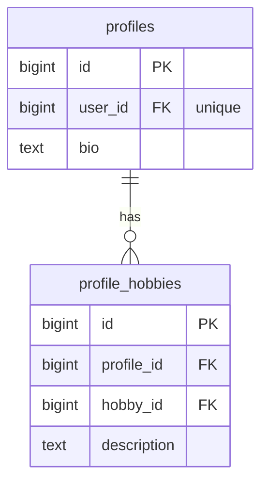
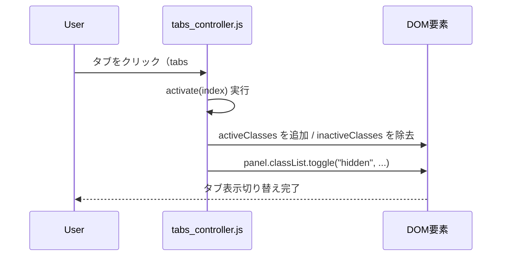

# tabs_controller CSSクラス管理移行 設計書

**日付:** 2026-04-09
**Issue:** #196
**ステータス:** 合意済み

---

## 1. この設計で作るもの

- `tabs_controller.js` の `activate` メソッドをStimulusのClassesプロパティAPIを使ったクラス付け替えに変更
- `show.html.erb` 全体のインラインスタイルをTailwindクラスへ置換
- Stimulusのクラス宣言（`data-tabs-active-class` / `data-tabs-inactive-class`）をHTMLに追加

## 2. 目的

- JSがスタイルを知らない状態にし、CSS変更時にJSを触らなくて済むようにする
- インラインスタイルを排除してメンテナンス性を向上させる

## 3. スコープ

### 含むもの

- `tabs_controller.js` のリファクタ（`element.style.*` → `classList.add/remove`）
- `show.html.erb` 全インラインスタイルのTailwind化

### 含まないもの

- DB変更・マイグレーション（不要）
- 他ビューのインラインスタイル修正（今回はこのファイルのみ）

## 4. 設計方針

| 方式 | 実装コスト | 拡張性 | 現状との相性 |
|---|---|---|---|
| StimulusのClassesプロパティAPI | 低 | 高（HTMLだけでクラス変更できる） | ◎ |
| カスタムCSS（`@apply`） | 中 | 中 | △（Tailwind公式非推奨） |
| クラス名をJSにハードコード | 低 | 低（JS修正が発生） | △ |

**採用理由:** StimulusのClassesプロパティAPIはTailwindとStimulusの公式の組み合わせ。JSはクラス名を知らず、HTMLで差し替えられる。

## 5. データ設計

なし（DBへの変更なし）

### ER図



## 6. 画面・アクセス制御の流れ

### シーケンス図



## 7. アプリケーション設計

### tabs_controller.js（変更後）

```js
import { Controller } from "@hotwired/stimulus"

export default class extends Controller {
  static targets = ["tab", "panel"]
  static classes = ["active", "inactive"]  // 追加

  connect() {
    this.activate(0)
  }

  switch(event) {
    const index = this.tabTargets.indexOf(event.currentTarget)
    this.activate(index)
  }

  activate(index) {
    this.tabTargets.forEach((tab, i) => {
      if (i === index) {
        tab.classList.add(...this.activeClasses)
        tab.classList.remove(...this.inactiveClasses)
      } else {
        tab.classList.add(...this.inactiveClasses)
        tab.classList.remove(...this.activeClasses)
      }
    })
    this.panelTargets.forEach((panel, i) => {
      panel.classList.toggle("hidden", i !== index)
    })
  }
}
```

### show.html.erb（変更後イメージ・抜粋）

```html
<div data-controller="tabs"
     data-tabs-active-class="bg-gradient-to-br from-blue-600 to-blue-800 text-white border-transparent"
     data-tabs-inactive-class="bg-blue-400/15 text-blue-400 border-blue-400/40">

  <div class="flex flex-wrap gap-1.5 mb-3 pb-2 border-b border-gray-700/40">
    <button type="button"
            data-tabs-target="tab"
            data-action="click->tabs#switch"
            class="text-xs px-3 py-1 rounded-full cursor-pointer border transition-all duration-200">
      ひとこと
    </button>
    ...
  </div>

  <div data-tabs-target="panel"
       class="min-h-12 text-sm text-gray-300 whitespace-pre-line break-words">
    ...
  </div>
</div>
```

## 8. ルーティング設計

なし（ルーティング変更なし）

## 9. レイアウト / UI 設計

インラインスタイル → Tailwindクラスの対応表：

| インラインスタイル | Tailwindクラス |
|---|---|
| `padding: 1.5rem` | `p-6` |
| `border-radius: 0.75rem` | `rounded-xl` |
| `background: rgba(255,255,255,0.03)` | `bg-white/[.03]` |
| `border: 1px solid rgba(55,65,81,0.4)` | `border border-gray-700/40` |
| `box-shadow: 0 4px 20px rgba(0,0,0,0.3)` | `shadow-[0_4px_20px_rgba(0,0,0,0.3)]` |
| `display:flex; align-items:center; gap:0.75rem` | `flex items-center gap-3` |
| `margin-bottom: 1.25rem` | `mb-5` |
| `font-size:1rem; font-weight:500; color:#fff` | `text-base font-medium text-white` |
| `min-height:3rem; font-size:0.875rem; color:#d1d5db` | `min-h-12 text-sm text-gray-300` |
| `white-space:pre-line; word-break:break-word` | `whitespace-pre-line break-words` |
| `margin-top:1rem; text-align:right` | `mt-4 text-right` |
| `font-size:0.875rem; color:#60a5fa` | `text-sm text-blue-400` |

## 10. クエリ・性能面

なし（フロントエンドのみの変更）

## 11. トランザクション / Service 分離

**トランザクション:** 不要（DBアクセスなし）
**Service 分離:** 不要（JS/HTMLのリファクタのみ）

## 12. 実装対象一覧

| # | 対象 | 内容 |
|---|---|---|
| 1 | JS | `tabs_controller.js` にClassesプロパティ追加・`activate()` をclassList操作に変更 |
| 2 | View | `show.html.erb` 全インラインスタイルをTailwindクラスへ置換 |
| 3 | テスト | `tabs_controller` Stimulusのspecが引き続き通ることを確認 |

## 13. 受入条件

- [ ] タブのアクティブ/非アクティブの見た目が変更前と同等
- [ ] `tabs_controller.js` に `element.style.*` の直接指定が残らない
- [ ] `show.html.erb` のインラインスタイル（`style="..."` 属性）が除去されている
- [ ] 既存のRSpecが全通過
- [ ] RuboCop全通過

## 14. この設計の結論

StimulusのClassesプロパティAPIでJSとCSSの関心を完全に分離する。HTMLを変えるだけでデザイン変更ができる構成にする。
