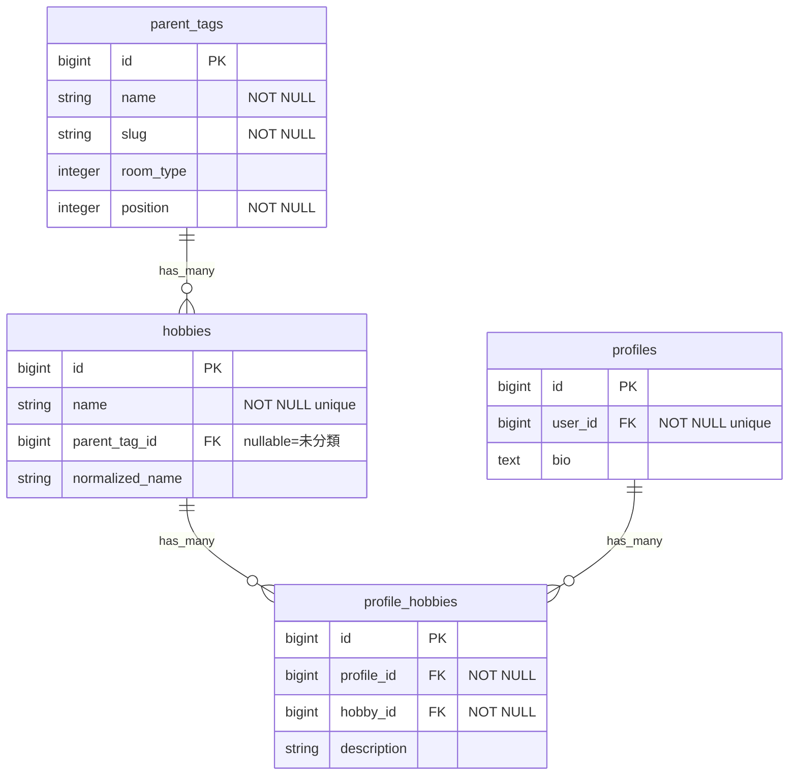
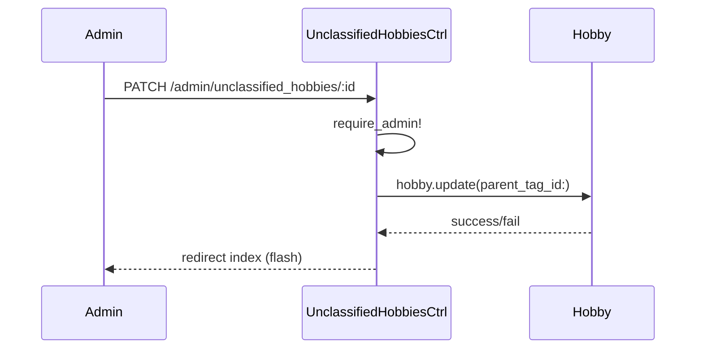
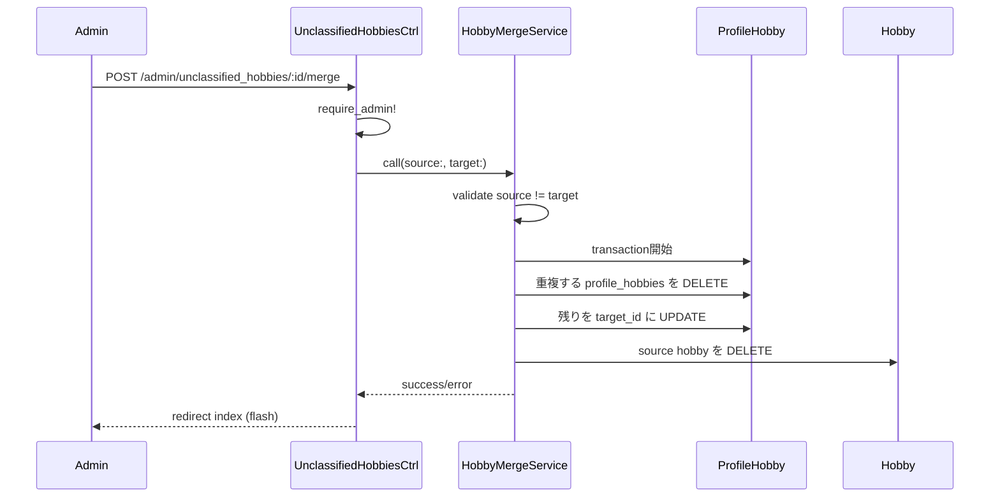

# 未分類タグ管理画面 設計書

**日付:** 2026-04-10
**Issue:** #171
**ステータス:** 合意済み

---

## 1. この設計で作るもの
- `Admin::UnclassifiedHobbiesController`（index / update / merge）
- `Admin::HobbyMergeService`（統合ロジック）
- 管理画面ビュー（一覧・分類フォーム・統合フォーム）
- adminルーティング拡張

マイグレーション不要（`hobbies.parent_tag_id` はすでに nullable）。

## 2. 目的
- 未分類タグ（`parent_tag_id = NULL`）を管理者が親タグへ振り分けられる
- 表記ゆれタグを統合し、`profile_hobbies` の一貫性を保つ

## 3. スコープ

### 含むもの
- 未分類タグ一覧（タグ名・使用回数・ユーザー数）
- 検索機能
- 分類機能（親タグへの振り分け）
- 統合機能（profile_hobbies 付け替え＋元タグ削除）

### 含まないもの
- 親タグ自体の追加・編集・削除（将来対応）
- バッチ分類（複数タグの一括操作）（将来対応）
- 自動分類提案機能（将来対応）
- 統合先ドロップダウンの検索UI（リストが長い場合の将来対応）

## 4. 設計方針

### 統合UI — ドロップダウンの選択肢

| 方式 | 実装コスト | UX | 懸念 |
|---|---|---|---|
| A: 全タグから選択 | 低 | 表記ゆれ先が未分類でも選べる | リストが長い |
| B: 分類済みタグのみ | 低 | シンプル | 未分類→未分類統合ができない |

**採用: A（全タグから選択、自分自身を除外）**
表記ゆれは未分類タグ同士の統合もありうるため。リストが長くなる問題は将来的に検索UIで対応。

### 異常系方針
- 統合元＝統合先の場合はバリデーションエラーでフォームに戻す
- 統合先が存在しない場合は 404（ドロップダウン選択なので念のための安全網）

## 5. データ設計

マイグレーション不要。

| テーブル | 操作 | 内容 |
|---|---|---|
| `hobbies` | UPDATE | `parent_tag_id` を設定（分類）または DELETE（統合後） |
| `profile_hobbies` | UPDATE | 統合時に `hobby_id` を統合先に付け替え（重複は削除） |

### DB 制約

| カラム | 制約 | 理由 |
|---|---|---|
| `profile_hobbies(profile_id, hobby_id)` | unique | 統合後に重複が発生しうるため DELETE で対処 |

### ER 図



## 6. 画面・アクセス制御の流れ

### シーケンス図（分類）



### シーケンス図（統合）



## 7. アプリケーション設計

### Controller

```ruby
class Admin::UnclassifiedHobbiesController < Admin::BaseController
  def index
    @hobbies = Hobby.where(parent_tag_id: nil)
                    .left_joins(:profile_hobbies)
                    .select("hobbies.*, COUNT(DISTINCT profile_hobbies.id) AS usage_count,
                             COUNT(DISTINCT profile_hobbies.profile_id) AS user_count")
                    .group("hobbies.id")
                    .then { |q| params[:q].present? ? q.where("hobbies.name LIKE ?", "%#{params[:q]}%") : q }
    @parent_tags = ParentTag.order(:room_type, :position)
    @all_hobbies = Hobby.order(:name)
  end

  def update
    @hobby = Hobby.where(parent_tag_id: nil).find(params[:id])
    if @hobby.update(parent_tag_id: params[:hobby][:parent_tag_id])
      redirect_to admin_unclassified_hobbies_path, notice: "分類しました"
    else
      redirect_to admin_unclassified_hobbies_path, alert: "分類に失敗しました"
    end
  end

  def merge
    source = Hobby.find(params[:id])
    target = Hobby.find(params[:target_hobby_id])
    result = Admin::HobbyMergeService.call(source:, target:)
    if result.success?
      redirect_to admin_unclassified_hobbies_path, notice: "統合しました"
    else
      redirect_to admin_unclassified_hobbies_path, alert: result.error
    end
  end
end
```

### Service（`app/services/admin/hobby_merge_service.rb`）

```ruby
class Admin::HobbyMergeService
  Result = Struct.new(:success?, :error, keyword_init: true)

  def self.call(source:, target:)
    new(source:, target:).call
  end

  def initialize(source:, target:)
    @source = source
    @target = target
  end

  def call
    return Result.new(success?: false, error: "統合元と統合先が同じです") if @source.id == @target.id

    ActiveRecord::Base.transaction do
      duplicate_profile_ids = ProfileHobby.where(hobby_id: @target.id).pluck(:profile_id)
      ProfileHobby.where(hobby_id: @source.id, profile_id: duplicate_profile_ids).delete_all
      ProfileHobby.where(hobby_id: @source.id).update_all(hobby_id: @target.id)
      @source.destroy!
    end
    Result.new(success?: true, error: nil)
  rescue => e
    Result.new(success?: false, error: e.message)
  end
end
```

## 8. ルーティング設計

```ruby
namespace :admin do
  root "dashboards#show"
  resources :unclassified_hobbies, only: [:index, :update] do
    member do
      post :merge
    end
  end
end
```

**設計意図:** member route の `merge` は特定リソース（source hobby）に対する操作のため、`member` に配置。

## 9. レイアウト / UI 設計

既存の `admin` レイアウトを使用。各行にインラインフォームを配置：
- **[分類]** → 親タグの select ドロップダウン + 保存ボタン
- **[統合]** → 全タグの select ドロップダウン（自分自身を除外）+ 統合ボタン

## 10. クエリ・性能面

| クエリ | 対策 |
|---|---|
| 未分類一覧（usage_count / user_count） | `left_joins` + `group` + `select` で1クエリ |
| 親タグ一覧 | `@parent_tags` でまとめて取得 |
| 統合先選択肢 | `@all_hobbies` でまとめて取得 |

N+1なし。追加インデックス不要（`parent_tag_id` にインデックス済み）。

## 11. トランザクション / Service 分離

**トランザクション:** 必要（`profile_hobbies` の付け替え＋`hobbies` の削除が不可分）
**Service分離:** 要（`Admin::HobbyMergeService`）
→ 2モデル跨ぎ＋トランザクション＋削除処理のため、design.mdの分離ポリシーに完全合致。

## 12. 実装対象一覧

| # | 対象 | 内容 |
|---|---|---|
| 1 | Route | `admin/unclassified_hobbies` 追加 |
| 2 | Controller | `Admin::UnclassifiedHobbiesController`（index/update/merge） |
| 3 | Service | `Admin::HobbyMergeService` |
| 4 | View | `app/views/admin/unclassified_hobbies/index.html.erb` |
| 5 | Spec | `spec/system/admin/unclassified_hobbies_spec.rb` |
| 6 | Spec | `spec/services/admin/hobby_merge_service_spec.rb` |

## 13. 受入条件

- [ ] 未分類タグの一覧が表示される（タグ名・使用回数・ユーザー数）
- [ ] タグを親タグに分類できる（`parent_tag_id` 更新）
- [ ] タグを別のタグに統合できる（`profile_hobbies` 付け替え＋元タグ削除）
- [ ] 検索でタグを絞り込める
- [ ] adminユーザーのみアクセスできる
- [ ] RSpec / RuboCop 全通過

## 14. この設計の結論

マイグレーション不要でService（`HobbyMergeService`）にトランザクションを集約。コントローラは薄く保ち、統合ロジックのみServiceに切り出す設計。将来的なバッチ分類・自動分類提案は本設計を拡張する形で対応可能。
