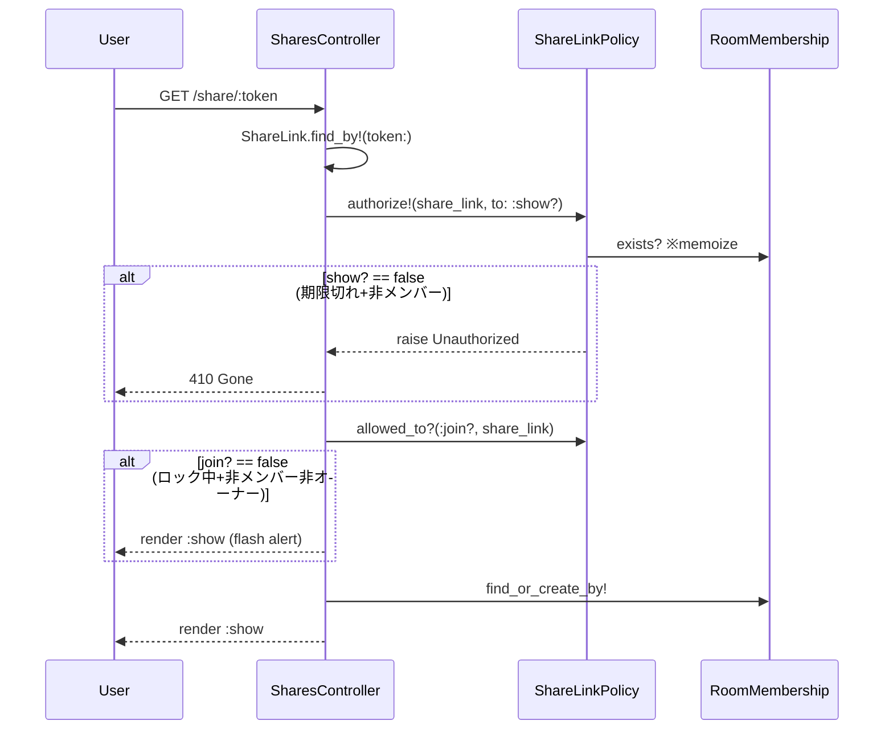

# action_policy 導入 + SharesController アクセス権判定分離 設計書

**日付:** 2026-04-11
**Issue:** 未採番
**ステータス:** 合意済み

---

## 1. この設計で作るもの

- `Gemfile` に `gem "action_policy"` を追加
- `app/policies/application_policy.rb`（新規）: ベースポリシー
- `app/policies/share_link_policy.rb`（新規）: ShareLink のアクセス権判定
- `app/controllers/application_controller.rb`（変更）: `include ActionPolicy::Controller`
- `app/controllers/shares_controller.rb`（変更）: `authorize!` / `allowed_to?` に委譲
- `spec/policies/share_link_policy_spec.rb`（新規）: Policy ユニットテスト

---

## 2. 目的

1. アクセス権判定を Policy に切り出し、Controller を HTTP の入出力に専念させる
2. action_policy の `authorize!` / `allowed_to?` によりテスト可能な単一責務クラスにする
3. 将来他コントローラへの認可追加も同じパターンで拡張できる基盤を作る

---

## 3. スコープ

### 含むもの
- action_policy gem 導入とベース設定
- `ShareLinkPolicy#show?`（期限切れ判定）・`#join?`（ロック判定）の実装
- Controller の `rescue_from ActionPolicy::Unauthorized → 410 Gone`

### 含まないもの
- 他コントローラへの `authorize!` 追加（別 Issue で段階的に導入）
- Pundit の利用（今回は採用しない）

---

## 4. 設計方針

| 方式 | 実装コスト | 将来の拡張 | 現状との相性 |
|------|----------|-----------|------------|
| **action_policy（採用）** | 中（gem + ApplicationPolicy） | ◎ 全コントローラに展開可 | ◎ Rails 標準の `current_user` と親和 |
| Plain Ruby Policy | 低 | △ gem なし・独自設計 | ◎ |
| Pundit | 中 | ○ | ○ |

**採用理由:** action_policy は `authorize!` / `allowed_to?` の使い分けでハードブロック・ソフトブロック両方を自然に表現でき、今回のケース（410 返す場合 vs フラッシュ表示にとどめる場合）に最も適合する。

---

## 5. データ設計

変更: **なし**（マイグレーション不要）

---

## 6. 画面・アクセス制御の流れ



---

## 7. アプリケーション設計

```ruby
# app/policies/application_policy.rb
class ApplicationPolicy < ActionPolicy::Base
end
```

```ruby
# app/policies/share_link_policy.rb
class ShareLinkPolicy < ApplicationPolicy
  # user   = current_user（action_policy が自動注入）
  # record = share_link

  # 期限切れ でも 既存メンバーなら閲覧継続可
  def show?
    !record.expired? || member?
  end

  # ロック中は 既存メンバー or オーナーのみ参加可
  def join?
    !record.room.locked? || member? || owner?
  end

  private

  def member?
    @member ||= viewer_profile.present? &&
      RoomMembership.exists?(room: record.room, profile: viewer_profile)
  end

  def owner?
    viewer_profile&.id == record.room.issuer_profile_id
  end

  def viewer_profile
    user.profile
  end
end
```

```ruby
# app/controllers/application_controller.rb（変更）
class ApplicationController < ActionController::Base
  include ActionPolicy::Controller
  authorize :user, through: :current_user
  # ... 既存の before_action など
end
```

```ruby
# app/controllers/shares_controller.rb（変更後）
class SharesController < ApplicationController
  before_action :authenticate_user!
  rescue_from ActionPolicy::Unauthorized, with: :handle_unauthorized

  def show
    share_link      = ShareLink.includes(:room).find_by!(token: params[:token])
    @room           = share_link.room
    @viewer_profile = current_user.profile

    authorize! share_link, to: :show?   # 期限切れ+非メンバー → 410

    unless allowed_to?(:join?, share_link)
      flash.now[:alert] = "この部屋は現在ロック中のため参加できません"
      @memberships = memberships_for_display
      @jsmind_data = JsmindDataBuilder.new(@room, @memberships).build
      return render :show
    end

    RoomMembership.find_or_create_by!(room: @room, profile: @viewer_profile) if @viewer_profile
    @memberships = memberships_for_display
    @jsmind_data = JsmindDataBuilder.new(@room, @memberships).build
  end

  private

  def memberships_for_display
    @room.room_memberships
         .includes(profile: [ :user, { profile_hobbies: { hobby: :parent_tag } } ])
         .order(created_at: :asc)
  end

  def handle_unauthorized
    head :gone
  end
end
```

**設計意図:**
- `authorize!` は「見られてはいけない」ケース（期限切れ+非メンバー）に使用 → 例外で一元ハンドリング
- `allowed_to?` は「ソフトブロック」（ロック中）に使用 → ページは表示しつつ flash で案内
- `rescue_from` は `SharesController` に閉じる → 他コントローラに影響しない
- `member?` は `@member` でメモ化 → `show?` と `join?` の両方から呼ばれても DB クエリは 1 回

---

## 8. ルーティング設計

変更: **なし**

---

## 10. クエリ・性能面

- `RoomMembership.exists?` は Policy 内でメモ化済み → 最大 1 回のみ実行
- 既存の `includes` は変更なし

---

## 11. トランザクション / Service 分離

**トランザクション:** 不要（書き込みは `find_or_create_by!` 1 件のみ）
**Service 分離:** 不要（Policy に判定ロジックを分離。入室処理は単純なため）

---

## 12. 実装対象一覧

| # | 対象 | 内容 |
|---|------|------|
| 1 | `Gemfile` | `gem "action_policy"` 追加 |
| 2 | `app/policies/application_policy.rb` | 新規（ベースポリシー） |
| 3 | `app/policies/share_link_policy.rb` | 新規（show? / join?） |
| 4 | `app/controllers/application_controller.rb` | `include ActionPolicy::Controller` + `authorize :user` 追加 |
| 5 | `app/controllers/shares_controller.rb` | `authorize!` / `allowed_to?` に変更 |
| 6 | `spec/policies/share_link_policy_spec.rb` | 新規（5 ケース） |

---

## 13. 受入条件

- [ ] `ShareLinkPolicy#show?` が「期限切れ + 非メンバー」で `false` を返す
- [ ] `ShareLinkPolicy#show?` が「期限切れ + メンバー」で `true` を返す
- [ ] `ShareLinkPolicy#join?` が「ロック中 + 非メンバー・非オーナー」で `false` を返す
- [ ] `ShareLinkPolicy#join?` が「ロック中 + メンバー」で `true` を返す
- [ ] `ShareLinkPolicy#join?` が「ロック中 + オーナー」で `true` を返す
- [ ] 期限切れ + 非メンバーのリクエストが 410 を返す
- [ ] 既存の `spec/requests/shares_spec.rb` が全て通過する

---

## 14. この設計の結論

action_policy を導入し `ShareLinkPolicy` に `show?` / `join?` を実装。Controller はハードブロック（`authorize!`）とソフトブロック（`allowed_to?`）を使い分けるだけになり、判定ロジックがゼロになる。将来の他コントローラへの拡張も同パターンで対応可能。
