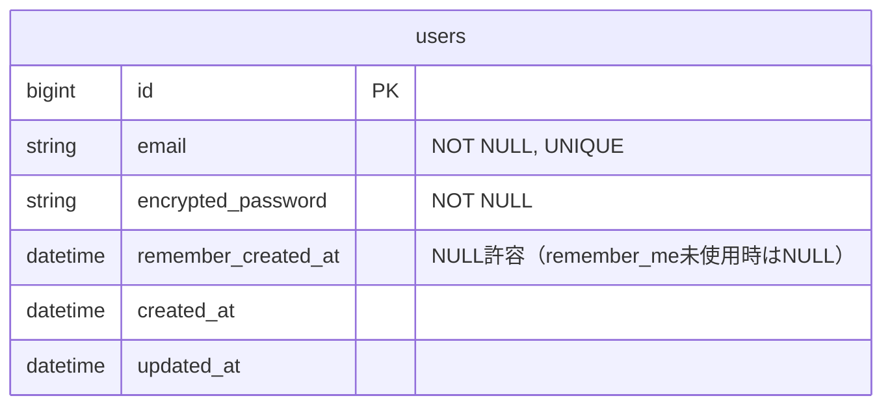
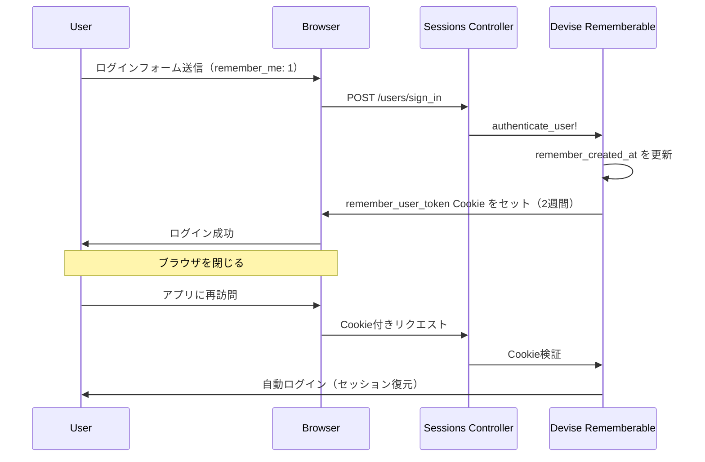

# オートログイン（Remember me）設計書

**日付:** 2026-04-11
**Issue:** #70
**ステータス:** 合意済み

---

## 1. この設計で作るもの

- ログインフォームに「ログイン状態を保持する」チェックボックスを追加
- チェックボックスのシステムspecを追加

## 2. 目的

- 再訪時の自動ログイン復元でUXを向上させる
- Deviseの`rememberable`機能を有効活用する

## 3. スコープ

### 含むもの

- `app/views/devise/sessions/new.html.erb` へのチェックボックス追加
- `spec/system/auth/login_spec.rb` へのspec追加

### 含まないもの

- OAuth（Google/Discord）ログインへの remember me 対応 → Issue #199 で別途対応
- 保持期間のカスタム設定（デフォルト2週間を使用）

## 4. 設計方針

マイグレーション不要・既存設定で機能する最小変更で実装する。

| 観点 | 現在の状態 | 対応 |
|---|---|---|
| `rememberable` モジュール | 有効済み | 不要 |
| `remember_created_at` カラム | 存在済み | 不要 |
| `config.remember_for` | デフォルト2週間（コメントアウト） | そのまま使用 |
| `expire_all_remember_me_on_sign_out` | `true` に設定済み | そのまま（ログアウト時にトークン無効化） |
| ビューのチェックボックス | 未追加 | **追加が必要** |

**採用理由:** Deviseの`rememberable`がすでに完全に設定済みのため、ビューにチェックボックスを追加するだけで機能する。

**admin について:** adminは別ログインフォームを持たず、同じ `/users/sign_in` を使用するため、ビュー変更1箇所で自動対応される。

## 5. データ設計

変更なし（`remember_created_at` カラムは存在済み）。

### ER 図



## 6. 画面・アクセス制御の流れ

### シーケンス図



## 7. アプリケーション設計

**変更ファイル:** `app/views/devise/sessions/new.html.erb` のみ

チェックボックスはパスワードフィールドと「パスワードをお忘れですか？」リンクの間に配置。既存のインラインCSSスタイルに統一する。

```erb
<div style="margin-bottom: 1rem; display: flex; align-items: center; gap: 0.5rem;">
  <%= f.check_box :remember_me, style: "width: 1rem; height: 1rem; accent-color: #3b82f6; cursor: pointer;" %>
  <label style="font-size: 0.875rem; color: #d1d5db; cursor: pointer;">ログイン状態を保持する</label>
</div>
```

**設計意図:** `f.check_box :remember_me` を使うことで Devise が `params[:user][:remember_me]` を自動処理する。ビュー以外は無変更。

## 8. ルーティング設計

変更なし（Devise が `/users/sign_in` を処理）。

## 9. レイアウト / UI 設計

既存フォームのインラインCSSスタイルに統一。Tailwind クラスは使用しない（現行ビューに合わせる）。

配置：パスワードフィールド → **チェックボックス** → 「パスワードをお忘れですか？」リンク → ログインボタン

## 10. クエリ・性能面

- `remember_created_at` の更新は Devise が行う（1クエリ）
- N+1 なし、インデックス追加不要

## 11. トランザクション / Service 分離

**トランザクション:** 不要（Devise が内部で処理）
**Service 分離:** 不要（ビュー変更のみ）

## 12. 実装対象一覧

| # | 対象 | 内容 |
|---|---|---|
| 1 | View | `app/views/devise/sessions/new.html.erb` に `remember_me` チェックボックスを追加 |
| 2 | Spec | `spec/system/auth/login_spec.rb` にチェックボックス表示・Cookie動作のテストを追加 |

## 13. 受入条件

- [ ] ログインフォームに「ログイン状態を保持する」チェックボックスが表示される
- [ ] チェックありでログインすると `remember_user_token` Cookie がセットされる
- [ ] チェックなしでログインすると `remember_user_token` Cookie がセットされない
- [ ] RSpec / RuboCop 全通過

## 14. この設計の結論

Deviseの`rememberable`は設定済みのため、ビューにチェックボックスを追加するだけの最小変更で実現する。
OAuth対応は Issue #199 で別途実施。
