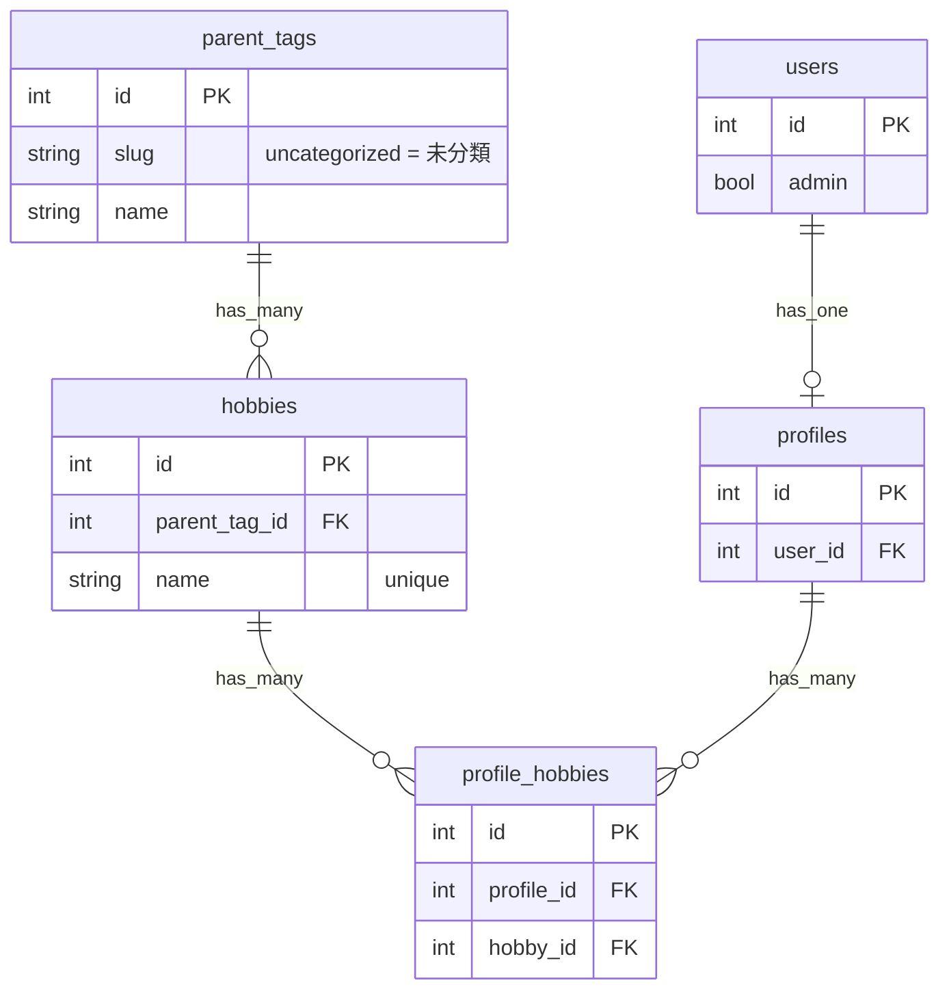
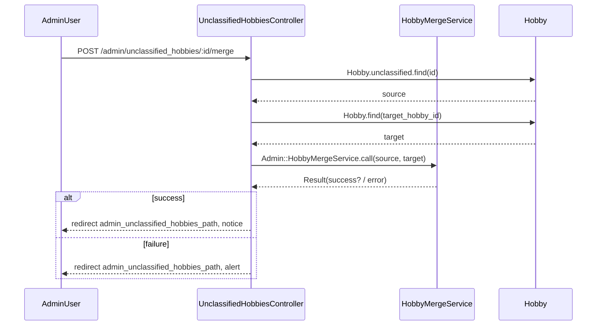

# Admin::UnclassifiedHobbiesController Request spec 追加 設計書

**日付:** 2026-04-12
**Issue:** #TBD
**ステータス:** 合意済み

---

## 1. この設計で作るもの

- `spec/requests/admin/unclassified_hobbies_spec.rb`（新規）
  - `index`・`update`・`merge` の request spec（正常系・異常系・アクセス制御）

## 2. 目的

- 複雑なSQLクエリ（COUNT / GROUP BY / LEFT JOIN）の動作をブラウザなしで高速に検証する
- HTTPステータス・リダイレクト先・DB状態変化を request spec で明示的にカバーする
- system spec では検証しにくい一般ユーザー・未ログインのアクセス制御を確認する

## 3. スコープ

### 含むもの
- `spec/requests/admin/unclassified_hobbies_spec.rb` の新規作成

### 含まないもの
- コントローラ・モデル・サービスの変更（テスト追加のみ）
- system spec の変更

## 4. 設計方針

**system spec との役割分担**

| 観点 | system spec（既存） | request spec（今回） |
|---|---|---|
| UI表示（テキスト・ボタン） | ✅ | — |
| HTTPステータス | — | ✅ |
| リダイレクト先 | 間接的 | ✅ 明示 |
| DB状態変化 | ✅ 一部 | ✅ 全アクション |
| アクセス制御（未ログイン） | — | ✅ |
| 複雑なSQLの集計値 | ✅ 一部 | ✅ 明示 |
| 実行速度 | 低速（Capybara） | 高速 |

**採用理由：request spec を追加** — system spec は UI駆動で遅く、HTTPレベルの検証が弱い。request spec を並存させることで高速・明示的な検証が可能になる。

## 5. データ設計

なし（DB変更不要）

### ER図



## 6. 画面・アクセス制御の流れ

**アクセス判定順序：**
1. `authenticate_user!` → 未ログインは `/users/sign_in` へリダイレクト
2. `require_admin!` → 非管理者は `root_path` へリダイレクト

### シーケンス図（merge）



## 7. アプリケーション設計

**テスト構造**

```ruby
RSpec.describe "Admin::UnclassifiedHobbiesController", type: :request do
  let!(:admin_user)               { create(:user, :admin) }
  let!(:uncategorized_parent_tag) { ParentTag.find_or_create_by!(slug: "uncategorized") { |pt| pt.name = "未分類" } }
  let!(:classified_parent_tag)    { create(:parent_tag) }

  describe "GET /admin/unclassified_hobbies" do
    context "管理者の場合"
      # 200 OK
      # 未分類タグのみ含まれる（分類済みは含まれない）
      # 検索クエリで絞り込まれる
      # usage_count / user_count が集計される
    context "一般ユーザーの場合"  # → root_path へリダイレクト
    context "未ログインの場合"    # → sign_in へリダイレクト

  describe "PATCH /admin/unclassified_hobbies/:id" do
    context "管理者の場合"
      # parent_tag_id が更新される
      # admin_unclassified_hobbies_path へリダイレクト
      # 分類済みhobbyを対象にすると RecordNotFound (404)
    context "一般ユーザーの場合"  # → root_path へリダイレクト

  describe "POST /admin/unclassified_hobbies/:id/merge" do
    context "管理者の場合"
      # profile_hobbies が target に付け替えられる
      # source hobby が削除される
      # admin_unclassified_hobbies_path へリダイレクト
      # source == target のとき alert とともにリダイレクト
    context "一般ユーザーの場合"  # → root_path へリダイレクト
end
```

**設計意図：** `find_or_create_by!` を使う理由は、`Hobby.unclassified` スコープが `ParentTag.where(slug: "uncategorized")` に依存しており、slug が重複するとエラーになるため。

## 8. ルーティング設計

変更なし

## 9. レイアウト / UI 設計

変更なし

## 10. クエリ・性能面

`index` の複雑なSQL（既存コントローラのまま）：

```sql
SELECT hobbies.*,
       COUNT(DISTINCT profile_hobbies.id) AS usage_count,
       COUNT(DISTINCT profile_hobbies.profile_id) AS user_count
FROM hobbies
LEFT JOIN profile_hobbies ON profile_hobbies.hobby_id = hobbies.id
WHERE hobbies.parent_tag_id IN (SELECT id FROM parent_tags WHERE slug = 'uncategorized')
GROUP BY hobbies.id
```

追加インデックス：不要（テスト追加のみ）

## 11. トランザクション / Service 分離

**トランザクション：** 不要（テスト追加のみ。`merge` のトランザクションは既存サービス内で処理済み）
**Service 分離：** 不要

## 12. 実装対象一覧

| # | 対象 | 内容 |
|---|---|---|
| 1 | spec | `spec/requests/admin/unclassified_hobbies_spec.rb` 新規作成 |

## 13. 受入条件

- [ ] 管理者のみアクセスできることを確認（index / update / merge 各アクション）
- [ ] `index` が未分類タグ一覧を返す（200 OK）
- [ ] `index` が検索クエリで絞り込まれたレスポンスを返す
- [ ] `index` が usage_count / user_count を正しく集計して返す
- [ ] `update` 成功時に `parent_tag_id` が更新されリダイレクトされる
- [ ] `update` 対象が分類済みの場合は 404 を返す
- [ ] `merge` 成功時に `profile_hobbies` が付け替えられ source が削除される
- [ ] `merge` 失敗時（source == target）に alert とともにリダイレクトされる
- [ ] RSpec・RuboCop 全通過

## 14. この設計の結論

テスト追加のみ。コントローラ・モデル・DBへの変更ゼロ。system spec の UI検証を補完する形で、request spec で HTTP/DB レベルの検証をカバーする。
