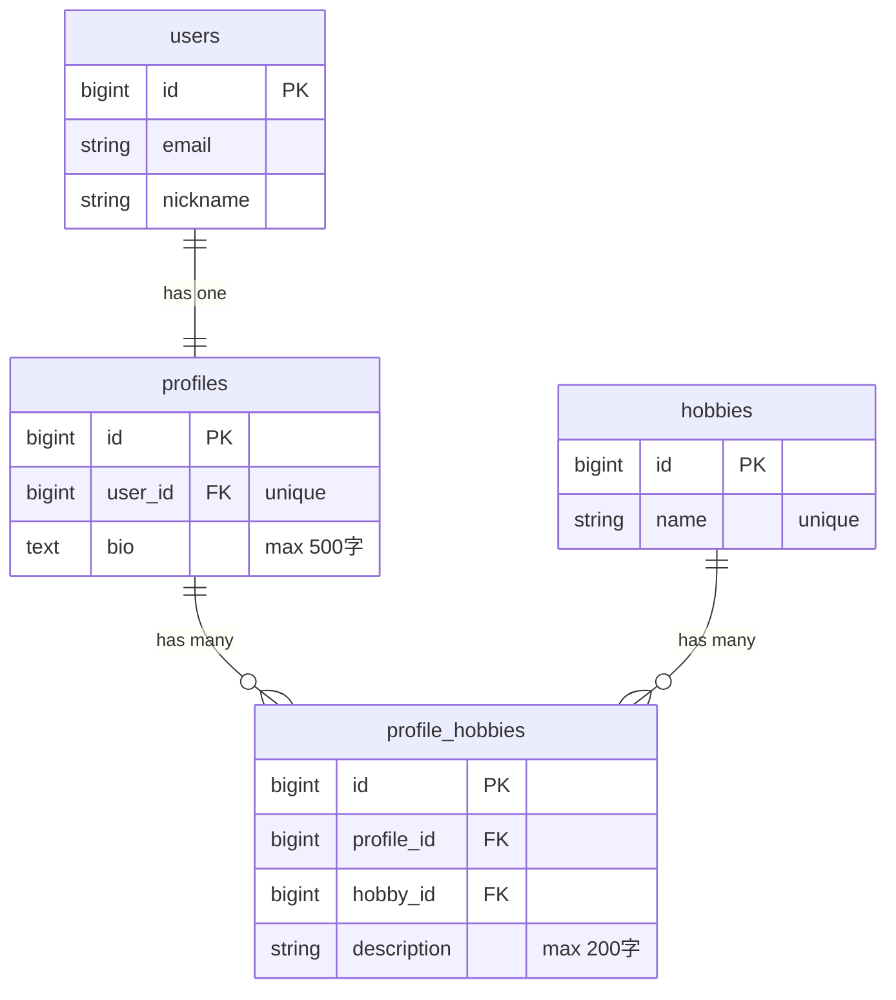
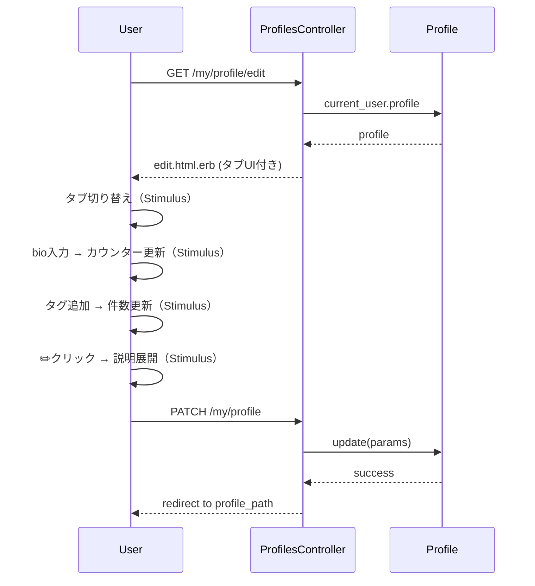

# プロフィール編集UI改善 設計書

**日付:** 2026-04-12
**Issue:** 未採番（/issue で作成予定）
**ステータス:** 合意済み

---

## 1. この設計で作るもの

- `_form.html.erb`：タブ化（ひとこと / タグ）・bio文字数カウンター・タグ件数カウンター・Sticky送信ボタン・Tailwind統一
- `edit.html.erb`：ボタン横並び・削除ボタン折りたたみ・Tailwind統一
- `new.html.erb`：Tailwind統一・ボタン横並び
- Stimulus新規：`char_counter_controller.js`（bio カウンター＋auto-resize）
- Stimulus修正：`tag_description_controller.js`（折りたたみ＋カウンター）
- Stimulus修正：`tag_autocomplete_controller.js`（件数カウンター表示）
- Spec更新：タブ切り替え対応（`profile_tag_autocomplete_spec.rb` / `profile_tag_description_spec.rb`）

## 2. 目的

- 入力フィードバックの充実（カウンター・auto-resize）
- 誤操作防止（削除ボタン格納）
- コード保守性向上（インラインスタイル → Tailwind）

## 3. スコープ

### 含むもの
- `my/profiles` の new / edit / _form ビュー
- 上記3つの Stimulus コントローラ
- 既存 System Spec の更新

### 含まないもの
- `profiles/show` 等の表示系画面（将来対応）
- Controller / Model / DB の変更
- 「自己紹介」ラベルの表示ページへの適用（将来対応）

## 4. 設計方針

### タブ切り替え

| 方式 | 実装コスト | 既存との相性 |
|---|---|---|
| `tabs_controller.js` 再利用 | 低（ゼロ追加） | 既存実装あり、実績あり |
| 新規 Stimulus コントローラ作成 | 中 | 重複になる |

**採用理由：** `tabs_controller.js` が既に存在しており、`panel` / `tab` targets で完結する。

### タグ説明の折りたたみ

`tag_description_controller.js` の `#renderDescriptionInputs` はJSで動的にHTMLを生成しているため、Stimulus の `data-controller` をネストできない。

| 方式 | 実装コスト | 既存との相性 |
|---|---|---|
| `data-action="click->tag-description#onToggle"` で処理 | 低 | コントローラ内で完結 |
| `toggle_controller.js` を動的要素に適用 | 高（JS での動的登録が必要） | 複雑化する |

**採用理由：** 既存の `tag_description_controller.js` に `onToggle` アクションを追加する方式が最もシンプル。

### bio カウンター＋auto-resize

| 方式 | 実装コスト | 再利用性 |
|---|---|---|
| 新規 `char_counter_controller.js` | 低 | 高（将来タグ説明にも適用可能）|
| `_form.html.erb` にインラインJS | 低 | 低（Stimulusの方針に反する）|

**採用理由：** Stimulus に統一する方針のため、新規コントローラを作成。

## 5. データ設計

**変更なし。** UIのみの変更であり、DBスキーマ・モデルへの影響ゼロ。

### ER 図



## 6. 画面・アクセス制御の流れ

変更なし（`My::ProfilesController` のロジックは一切触らない）。



## 7. アプリケーション設計

### 新規：`char_counter_controller.js`

```js
// targets: input（textarea）, display（カウンター表示）
// values: max（上限数）

connect() → 初期カウントを表示 + auto-resize
count()   → input イベントで呼び出し。カウント更新 + auto-resize
```

**設計意図：** bio 1箇所のためだが、将来タグ説明のカウンターにも流用できるよう汎用設計。

### 修正：`tag_autocomplete_controller.js`

```js
// targets に "count" を追加
// #renderChips() 内で countTarget.textContent を更新
// 例: `${this.#chips.length} / ${this.maxValue}件`
```

**設計意図：** チップ追加・削除のたびに `#renderChips()` が呼ばれるため、そこで更新するのが自然。

### 修正：`tag_description_controller.js`

```js
// #renderDescriptionInputs を折りたたみ構造に変更
// 各タグを「[name] ✏️ ボタン」＋「hidden なコンテンツdiv」で構成
// onToggle(event): 対応コンテンツの hidden を toggle
// onDescriptionInput: カウンター表示も同時更新
```

**設計意図：** JS生成HTMLのためStimulus nested controllerが使えず、コントローラ内イベントハンドラで完結させる。

## 8. ルーティング設計

**変更なし。**

## 9. レイアウト / UI 設計

```
┌─────────────────────────────────────────┐
│         プロフィール編集                  │
│       miyaRY777 さんのプロフィール         │
├─────────────────────────────────────────┤
│  [ひとこと（選択中）]  [タグ]              │
├─────────────────────────────────────────┤
│                                         │
│  ■ ひとことパネル（デフォルト表示）        │
│  ひとこと（500字以内）                    │
│  ┌───────────────────────────────┐       │
│  │ インドが好きです…              │       │
│  │ （auto-resize で伸縮）         │       │
│  └───────────────────────────────┘       │
│                         12 / 500字      │
│                                         │
│  ■ タグパネル（hidden）                  │
│  [rails ×] [react ×]       2 / 10件    │
│  ┌───────────────────────────────┐       │
│  │ タグを入力（2文字〜）           │       │
│  └───────────────────────────────┘       │
│  [rails] ✏️    ← クリックで展開           │
│  [react] ✏️                             │
│                                         │
├─────────────────────────────────────────┤
│  [一覧へ戻る]       [更新する]            │  ← sticky
├─────────────────────────────────────────┤
│  ▶ 危険な操作  ← toggle_controller      │
│  （展開すると削除ボタン）                  │
└─────────────────────────────────────────┘
```

**Tailwind クラス方針：**
- 背景：`bg-white/5` / `bg-slate-800`
- ボーダー：`border border-slate-700/60`
- テキスト：`text-white` / `text-gray-400` / `text-blue-400`
- タブ選択中：`bg-gradient-to-br from-blue-600 to-blue-700 text-white`
- Sticky ボタンエリア：`sticky bottom-0 z-10 bg-[#0f172a] pt-3`

## 10. クエリ・性能面

**変更なし。** UIのみの変更であり、クエリ・N+1に影響なし。

## 11. トランザクション / Service 分離

- **トランザクション：不要**（Controller / Model の変更なし）
- **Service 分離：不要**（UIのみ）

## 12. 実装対象一覧

| # | 対象 | 内容 |
|---|---|---|
| 1 | `char_counter_controller.js` | 新規作成（カウンター＋auto-resize） |
| 2 | `tag_autocomplete_controller.js` | `count` target 追加・件数表示 |
| 3 | `tag_description_controller.js` | 折りたたみ構造・カウンター表示・onToggle 追加 |
| 4 | `_form.html.erb` | タブ化・カウンター・Sticky送信ボタン・Tailwind統一 |
| 5 | `edit.html.erb` | ボタン横並び・削除折りたたみ・Tailwind統一 |
| 6 | `new.html.erb` | ボタン横並び・Tailwind統一 |
| 7 | `profile_tag_autocomplete_spec.rb` | タブ切り替え対応（タグ操作前に「タグ」タブへ切り替え） |
| 8 | `profile_tag_description_spec.rb` | タブ切り替え・✏️クリック対応 |

## 13. 受入条件

- [ ] 「ひとこと」「タグ」の2タブで切り替えられる
- [ ] ラベルが「自己紹介」→「ひとこと」に変更されている（フォームのみ）
- [ ] bio にリアルタイム文字数カウンター（x / 500字）が表示される
- [ ] タグエリアにリアルタイム件数カウンター（x / 10件）が表示される
- [ ] タグ説明が `[name] ✏️` クリックで展開する折りたたみ式になる
- [ ] タグ説明にリアルタイム文字数カウンター（x / 200字）が表示される
- [ ] bio テキストエリアが auto-resize する（Stimulus）
- [ ] 「一覧へ戻る」と「更新する/作成する」が横並びで表示される
- [ ] 削除ボタンが折りたたみに格納されている
- [ ] インラインスタイルが Tailwind に統一されている
- [ ] 既存 RSpec が通る

## 14. この設計の結論

**既存 Stimulus コントローラを最大限再利用し、新規は `char_counter_controller.js` 1本のみ追加。UIのみの変更でロジック・DBへの影響ゼロ。**

将来的に「ひとこと」ラベルの表示ページへの反映や、他フォームへのカウンター適用時も `char_counter_controller.js` が再利用できる。
