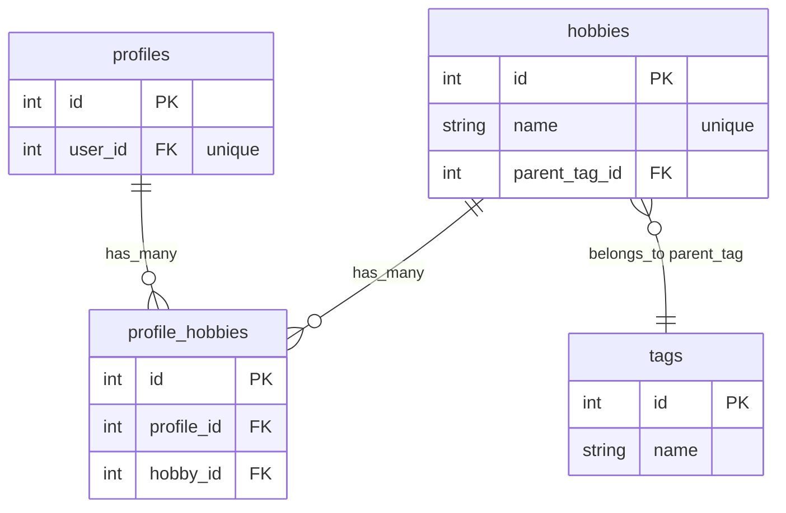
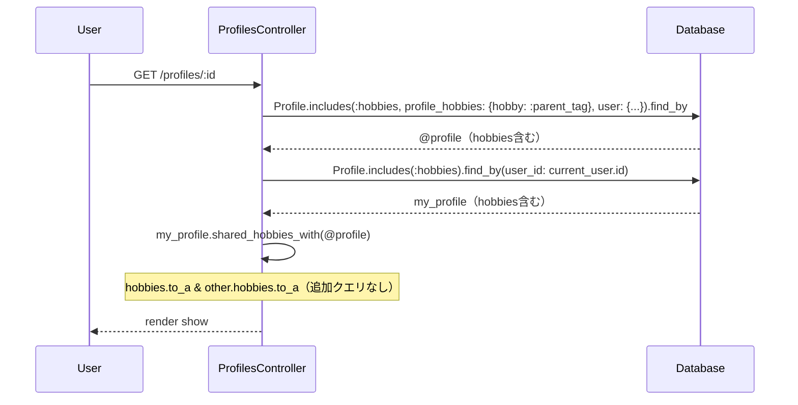

# ProfilesController N+1修正 設計書

**日付:** 2026-04-12
**Issue:** #TBD
**ステータス:** 合意済み

---

## 1. この設計で作るもの

- `ProfilesController#show` で `shared_hobbies_with` を呼ぶ際の余分なクエリを排除する

## 2. 目的

- `hobbies` 関連のN+1クエリを解消し、プロフィール詳細ページのパフォーマンスを改善する

## 3. スコープ

### 含むもの
- `app/controllers/profiles_controller.rb` の `show` アクションへの `includes` 追加

### 含まないもの
- `Profile#shared_hobbies_with` の変更（現状のシンプルな実装を維持）
- マイグレーション・モデル変更

## 4. 設計方針

**問題の所在：2箇所で `hobbies` がeager loadされていない**

```
① @profile の includes に :hobbies がない
   → other_profile.hobbies.to_a でSQLが発行される

② my_profile = current_user.profile で hobbies をロードしていない
   → my_profile.hobbies.to_a でSQLが発行される
```

| 方式 | 実装コスト | 可読性 | 現状との相性 |
|---|---|---|---|
| A: `includes` に `:hobbies` 追加 | 低 | 高 | 既存パターンと統一 |
| B: `shared_hobbies_with` をSQL交差に書き換え | 高 | 中 | モデルの責務が増える |
| C: `Preloader` を手動で呼ぶ | 中 | 低 | 不必要に複雑 |

**採用理由：案A** — 既存の `includes` パターンを踏襲するだけで解決でき、最もシンプル。

## 5. データ設計

なし（DB変更不要）

### ER図



## 6. 画面・アクセス制御の流れ

### シーケンス図



## 7. アプリケーション設計

**修正後の `show` アクション：**

```ruby
def show
  @profile = Profile.includes(
    :hobbies,
    profile_hobbies: { hobby: :parent_tag },
    user: { avatar_attachment: :blob }
  ).find_by(id: params[:id])
  return redirect_to profiles_path, alert: "プロフィールが見つかりません" unless @profile

  @profile_hobby_map = @profile.profile_hobbies.index_by(&:hobby_id)

  my_profile = Profile.includes(:hobbies).find_by(user_id: current_user.id)
  @shared_hobbies = my_profile ? my_profile.shared_hobbies_with(@profile) : []
end
```

**設計意図：**
- `@profile` の includes に `:hobbies` を追加 → `other_profile.hobbies.to_a` が追加クエリを発行しない
- `my_profile` を `Profile.includes(:hobbies).find_by(user_id: current_user.id)` に変更 → `my_profile.hobbies.to_a` が追加クエリを発行しない

## 8. ルーティング設計

変更なし

## 9. レイアウト / UI 設計

変更なし

## 10. クエリ・性能面

**修正前（発行されるSQL）**

```
SELECT profiles ... WHERE id = ?            # @profile
SELECT hobbies ... WHERE profile_id = ?     # other_profile.hobbies ← 余分
SELECT profiles ... WHERE user_id = ?       # my_profile
SELECT hobbies ... WHERE profile_id = ?     # my_profile.hobbies ← 余分
```

**修正後**

```
SELECT profiles + hobbies (includes) WHERE id = ?         # @profile（hobbies込み）
SELECT profiles + hobbies (includes) WHERE user_id = ?    # my_profile（hobbies込み）
```

追加インデックス：不要（既存のFK・indexで対応済み）

## 11. トランザクション / Service 分離

**トランザクション：** 不要（読み取りのみ）
**Service 分離：** 不要（コントローラの includes 調整のみ）

## 12. 実装対象一覧

| # | 対象 | 内容 |
|---|---|---|
| 1 | Controller | `profiles_controller.rb#show` の includes に `:hobbies` を追加、`my_profile` のロード方法変更 |

## 13. 受入条件

- [ ] `show` アクションで `hobbies` のSQLが余分に発行されない
- [ ] `rspec spec/` 全通過
- [ ] `rubocop` 全通過

## 14. この設計の結論

コントローラの `includes` に `:hobbies` を2箇所追加するだけで解決できる。DB・モデル・サービスの変更は不要。
