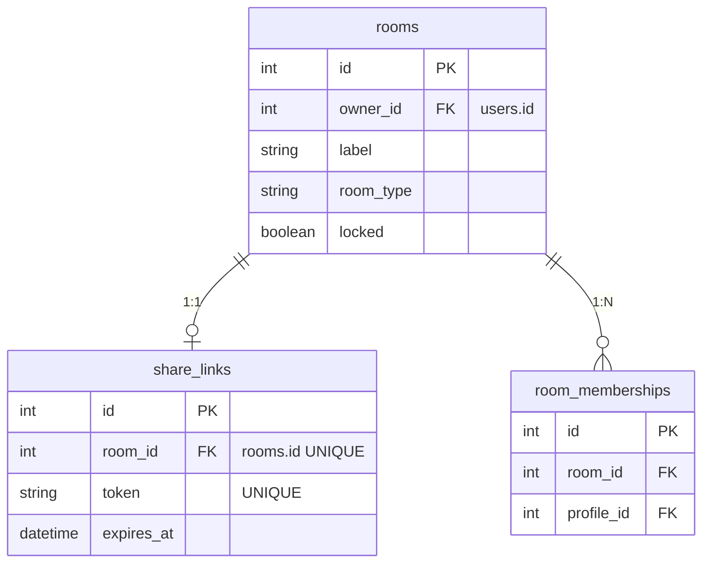
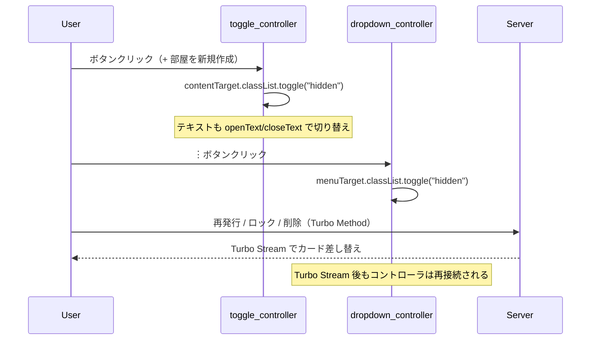

# mypage/rooms UI改善 設計書

**日付:** 2026-04-12
**Issue:** 未採番（/issue で作成予定）
**ステータス:** 合意済み

---

## 1. この設計で作るもの

- `_room.html.erb` のカード構造を改修（バッジ横並び・操作分離・URL下段移動）
- `index.html.erb` の作成フォームを折りたたみ化
- `toggle_controller.js` を新規追加（フォーム開閉）
- `dropdown_controller.js` を新規追加（︙メニュー）

## 2. 目的

1. 操作の視覚的優先度を整理し、誤タップ・誤クリックを減らす
2. 初期表示をすっきりさせ、部屋一覧の視認性を上げる
3. 共有URLの目立ちすぎを解消し、Copyボタン中心のUIにする

## 3. スコープ

### 含むもの
- `_room.html.erb` の全面改修
- `index.html.erb` のフォーム折りたたみ化
- Stimulus `toggle` / `dropdown` コントローラ追加

### 含まないもの
- ロジック・DB・ルーティング変更
- `joined_room` パーシャルへの変更
- モバイル向け特別対応（flex-wrap で自然に折り返す）

## 4. 設計方針

### JS Controller の実装方式

| 方式 | 実装コスト | JS依存 | 現状との相性 |
|---|---|---|---|
| A. Stimulus custom controller | 低（各20行程度） | あり（Stimulus） | 既存コントローラと統一 |
| B. `<details>/<summary>` HTML | 最低（JS不要） | なし | スタイル自由度が低い |
| C. Alpine.js 等の追加 | 高（gem追加） | 新規依存 | 既存と乖離 |

**採用理由:** 案Aを採用。既存の `clipboard` / `tabs` 等と同じパターンで追加でき、スタイル自由度も高い。`<details>` は開閉アニメーションやテキスト切り替えが難しい。

## 5. データ設計

**なし。** マイグレーション不要。

### DB 制約

変更なし。

### ER 図



## 6. 画面・アクセス制御の流れ

### シーケンス図



## 7. アプリケーション設計

### `toggle_controller.js`

```javascript
import { Controller } from "@hotwired/stimulus"

export default class extends Controller {
  static targets = ["content", "openText", "closeText"]

  connect() {
    this.contentTarget.classList.add("hidden")
    this.openTextTarget.classList.remove("hidden")
    this.closeTextTarget.classList.add("hidden")
  }

  toggle() {
    const isHidden = this.contentTarget.classList.toggle("hidden")
    this.openTextTarget.classList.toggle("hidden", !isHidden)
    this.closeTextTarget.classList.toggle("hidden", isHidden)
  }
}
```

### `dropdown_controller.js`

```javascript
import { Controller } from "@hotwired/stimulus"

export default class extends Controller {
  static targets = ["menu"]

  connect() {
    this.boundClose = this.closeOnOutsideClick.bind(this)
    document.addEventListener("click", this.boundClose)
  }

  disconnect() {
    document.removeEventListener("click", this.boundClose)
  }

  toggle(event) {
    event.stopPropagation()
    this.menuTarget.classList.toggle("hidden")
  }

  closeOnOutsideClick(event) {
    if (!this.element.contains(event.target)) {
      this.menuTarget.classList.add("hidden")
    }
  }
}
```

**設計意図:**
- `connect` / `disconnect` でイベントリスナーを管理し、Turbo Stream によるカード差し替え後もメモリリークしない
- `stopPropagation` で ︙ クリック時に `closeOnOutsideClick` が即座に発火するのを防ぐ

## 8. ルーティング設計

**変更なし。**

## 9. レイアウト / UI 設計

### カード構造の変更方針

```
【現状】                   【変更後】
バッジ（縦並び）           部屋名
部屋名                     バッジ横並び（タイプ・公開状態・期限）  ︙
共有URL（全文リンク）       ─────────────────────────
有効期限                   参加人数 / 有効期限
参加人数                   ─────────────────────────
操作（全部同列）           [部屋を見る] [編集]
                           ─────────────────────────
                           共有リンク（省略）    [Copy]
```

### ︙メニューの中身
- 再発行（黄）
- ロックする / 解除する（赤 / 緑）
- 削除（赤）

## 10. クエリ・性能面

**変更なし。** 既存の `room.room_memberships.size` はそのまま維持。N+1確認は Phase 3 REFACTOR 時にサブエージェントで実施。

## 11. トランザクション / Service 分離

**トランザクション:** 不要（ビュー変更のみ）
**Service 分離:** 不要（ビュー変更のみ）

## 12. 実装対象一覧

| # | 対象 | 内容 |
|---|---|---|
| 1 | `_room.html.erb` | カード構造改修（バッジ横並び・操作分離・URL下段） |
| 2 | `index.html.erb` | フォーム折りたたみ化（toggle controller 使用） |
| 3 | `toggle_controller.js` | `rails generate stimulus toggle` で生成・実装 |
| 4 | `dropdown_controller.js` | `rails generate stimulus dropdown` で生成・実装 |
| 5 | `index.js` | `rails generate stimulus` により自動更新（手動編集不要） |

## 13. 受入条件

- [ ] バッジ（タイプ・公開状態・期限有効/切れ）が横並びで表示される
- [ ] 操作が「部屋を見る（主ボタン）」「編集（副ボタン）」「︙メニュー」に分離されている
- [ ] ︙メニューに再発行・ロック/解除・削除が入っている
- [ ] ︙メニューが外クリックで閉じる
- [ ] 共有URLが下段に移動し省略表示・Copyボタン中心になっている
- [ ] 作成フォームが初期非表示で、ボタンクリックで開閉できる
- [ ] 既存Turbo Stream（create / lock / unlock / regenerate / update / destroy）が引き続き動作する

## 14. この設計の結論

ビュー・JS のみの変更。DBもルーティングも触らず、既存Turbo Stream構成を維持したまま実現できる。Stimulus の `toggle` / `dropdown` 追加は既存パターンと統一しており、今後他画面に流用しやすい。
