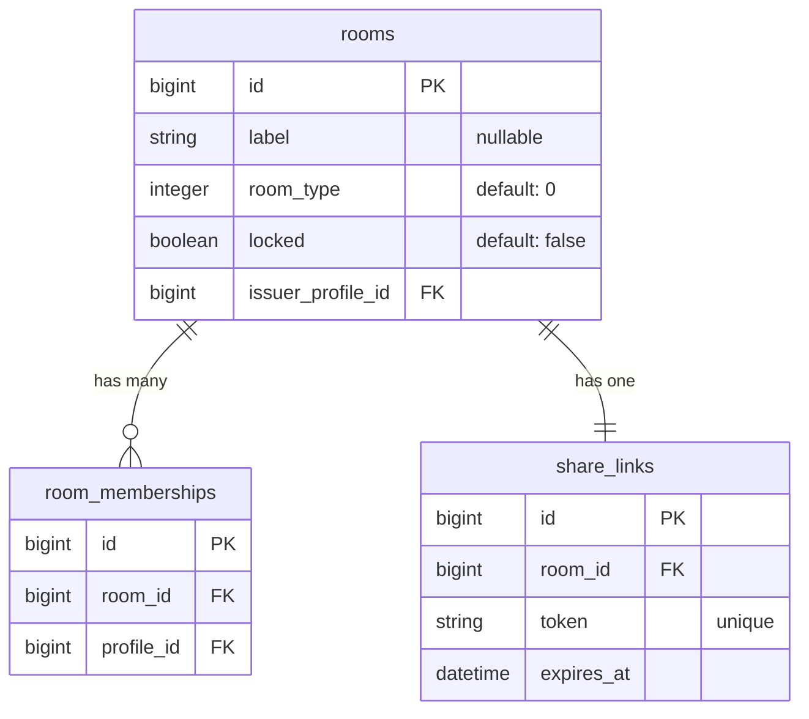
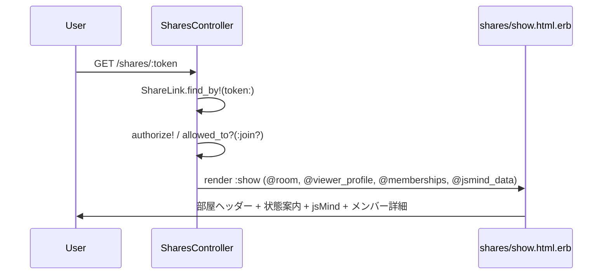

# shares/show UI 改善 設計書

**日付:** 2026-04-12
**Issue:** 未採番
**ステータス:** 合意済み

---

## 1. この設計で作るもの

- `config/locales/ja.yml` を新規作成（`room_type` の日本語ラベル）
- `shares/show.html.erb` を改修
  - 最外枠（大枠ラッパー）の追加
  - 部屋ヘッダー（部屋名・room_typeバッジ・ロック状態バッジ・参加人数）
  - 状態案内（ロック有無で分岐）
  - マインドマップ枠に「更新」ボタン
  - プロフィール未登録警告を大枠内に組み込む

## 2. 目的

- 共有画面に必要な情報（部屋の種別・状態・参加人数）を明示し、ユーザーが状況を把握しやすくする
- マインドマップ更新の導線を追加し、UX を改善する

## 3. スコープ

### 含むもの

- `app/views/shares/show.html.erb` の改修
- `config/locales/ja.yml` の新規作成（`room_type` ラベルのみ）

### 含まないもの

- 右ペイン（`turbo-frame#member_detail`）は変更しない
- `jsmind_map.js` は変更しない
- コントローラ・モデル・DB は変更しない

## 4. 設計方針

**更新ボタンの実装方法**

| 方式 | 実装コスト | 動作 | Turboとの相性 |
|---|---|---|---|
| `<a href="..." data-turbo="false">` | 低 | フルリロード | ◎（意図的に回避） |
| `<button onclick="location.reload()">` | 低 | フルリロード | △（インラインJS） |
| Stimulus コントローラ | 中 | フルリロード | ○ |

**採用理由:** `data-turbo="false"` 付きリンクが最もシンプルで Rails の流儀に合う。jsMind は全体再描画が必要なのでフルリロードが正解。

**I18n の方式:** 既存の `config/locales/en.yml` と同じ構造で `ja.yml` を新規作成。将来の多言語化・enum 拡張に対応できる。

## 5. データ設計

変更なし（マイグレーション不要）

### ER 図



## 6. 画面・アクセス制御の流れ



## 7. アプリケーション設計

コントローラは変更なし。ビューのみで以下を表現する。

```erb
<%# 部屋ヘッダー例 %>
<h1><%= @room.label.presence || "名無しの部屋" %></h1>
<span><%= t("activerecord.attributes.room.room_types.#{@room.room_type}") %></span>
<span><%= @room.locked? ? "ロック中" : "公開中" %></span>
<span>参加 <%= @memberships.size %>人</span>

<%# 状態案内（分岐） %>
<% if @room.locked? %>
  この部屋は現在ロック中です。
<% else %>
  この部屋は公開中です。気になるメンバーを選んでください。
<% end %>

<%# 更新ボタン（フルリロード） %>
<%= link_to "更新", request.fullpath, data: { turbo: false }, class: "..." %>
```

## 8. ルーティング設計

変更なし

## 9. レイアウト / UI 設計

デザイン方針（ダーク系リッチなテーマ）に沿ったTailwindクラスを使用。

```
╔══ 最外枠（max-w-7xl mx-auto px-4 py-8） ════════════════════╗
║  ┌── 部屋ヘッダー（bg-gray-800 rounded-xl p-6） ──────────┐  ║
║  │  部屋名 h1                                              │  ║
║  │  [勉強] [公開中]  参加 8人                              │  ║
║  └─────────────────────────────────────────────────────────┘  ║
║                                                               ║
║  ┌── 状態案内（bg-gray-700/50 rounded-lg p-4） ───────────┐  ║
║  │  この部屋は公開中です。…                                │  ║
║  └─────────────────────────────────────────────────────────┘  ║
║                                                               ║
║  ┌── 左ペイン（58%） ─────────┬── 右ペイン（42%） ───────┐  ║
║  │  共通点マップ  [更新]       │  メンバー詳細             │  ║
║  │  jsMind                    │  （現状維持）              │  ║
║  └────────────────────────────┴────────────────────────────┘  ║
╚═══════════════════════════════════════════════════════════════╝
```

## 10. クエリ・性能面

- `@memberships` は既に `includes` 済みのため N+1 なし
- 参加人数表示は `@memberships.size`（SQL を再発行しない）を使用

## 11. トランザクション / Service 分離

**トランザクション:** 不要（ビュー変更のみ）
**Service 分離:** 不要（ビュー変更のみ）

## 12. 実装対象一覧

| # | 対象 | 内容 |
|---|---|---|
| 1 | `config/locales/ja.yml` | 新規作成。`room_type` の日本語ラベル（chat/study/game） |
| 2 | `app/views/shares/show.html.erb` | 大枠・部屋ヘッダー・状態案内・更新ボタンを追加 |

## 13. 受入条件

- [ ] 部屋名・room_type（日本語バッジ）・ロック状態・参加人数が表示される
- [ ] 状態案内がロック有無で分岐表示される
- [ ] マインドマップ枠に「更新」ボタンがあり、押すとフルリロードされる
- [ ] プロフィール未登録の場合は警告が表示される
- [ ] 右ペイン（メンバー詳細）は変更なし
- [ ] `rubocop` が通る

## 14. この設計の結論

**ビュー2ファイルのみの変更。DB・コントローラ・JS には触れない。** I18n を通じた `room_type` 日本語表示により、将来の enum 追加にも対応できる。
