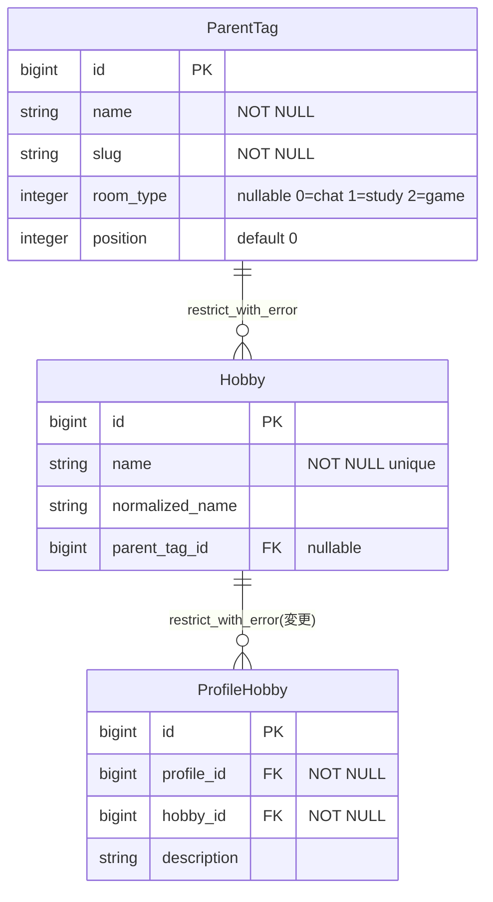
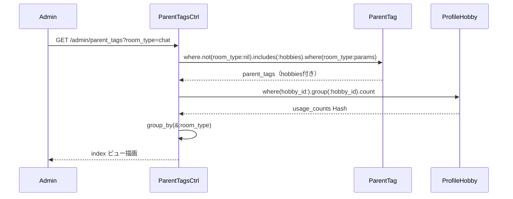
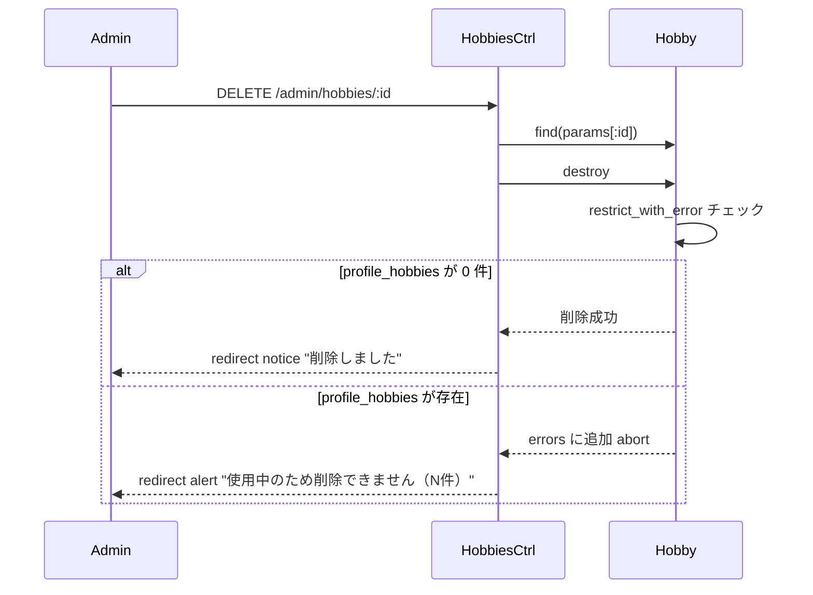

# 管理画面 親タグ管理機能 設計書

**日付:** 2026-04-13
**Issue:** #197
**ステータス:** 合意済み

---

## 1. この設計で作るもの

- `Admin::ParentTagsController`（index/new/create/edit/update/destroy）
- `Admin::HobbiesController`（new/create/edit/update/destroy）
- 対応ビュー（一覧・新規作成・編集）
- ルーティング追加
- 管理ナビリンク追加
- `Hobby` モデルの `dependent` 変更（`:destroy` → `:restrict_with_error`）

---

## 2. 目的

- 管理者が親タグ・子タグの構成を一覧で把握・編集できる
- 使用中の子タグを誤って削除しない仕組みをモデルレベルで保証する

---

## 3. スコープ

### 含むもの

- `/admin/parent_tags` 一覧（room_type セクション分け、フィルター付き）
- 親タグ・子タグの CRUD
- 使用中子タグの削除ガード

### 含まないもの

- 「未分類」parent_tag（slug="uncategorized", room_type=nil）→ 一覧から除外（既存の未分類タグ管理画面で管理）
- 子タグの並び替え（position 管理）→ 将来対応
- フィルターの Turbo Frame 化 → 後で対応可能な設計にしておく

---

## 4. 設計方針

### Hobby モデルの `dependent` 変更について

| 方式 | 安全性 | 影響範囲 |
|------|--------|---------|
| Controller でチェック | 漏れる可能性あり | Controller のみ |
| **モデルで `restrict_with_error`（採用）** | DB レベルで保証 | アプリ全体 |

**採用理由:** `HobbyMergeService` は destroy 前に `update_all(hobby_id: target.id)` で profile_hobbies を再割当てするため、destroy 時点で 0 件が保証される。モデルレベルの制約が安全。

---

## 5. データ設計

**マイグレーション:** なし（既存テーブル・制約をそのまま活用）

**モデル変更:**

```ruby
# Hobby モデル（変更箇所のみ）
has_many :profile_hobbies, dependent: :restrict_with_error  # :destroy → 変更
```

### DB 制約

| カラム | 制約 | 理由 |
|--------|------|------|
| parent_tags.slug | UNIQUE (room_type, slug) | 既存 DB 制約を活用 |
| hobbies.name | UNIQUE | 既存 DB 制約を活用 |
| parent_tags → hobbies | restrict_with_error | 子タグがある親タグを削除不可 |
| hobbies → profile_hobbies | restrict_with_error（変更） | 使用中子タグを削除不可 |

### ER 図



---

## 6. 画面・アクセス制御の流れ

### シーケンス図（index）



### シーケンス図（Hobby destroy）



---

## 7. アプリケーション設計

**Service 分離:** 不要（各操作は単一モデル、トランザクション不要）

### Admin::ParentTagsController

```ruby
def index
  scope = ParentTag.where.not(room_type: nil)
                   .includes(:hobbies)
                   .order(:room_type, :position)
  scope = scope.where(room_type: params[:room_type])   if params[:room_type].present?
  scope = scope.where(id: params[:parent_tag_id])       if params[:parent_tag_id].present?
  parent_tags = scope.to_a

  hobby_ids                 = parent_tags.flat_map { |pt| pt.hobbies.map(&:id) }
  @usage_counts             = ProfileHobby.where(hobby_id: hobby_ids).group(:hobby_id).count
  @parent_tags_by_room_type = parent_tags.group_by(&:room_type)
  @all_parent_tags          = ParentTag.where.not(room_type: nil).order(:room_type, :position)
end
```

### Admin::HobbiesController#destroy

```ruby
def destroy
  @hobby = Hobby.find(params[:id])
  if @hobby.destroy
    redirect_to admin_parent_tags_path, notice: "削除しました"
  else
    redirect_to admin_parent_tags_path,
      alert: "使用中のため削除できません（#{@hobby.profile_hobbies.count}件が使用中）"
  end
end
```

---

## 8. ルーティング設計

```ruby
namespace :admin do
  root "dashboards#show"
  resources :parent_tags, only: %i[index new create edit update destroy]
  resources :hobbies,     only: %i[new create edit update destroy]
  resources :unclassified_hobbies, only: [:index, :update] do
    member { post :merge }
  end
end
```

---

## 9. レイアウト / UI 設計

```
/admin/parent_tags  （一覧：モックアップ通り）

┌ フィルター ─────────────────────────────────┐
│ 部屋タイプ ▼   親タグ ▼   [検索] [リセット]  │
└─────────────────────────────────────────────┘

🗨 chat                        ＋親タグ作成  ＋子タグ作成
┌ 親タグ ──┬ 子タグ ──────┬ 操作 ────────┐
│ アニメ   │ 進撃の巨人  │ 編集  削除   │
│ アニメ   │ ワンピース  │ 編集  削除   │
│ ゲーム   │ Apex        │ 編集  削除   │
└──────────┴─────────────┴──────────────┘

🎓 study                       ＋親タグ作成  ＋子タグ作成
...

🎮 game                        ＋親タグ作成  ＋子タグ作成
...
```

- 既存管理画面（`admin.html.erb`）のスタイル（ダーク系テーブル）に合わせる
- `＋親タグ作成` → `/admin/parent_tags/new?room_type=chat`（room_type を pre-select）
- `＋子タグ作成` → `/admin/hobbies/new?parent_tag_id=1`（親タグを pre-select）

---

## 10. クエリ・性能面

| クエリ | 件数 | 対策 |
|--------|------|------|
| parent_tags + hobbies | includes で 2 クエリ | ✅ |
| profile_hobbies 使用数 | group count で 1 クエリ | ✅ |
| フィルター用 all_parent_tags | 1 クエリ | 許容範囲 |

**合計: 最大 4 クエリ（N+1 なし）**

---

## 11. トランザクション / Service 分離

**トランザクション:** 不要（各操作は単一モデル）
**Service 分離:** 不要

---

## 12. 実装対象一覧

| # | 対象 | 内容 |
|---|------|------|
| 1 | Model | `Hobby#profile_hobbies` の `dependent` を `:restrict_with_error` に変更 |
| 2 | Controller | `Admin::ParentTagsController` 新規作成（index/new/create/edit/update/destroy） |
| 3 | Controller | `Admin::HobbiesController` 新規作成（new/create/edit/update/destroy） |
| 4 | View | `admin/parent_tags/index.html.erb`（フィルター + room_type セクション + テーブル） |
| 5 | View | `admin/parent_tags/new.html.erb` / `_form.html.erb` |
| 6 | View | `admin/parent_tags/edit.html.erb` |
| 7 | View | `admin/hobbies/new.html.erb` / `_form.html.erb` |
| 8 | View | `admin/hobbies/edit.html.erb` |
| 9 | Routes | `resources :parent_tags` / `resources :hobbies` を admin namespace に追加 |
| 10 | Layout | `admin.html.erb` に「親タグ管理」ナビリンク追加 |

---

## 13. 受入条件

- [ ] フィルター（部屋タイプ・親タグ）で絞り込める
- [ ] chat / study / game のセクションに分けて表示される
- [ ] 各セクションに「＋親タグ作成」「＋子タグ作成」ボタンがある
- [ ] テーブルに「親タグ｜子タグ｜操作（編集・削除）」が表示される
- [ ] 親タグのCRUDができる（name/slug/room_type を手動入力）
- [ ] 子タグのCRUDができる
- [ ] 使用中の子タグ（profile_hobbies あり）は削除できない（件数をエラー表示）
- [ ] 管理ナビに「親タグ管理」リンクが追加される

---

## 14. この設計の結論

マイグレーション不要・Service不要・既存制約を最大活用する設計。`Hobby#dependent` をモデルレベルで変更し、アプリ全体で一貫した削除ガードを実現する。Turbo Frame 化は後から数行の変更で対応できる構造にしてある。
