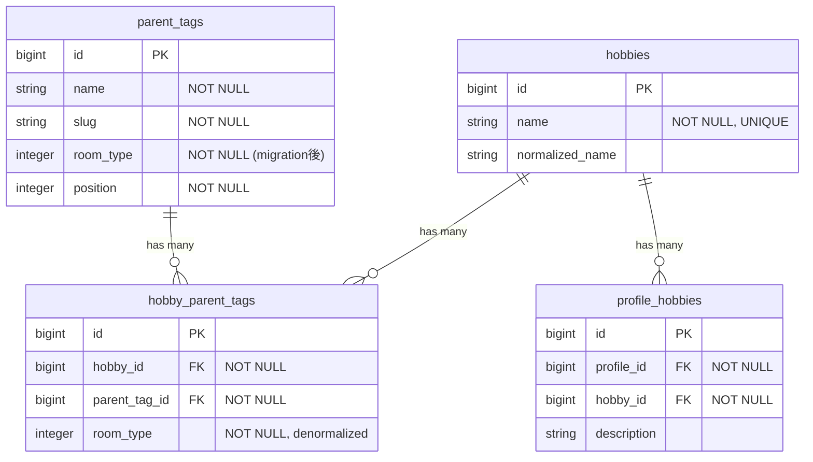
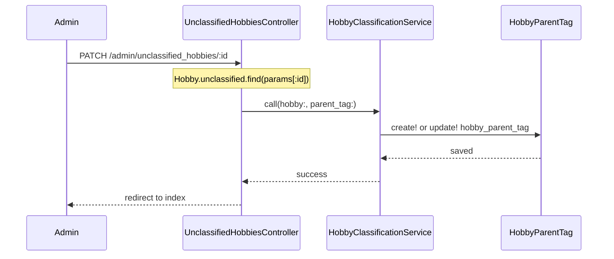
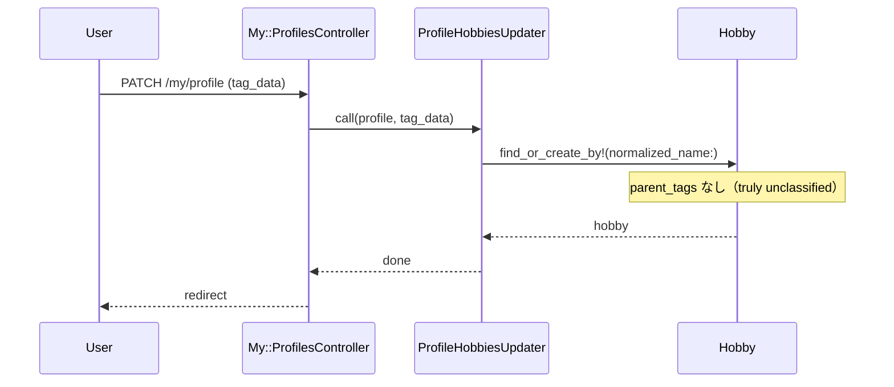

# Hobby × ParentTag 多対多リファクタ 設計書

**日付:** 2026-04-14
**Issue:** 未採番（/issue で作成予定）
**ステータス:** 合意済み

---

## 1. この設計で作るもの

- `hobby_parent_tags` 中間テーブル（room_type を denormalize して DB 制約を実現）
- room_type ごとの uncategorized 親タグ 3 件（chat / study / game）
- `HobbyParentTag` モデル
- `Admin::HobbyClassificationService`（分類操作の Service 化）
- 既存全ファイルの association / includes 更新
- データ移行 migration

## 2. 目的

1. 同じ Hobby（例: Apex）を複数 room_type の ParentTag に紐付けられるようにする
2. Hobby レコードの重複を防ぐ（趣味の辞書は 1 件のまま保つ）
3. 「同一 room_type 内は 1 hobby = 1 parent_tag」を DB 制約で保証する

## 3. スコープ

### 含むもの

- DB: `hobby_parent_tags` テーブル追加、データ移行、`hobbies.parent_tag_id` 削除
- Model: `Hobby`・`ParentTag` の association 変更、`HobbyParentTag` 新規作成
- Service: `ProfileHobbiesUpdater`・`JsmindDataBuilder` 更新、`Admin::HobbyClassificationService` 新規作成
- Controller: admin/hobbies, admin/unclassified_hobbies, rooms/members, profiles, shares, profile_search_query の includes / params 更新
- View: admin/hobbies フォームを room_type ごとの複数セレクトに変更
- Spec: モデル・リクエスト・システム spec の全面更新

### 含まないもの

- mindmap の UI 表示変更（JsmindDataBuilder のロジック変更のみ）
- 既存の parent_tags CRUD（slug / name / position の編集機能は変更なし）

## 4. 設計方針

**中間テーブルに `room_type` を denormalize する**

| 方式 | DB 制約 | 実装コスト | リスク |
|---|---|---|---|
| A: denormalize (採用) | unique(hobby_id, room_type) で保証 | 中（sync 必要） | room_type 変更時は cascade 更新が必要 |
| B: application 検証のみ | なし | 低 | テストをすり抜けると不整合 |
| C: DB trigger | 完全に DB 側で保証 | 高 | Rails 移行管理外 |

**採用理由:** design.md に「重要な整合性は必ず DB で保証」とある。`parent_tags.room_type` は運用上変更されることがほぼなく、denormalize の stale リスクは低い。A 案を採用する。

**「未分類」の定義変更**

| | 旧設計 | 新設計 |
|---|---|---|
| 定義 | `parent_tags.slug = "uncategorized", room_type: nil` の 1 件 | `hobby_parent_tags` レコードが存在しない状態 |
| ProfileHobbiesUpdater の新規 hobby | uncategorized parent_tag に紐付け | 何も紐付けない（truly unclassified） |
| 管理画面での「未分類」 | uncategorized parent_tag を持つ hobby | hobby_parent_tags レコードが 0 件の hobby |
| uncategorized parent_tag の役割 | 自動紐付けの仮置き場 | 管理者が「room_type は確定したが sub_tag が未決定」と明示する際の staging 用 |

3 件の uncategorized parent_tags（chat/study/game）は管理者が明示的に使う場合のみ。ProfileHobbiesUpdater は一切使わない。

## 5. データ設計

### 新テーブル: `hobby_parent_tags`

| カラム | 型 | 制約 | 理由 |
|---|---|---|---|
| hobby_id | bigint | NOT NULL, FK → hobbies | 中間テーブルの必須 FK |
| parent_tag_id | bigint | NOT NULL, FK → parent_tags | 中間テーブルの必須 FK |
| room_type | integer | NOT NULL | denormalize; DB 制約のため |
| created_at / updated_at | datetime | NOT NULL | 標準 |

### インデックス

| インデックス | 種別 | 目的 |
|---|---|---|
| (hobby_id, parent_tag_id) | UNIQUE | 同じ (hobby, parent_tag) の重複防止 |
| (hobby_id, room_type) | UNIQUE | 1 hobby = 1 parent_tag per room_type を DB で保証 |

### 既存テーブルの変更

| テーブル | 変更 |
|---|---|
| hobbies | `parent_tag_id` カラム・FK を削除 |
| parent_tags | uncategorized（room_type: nil）を削除し、3 件（chat/study/game）を追加 |

### ER 図



## 6. 画面・アクセス制御の流れ

認可ロジックに変更なし。

### シーケンス図: 未分類 hobby を分類する



### シーケンス図: ProfileHobbiesUpdater（自動生成 hobby）



## 7. アプリケーション設計

### HobbyParentTag モデル（新規）

```ruby
class HobbyParentTag < ApplicationRecord
  belongs_to :hobby
  belongs_to :parent_tag

  enum :room_type, { chat: 0, study: 1, game: 2 }

  validates :hobby_id, uniqueness: { scope: :room_type }
  validates :parent_tag_id, uniqueness: { scope: :hobby_id }

  before_validation :sync_room_type

  private

  def sync_room_type
    self.room_type = parent_tag.room_type if parent_tag.present? && room_type.blank?
  end
end
```

**設計意図:** `sync_room_type` で parent_tag から room_type を自動セットし、呼び出し側で room_type を意識させない。バリデーションで DB 制約の二重保証。

### Hobby モデル

```ruby
class Hobby < ApplicationRecord
  has_many :hobby_parent_tags, dependent: :destroy
  has_many :parent_tags, through: :hobby_parent_tags

  # 未分類 = hobby_parent_tags レコードが存在しない
  scope :unclassified, -> {
    left_joins(:hobby_parent_tags).where(hobby_parent_tags: { id: nil })
  }
end
```

### ParentTag モデル

```ruby
class ParentTag < ApplicationRecord
  has_many :hobby_parent_tags, dependent: :restrict_with_error
  has_many :hobbies, through: :hobby_parent_tags
end
```

### ProfileHobbiesUpdater

- `uncategorized = ParentTag.find_by!(slug: "uncategorized", room_type: nil)` の行を削除
- `h.parent_tag_id = uncategorized.id` の行を削除
- 新規 Hobby はそのまま parent_tags なしで作成

### JsmindDataBuilder

`profiles_by_parent_tag_id` を以下に変更:

```ruby
def profiles_by_parent_tag_id
  @profiles_by_parent_tag_id ||=
    all_profiles.each_with_object(Hash.new { |h, k| h[k] = [] }) do |profile, hash|
      profile.profile_hobbies.each do |ph|
        ph.hobby.hobby_parent_tags.each do |hpt|
          hash[hpt.parent_tag_id] << profile
        end
      end
    end
end
```

includes を `profile_hobbies: { hobby: :hobby_parent_tags }` に変更（SharesController）。

**設計意図:** `matching_parent_tags` が room_type でフィルタ済みなので、hash 側は全 hobby_parent_tags を入れておけばよい。

### Admin::HobbyClassificationService（新規）

```ruby
class Admin::HobbyClassificationService
  def self.call(hobby:, parent_tag:)
    ApplicationRecord.transaction do
      hpt = hobby.hobby_parent_tags.find_by(room_type: parent_tag.room_type)
      if hpt
        hpt.update!(parent_tag:)
      else
        hobby.hobby_parent_tags.create!(parent_tag:)
      end
    end
  end
end
```

**設計意図:** `Admin::HobbiesController` と `Admin::UnclassifiedHobbiesController` の両方から呼び出せる共通 Service。2 モデル + トランザクションなので design.md の Service 分離ポリシーに準拠。

### Admin::HobbiesController

- `hobby_params` を `permit(:name, :chat_parent_tag_id, :study_parent_tag_id, :game_parent_tag_id)` に変更
- create/update 時に各 room_type の parent_tag_id があれば `HobbyClassificationService` を呼び出す
- フォームは room_type ごとに 3 つのセレクトボックスを表示

### Admin::UnclassifiedHobbiesController

```ruby
def update
  @hobby = Hobby.unclassified.find(params[:id])
  parent_tag = ParentTag.find(params[:parent_tag_id])
  Admin::HobbyClassificationService.call(hobby: @hobby, parent_tag:)
  redirect_to admin_unclassified_hobbies_path, notice: "分類しました"
rescue ActiveRecord::RecordNotFound, ActiveRecord::RecordInvalid
  redirect_to admin_unclassified_hobbies_path, alert: "分類に失敗しました"
end
```

### Rooms::MembersController

```ruby
# includes を変更
@profile = Profile.includes(:user, profile_hobbies: { hobby: :hobby_parent_tags }).find(params[:id])

# フィルタを変更
@room_related_phs = @profile.profile_hobbies.select do |ph|
  ph.hobby.hobby_parent_tags.any? { |hpt| hpt.room_type == @room.room_type }
end
```

## 8. ルーティング設計

変更なし。

## 9. レイアウト / UI 設計

admin/hobbies フォームを room_type 別の 3 セレクトに変更:

```
名前: [text field]
チャット親タグ: [select: (なし) | チャット系parent_tags...]
スタディ親タグ: [select: (なし) | スタディ系parent_tags...]
ゲーム親タグ:  [select: (なし) | ゲーム系parent_tags...]
```

既存の `?parent_tag_id=X` クエリ対応も維持（初期選択を該当 room_type のセレクトに入れる）。

## 10. クエリ・性能面

| クエリ | N+1 対策 |
|---|---|
| JsmindDataBuilder | `profile_hobbies: { hobby: :hobby_parent_tags }` で preload 済み |
| Rooms::MembersController | 同上（includes で eager load） |
| ProfilesController / SharesController | `profile_hobbies: { hobby: :hobby_parent_tags }` に変更 |
| Admin::UnclassifiedHobbiesController#index | 変更なし（`left_joins` + `group` クエリ） |

追加インデックス: `(hobby_id, room_type)` UNIQUE / `(hobby_id, parent_tag_id)` UNIQUE は上記の通り。

## 11. トランザクション / Service 分離

**トランザクション:** 必要。`HobbyClassificationService` 内で `Hobby` + `HobbyParentTag` を跨ぐ更新あり。`ProfileHobbiesUpdater` の既存トランザクションは維持。

**Service 分離:** 要。`Admin::HobbyClassificationService`（新規）。`ProfileHobbiesUpdater` は引き続き Service として維持。

**設計意図:** Controller から 2 モデル跨ぎ操作を排除し、テスト容易性を確保する（design.md 準拠）。

## 12. 実装対象一覧

| # | 対象 | 内容 |
|---|---|---|
| 1 | Migration 1 | `create_hobby_parent_tags` テーブル作成 + データ移行 + uncategorized 3 件追加 + 旧 uncategorized 削除 |
| 2 | Migration 2 | `hobbies.parent_tag_id` カラム・FK 削除 |
| 3 | HobbyParentTag | 新規モデル |
| 4 | Hobby | association 変更、`unclassified` scope 変更 |
| 5 | ParentTag | association 変更 |
| 6 | ProfileHobbiesUpdater | uncategorized 参照を削除 |
| 7 | JsmindDataBuilder | `profiles_by_parent_tag_id` 書き換え |
| 8 | Admin::HobbyClassificationService | 新規 Service |
| 9 | Admin::HobbiesController | params / create / update 変更 |
| 10 | Admin::UnclassifiedHobbiesController | `update` アクション変更、`Hobby.unclassified` スコープ反映 |
| 11 | Rooms::MembersController | includes / filter 変更 |
| 12 | ProfilesController | includes 変更 |
| 13 | SharesController | includes 変更 |
| 14 | ProfileSearchQuery | includes 変更 |
| 15 | admin/hobbies/_form.html.erb | 3 セレクトに変更 |
| 16 | spec/models/hobby_spec.rb | association / scope 更新 |
| 17 | spec/requests/admin/hobbies_spec.rb | params 更新 |
| 18 | spec/requests/admin/unclassified_hobbies_spec.rb | unclassified の定義変更に対応 |
| 19 | spec/system/admin/unclassified_hobbies_spec.rb | 同上 |
| 20 | spec/factories/hobbies.rb | parent_tag 参照を削除 |

## 13. 受入条件

- [ ] Apex 1 件が chat > ゲーム AND game > 対戦ゲームの両方に紐付けられる
- [ ] 同一 room_type への二重分類は DB エラーで拒否される
- [ ] 既存データが migration 後に正しく hobby_parent_tags に移行されている
- [ ] ProfileHobbiesUpdater で作った新規 hobby が未分類管理に表示される
- [ ] 管理画面から hobby を分類すると未分類管理から消える
- [ ] JsmindDataBuilder が正しい room_type のツリーを生成する
- [ ] RSpec 全通過 / RuboCop 全通過

## 14. この設計の結論

「Hobby は共通辞書」「ParentTag は room_type 別の文脈」として分離し、`hobby_parent_tags` 中間テーブルで多対多を実現する。`room_type` の denormalize により DB レベルの制約を維持する。`ProfileHobbiesUpdater` の新規 hobby は parent_tags を持たず（真の未分類）、管理者が明示的に分類する運用に変更する。

将来の拡張（room_type 追加など）は `ParentTag.enum` と uncategorized の追加 migration のみで対応可能。
