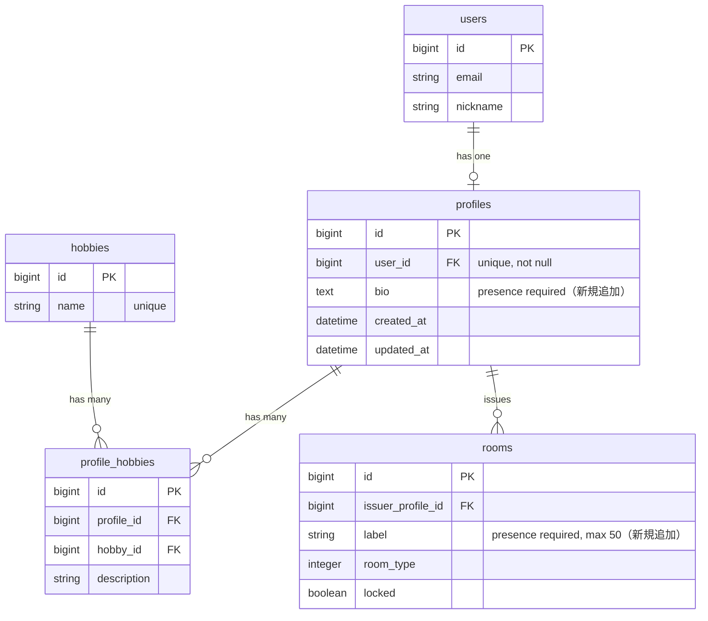
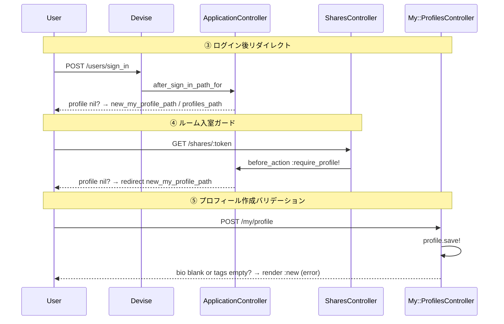

# UX改善・バリデーション追加・プロフィールガード実装 設計書

**日付:** 2026-04-14
**Issue:** #224
**ステータス:** 合意済み

---

## 1. この設計で作るもの

| # | 変更内容 | 対象ファイル |
|---|---|---|
| 1 | ログアウト確認ダイアログ | `app/views/shared/_navbar.html.erb` |
| 2 | TOPページ スクロール誘導↓アニメーション | `app/views/home/_hero.html.erb` |
| 3 | ログイン後・プロフィール未作成なら作成ページへリダイレクト | `app/controllers/application_controller.rb` |
| 4 | ShareLinkアクセス時のプロフィール未作成ガード | `app/controllers/shares_controller.rb` |
| 5 | プロフィール作成・編集バリデーション（bio必須・タグ1個以上） | `app/models/profile.rb` |
| 6 | 既存プロフィール不足時のバナー警告 | `app/controllers/application_controller.rb` |
| 7 | 部屋作成バリデーション（部屋名必須・50文字以内） | `app/models/room.rb` |

---

## 2. 目的

- プロフィール未作成ユーザーの迷子を防ぐ（ガード＋リダイレクト）
- 不完全なプロフィール・部屋データの登録を防ぐ（バリデーション）
- 誤ログアウト防止・TOPページのコンテンツ発見性向上（UX改善）

---

## 3. スコープ

### 含むもの
- ログアウト確認ダイアログ（turbo_confirm）
- TOPページ スクロール誘導↓アニメーション
- ログイン後プロフィール未作成リダイレクト
- シェアリンクアクセス時プロフィール未作成ガード
- プロフィール作成・編集バリデーション（bio必須・タグ1個以上）
- 既存プロフィール不足時のバナー警告
- 部屋作成バリデーション（部屋名必須・50文字以内）

### 含まないもの
- rooms/members_controller の 403 エラーのUX改善（別Issue）
- メール・プッシュ通知による補完促進
- マイグレーション（アプリ層のみ）

---

## 4. 設計方針

### ①ログアウト確認
Turbo の `data-turbo-confirm` を使う。デフォルトで `window.confirm()` が呼ばれる。

```erb
<%= button_to "ログアウト", destroy_user_session_path,
      method: :delete,
      data: { turbo_confirm: "ログアウトしますか？" },
      style: "...",
      form_class: "m-0 flex items-center" %>
```

### ②スクロール誘導
`_hero.html.erb` 末尾に `position: absolute; bottom: 2rem` で↓矢印を追加。
`@keyframes bounce` を `content_for :head` で注入する。

### ③ログイン後リダイレクト
`after_sign_in_path_for` を修正。プロフィール未作成時は `new_my_profile_path` を優先。

```ruby
def after_sign_in_path_for(resource)
  if resource.profile.nil?
    new_my_profile_path
  else
    stored_location_for(resource) || profiles_path
  end
end
```

### ④ルーム入室ガード（SharesController）
`before_action :require_profile!` を追加。

```ruby
before_action :require_profile!

def require_profile!
  return if current_user.profile
  redirect_to new_my_profile_path, alert: "部屋に入るにはプロフィールを作成してください"
end
```

### ⑤プロフィールバリデーション

```ruby
# bio必須（allow_blank: true を削除）
validates :bio, presence: true, length: { maximum: 500 }

# タグ1個以上（カスタムバリデーション）
validate :hobbies_text_not_empty

private

def hobbies_text_not_empty
  if new_record?
    if hobbies_text.blank?
      errors.add(:hobbies_text, "は1つ以上のタグを追加してください")
      return
    end
    tags = JSON.parse(hobbies_text) rescue []
    errors.add(:hobbies_text, "は1つ以上のタグを追加してください") if tags.empty?
  elsif hobbies_text.present?
    tags = JSON.parse(hobbies_text) rescue []
    errors.add(:hobbies_text, "は1つ以上のタグを追加してください") if tags.empty?
  end
end
```

### ⑥既存プロフィール警告
`ApplicationController` に `before_action :warn_incomplete_profile` を追加。
N+1を防ぐため `hobbies.exists?` を使う。

```ruby
before_action :warn_incomplete_profile

def warn_incomplete_profile
  return unless user_signed_in?
  return unless (profile = current_user.profile)
  return if controller_name == "profiles" && action_name.in?(%w[new edit update])

  if profile.bio.blank? || !profile.hobbies.exists?
    flash.now[:alert] = "プロフィールのひとことまたはタグが未入力です。編集ページから補完してください。"
  end
end
```

### ⑦部屋作成バリデーション

```ruby
validates :label, presence: true, length: { maximum: 50 }
```

部屋名の上限は50文字。DBカラムは `string`（255）なのでマイグレーション不要。

---

## 5. データ設計

**変更なし（マイグレーション不要）**

アプリケーション層のバリデーション追加のみ。

### ER図



---

## 6. 画面・アクセス制御の流れ

### シーケンス図



---

## 7. アプリケーション設計

- **ApplicationController**: `after_sign_in_path_for` 修正・`warn_incomplete_profile` 追加
- **SharesController**: `require_profile!` before_action 追加
- **Profile model**: `validates :bio, presence: true`・`validate :hobbies_text_not_empty`
- **Room model**: `validates :label, presence: true, length: { maximum: 50 }`
- **_navbar.html.erb**: `turbo_confirm` 追加
- **_hero.html.erb**: スクロール誘導矢印追加

Service分離は不要（単一モデルへの変更＋シンプルなコントローラ処理のみ）。

---

## 8. ルーティング設計

変更なし。

---

## 9. レイアウト / UI 設計

### ①ログアウト確認
- `button_to` に `data: { turbo_confirm: "ログアウトしますか？" }` を追加
- ブラウザ標準の `window.confirm()` を使用

### ②スクロール誘導矢印
- `_hero.html.erb` のセクション末尾に追加
- `position: absolute; bottom: 2rem; left: 50%; transform: translateX(-50%)`
- `@keyframes bounce` を `content_for :head` 内の `<style>` タグで定義
- 色: `#60a5fa`（既存テーマカラーに合わせる）

---

## 10. クエリ・性能面

- `warn_incomplete_profile` の `hobbies.exists?` は軽量なEXISTSクエリ1本。N+1なし。
- `after_sign_in_path_for` の `resource.profile` は Devise のセッション確立後に1回のみ。

---

## 11. トランザクション / Service 分離

**トランザクション:** 不要（既存のtransactionブロックはそのまま利用）
**Service 分離:** 不要（2モデル跨ぎなし）

---

## 12. 実装対象一覧

| # | 対象 | 内容 |
|---|---|---|
| 1 | View | `shared/_navbar.html.erb`: turbo_confirm追加 |
| 2 | View | `home/_hero.html.erb`: スクロール誘導↓矢印 |
| 3 | Controller | `ApplicationController#after_sign_in_path_for` 修正 |
| 4 | Controller | `ApplicationController#warn_incomplete_profile` 追加 |
| 5 | Controller | `SharesController`: `require_profile!` 追加 |
| 6 | Model | `Profile`: bio presence + hobbies_text_not_empty |
| 7 | Model | `Room`: label presence + length |
| 8 | Spec | 各変更のRSpec（model spec・system spec） |

---

## 13. 受入条件

- [ ] ログアウトボタン押下時に confirm() が出る、キャンセルでログアウトしない
- [ ] TOPページにアニメーション↓矢印が表示される
- [ ] ログイン後、プロフィール未作成なら new_my_profile_path へ遷移
- [ ] プロフィール作成済みなら profiles_path or 元いたページへ遷移
- [ ] プロフィール未作成でシェアリンクにアクセスするとガード＋リダイレクト
- [ ] プロフィール作成・編集時、bio未入力またはタグ0個でエラー表示
- [ ] 既存プロフィールのbio or タグが不足していると警告バナー表示
- [ ] 部屋作成時、部屋名未入力または51文字以上でエラー表示

---

## 14. この設計の結論

「プロフィール未作成ユーザーの迷子防止」「入力不備データの防止」「誤操作防止」を、マイグレーションなしの最小限のコード変更で実現する。
将来的には `warn_incomplete_profile` のチェックをセッションキャッシュ化することでパフォーマンスを改善できる。
