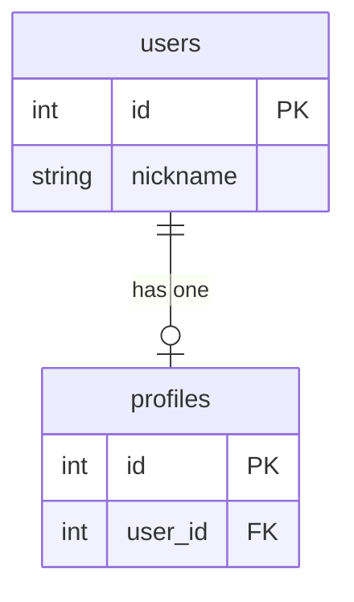
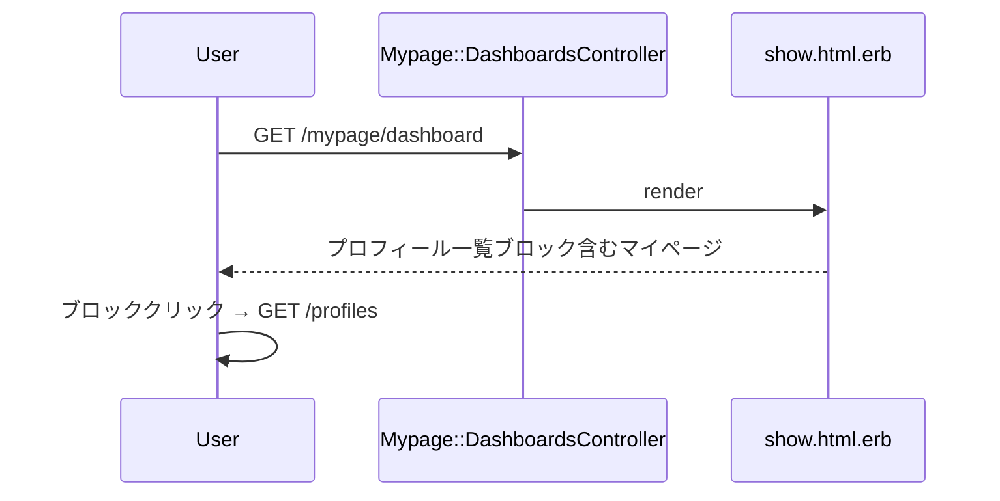

# マイページにプロフィール一覧への導線を追加 設計書

**日付:** 2026-04-19
**Issue:** #228
**ステータス:** 合意済み

---

## 1. この設計で作るもの
- `app/views/mypage/dashboards/show.html.erb` にプロフィール一覧ブロックを追加（`/profiles` リンク）

## 2. 目的
- マイページからプロフィール一覧への導線を追加し、回遊性を改善する

## 3. スコープ
### 含むもの
- `show.html.erb` のメニューグリッドへのブロック追加

### 含まないもの
- プロフィール一覧ページ自体の変更
- DB変更・マイグレーション

## 4. 設計方針
現在グリッドは `grid-cols-1 md:grid-cols-3`（3ブロック）。4ブロック目を追加するにあたり `md:grid-cols-2 lg:grid-cols-4` に変更し、4つが均等に並ぶレイアウトにする。

| 方式 | 見た目 | コスト |
|---|---|---|
| A: グリッドをそのまま（3+1） | デスクトップで4つ目が左寄り | 低 |
| B: `md:grid-cols-2 lg:grid-cols-4` に変更（2+2 → 4並び） | 均等でスッキリ | 低 |

**採用理由:** 案B。4ブロックが均等に並び見た目が整う。

## 5. データ設計
なし（ビューのみ）

### ER 図

## 6. 画面・アクセス制御の流れ

### シーケンス図

## 7. アプリケーション設計
- コントローラ変更なし
- ビューに `link_to profiles_path` ブロックを追加
- アイコンは既存ブロックと同スタイル（人型SVG）

## 8. ルーティング設計
変更なし。`profiles_path` は既存ルート。

## 9. レイアウト / UI 設計
既存3ブロックと同スタイル（ダーク系カード・青いアイコン）。グリッドを `md:grid-cols-2 lg:grid-cols-4` に変更。

## 10. クエリ・性能面
追加クエリなし。N+1の心配なし。

## 11. トランザクション / Service 分離
**トランザクション:** 不要
**Service 分離:** 不要（ビューのみ）

## 12. 実装対象一覧

| # | 対象 | 内容 |
|---|---|---|
| 1 | View | `app/views/mypage/dashboards/show.html.erb` グリッドを `md:grid-cols-2 lg:grid-cols-4` に変更 + プロフィール一覧ブロック追加 |

## 13. 受入条件
- [ ] マイページに「プロフィール一覧」ブロックが追加されている
- [ ] クリックで `/profiles` へ遷移する
- [ ] 既存ブロックに影響しない
- [ ] RSpec / RuboCop が全通過する

## 14. この設計の結論
ビュー1ファイルのみの変更。グリッドを4列対応に変更しつつ、既存デザインと統一したブロックを追加する。
