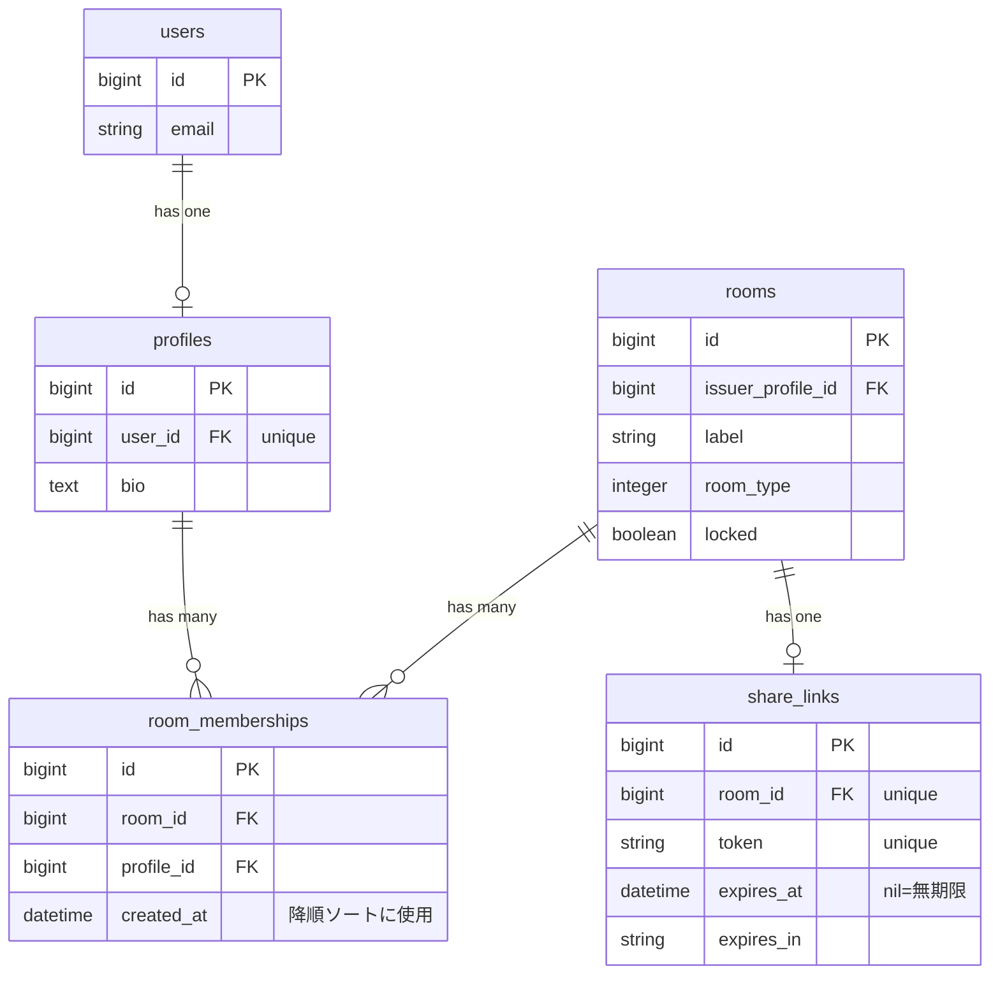
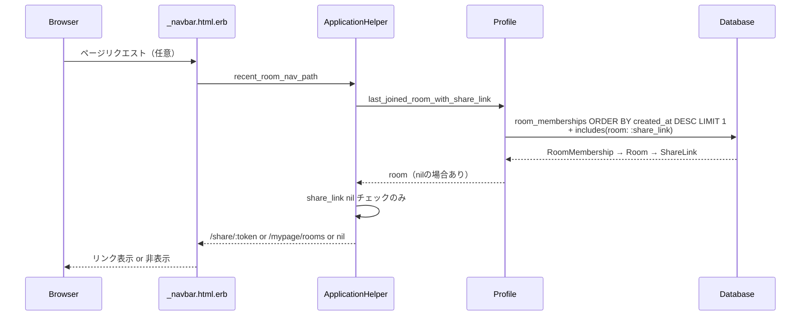

# ナビバーに直近の参加部屋へのリンクを追加 設計書

**日付:** 2026-04-19
**Issue:** #229
**ステータス:** 合意済み

---

## 1. この設計で作るもの

- `Profile` モデルに `last_joined_room_with_share_link` メソッド追加
- `ApplicationHelper` に `recent_room_nav_path` ヘルパー追加
- `app/views/shared/_navbar.html.erb` に直近部屋リンクを追加

## 2. 目的

ナビバーから直近の参加部屋（`/share/:token`）にワンクリックで戻れるようにする。

## 3. スコープ

### 含むもの
- Profile モデルへのメソッド追加
- ApplicationHelper へのヘルパー追加
- navbar partial へのリンク追加

### 含まないもの
- インデックス追加（データ量を考慮し今回は不要）
- キャッシュ（低トラフィックのため不要）

## 4. 設計方針

| 方式 | 実装コスト | テスト容易性 | 責務の明確さ |
|---|---|---|---|
| A: ApplicationHelper のみ | 低 | 中 | ヘルパーが取得＋URL生成を担う |
| B: Profile モデル + ApplicationHelper | 低〜中 | 高 | モデル=データ取得、ヘルパー=URL生成 |
| C: before_action で @recent_room をセット | 中 | 高 | 全リクエストで DB クエリが走る |

**採用理由:** 案 B。責務が分離され、モデルを単体テストできる。全リクエストで before_action を走らせる案 C は不要なクエリが増えるため除外。

**`expired?` チェック不要の根拠:**
`ShareLinkPolicy#show?` が `member? || owner?` の場合は期限切れでもアクセスを許可するため、参加者はトークンの有効期限に関わらず `/share/:token` にアクセスできる。フォールバックが必要なのは `share_link` が nil の場合のみ。

## 5. データ設計

**変更なし**（マイグレーション不要）

### DB 制約（変更なし）

| カラム | 制約 |
|---|---|
| `share_links.room_id` | unique（1部屋1リンク保証済み） |
| `share_links.token` | unique |

### ER 図



## 6. 画面・アクセス制御の流れ

| ケース | 結果 |
|---|---|
| 参加部屋なし（room_memberships = 0件） | リンク非表示 |
| 参加部屋あり + share_link あり | `share_path(token)` を表示（期限切れでも参加者はアクセス可） |
| 参加部屋あり + share_link が nil | `mypage_rooms_path`（edge case） |

### シーケンス図



## 7. アプリケーション設計

**Profile モデル（データ取得）**
```ruby
def last_joined_room_with_share_link
  room_memberships.order(created_at: :desc)
                  .includes(room: :share_link)
                  .first
                  &.room
end
```

**ApplicationHelper（URL 生成）**
```ruby
def recent_room_nav_path
  return nil unless current_user&.profile

  room = current_user.profile.last_joined_room_with_share_link
  return nil unless room

  share_link = room.share_link
  return mypage_rooms_path unless share_link

  share_path(share_link.token)
end
```

**_navbar.html.erb**
```erb
<% profile = current_user.profile %>
<% if (nav_path = recent_room_nav_path) %>
  <%= link_to profile.last_joined_room_with_share_link.label,
              nav_path,
              style: "color: #d1d5db; font-size: 0.875rem; text-decoration: none; transition: color 0.2s;" %>
<% end %>
```

> **注意:** `last_joined_room_with_share_link` をビュー内で複数回呼ばないよう、ヘルパーで room も返す or local 変数に保持する（Phase 2 で確定）。

## 8. ルーティング設計

変更なし。既存の `share_path(:token)` / `mypage_rooms_path` を利用。

## 9. レイアウト / UI 設計

- **表示テキスト:** `room.label`（部屋名）を表示
- **スタイル:** 既存ナビの `color: #d1d5db; font-size: 0.875rem` に統一（インラインスタイル）
- **配置:** マイページリンクの左隣（右側メニュー内）

## 10. クエリ・性能面

**主要クエリ（includes で 3 → 実質 2〜3 回）:**
1. `room_memberships WHERE profile_id = ? ORDER BY created_at DESC LIMIT 1`
2. `rooms WHERE id = ?`（includes）
3. `share_links WHERE room_id = ?`（includes）

`room_memberships` に `profile_id` インデックスあり（schema 確認済み）。複合インデックス `(profile_id, created_at)` は今回追加しない（データ量少量のため許容）。

## 11. トランザクション / Service 分離

**トランザクション:** 不要（読み取り専用）
**Service 分離:** 不要（単一モデルの読み取り + ヘルパーで完結）

## 12. 実装対象一覧

| # | 対象 | 内容 |
|---|---|---|
| 1 | `app/models/profile.rb` | `last_joined_room_with_share_link` メソッド追加 |
| 2 | `app/helpers/application_helper.rb` | `recent_room_nav_path` ヘルパー追加 |
| 3 | `app/views/shared/_navbar.html.erb` | 直近部屋リンク追加 |
| 4 | `spec/models/profile_spec.rb` | `last_joined_room_with_share_link` のテスト |
| 5 | `spec/helpers/application_helper_spec.rb` | `recent_room_nav_path` のテスト |
| 6 | `spec/requests/` | navbar リンク表示のリクエストスペック |

## 13. 受入条件

- [ ] 参加部屋ありの場合、直近部屋名リンクがナビに表示される
- [ ] share_link が nil の場合は `mypage_rooms_path` へフォールバック
- [ ] share_link が期限切れでも参加者はリンクを表示（ポリシーでアクセス可）
- [ ] 参加部屋なしの場合はリンク非表示
- [ ] 未ログイン・プロフィールなしの場合はリンク非表示
- [ ] 既存ナビのスタイルに合っている
- [ ] N+1 クエリが発生しない

## 14. この設計の結論

Profile モデルでデータ取得、ApplicationHelper で URL 生成という責務分離を採用。マイグレーション不要。`ShareLinkPolicy` が参加者に期限切れでもアクセスを許可することを確認し、`expired?` チェックを不要と判断したことがこの設計の核心。
