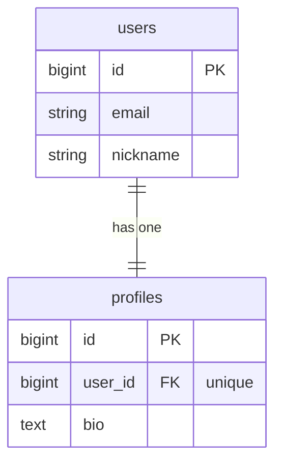
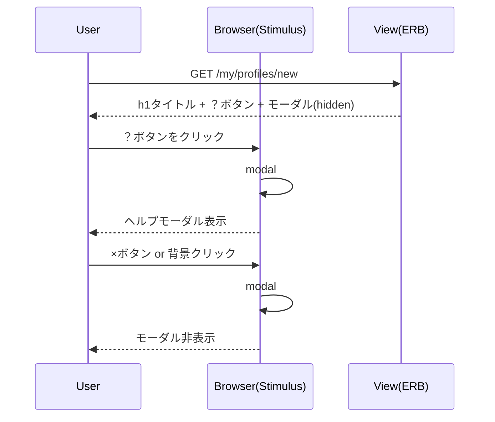

# プロフィールヘルプモーダル 設計書

**日付:** 2026-04-19
**Issue:** #231
**ステータス:** 合意済み

---

## 1. この設計で作るもの

- プロフィール作成画面（`new.html.erb`）のタイトル横に「？」ボタン追加
- プロフィール編集画面（`edit.html.erb`）のタイトル横に「？」ボタン追加
- 各画面専用のヘルプ内容 partial（2つ）
- モーダルラッパー共通 partial（将来の他画面横展開用）
- モーダル開閉用 Stimulus コントローラー（`modal_controller.js`）
- system spec（モーダル開閉の動作確認）

## 2. 目的

- 初回ユーザーが「何を書けばよいか」で迷わないようにする
- 将来の4画面への横展開を見越した再利用可能な構成にする

## 3. スコープ

### 含むもの

- `new.html.erb` / `edit.html.erb` への「？」ボタン追加
- 2画面分のヘルプコンテンツ partial
- モーダルラッパー共通 partial
- `modal_controller.js`（新規）
- system spec 1ファイル（2画面分）

### 含まないもの

- 部屋一覧・部屋詳細・部屋作成フォームのヘルプ（将来Issue化）
- オンボーディング機能

## 4. 設計方針

### 「？」ボタンの配置（タイトル中央を維持する方法）

現在のh1は `text-center` だが、ボタンを単純に右に追加すると中央がずれる。

| 方式 | 実装 | 中央維持 | 備考 |
|---|---|---|---|
| A: relative + absolute（採用） | 親をrelative、ボタンをabsolute right-0 | ✅ | シンプル・スマホ対応○ |
| B: flex + invisible spacer | flex container + 左に透明ダミー要素 | ✅ | DOM上に余計な要素が増える |
| C: Grid 3カラム | left空/center h1/right button | ✅ | 記述量が増える |

**採用理由：案A（relative + absolute）** — DOM がシンプルで、スマホでも崩れにくい。

### Stimulusコントローラの選択

| 方式 | 説明 | 採用 |
|---|---|---|
| 既存 `toggle_controller` を流用 | `content`の表示切り替えのみ対応 | ❌ バックドロップクリック閉じに対応できない |
| 新規 `modal_controller` を作成 | open/close/clickOutside の3アクション | ✅ |

## 5. データ設計

**DBへの変更なし。**

### DB 制約

なし

### ER 図



## 6. 画面・アクセス制御の流れ

### シーケンス図



## 7. アプリケーション設計

### Stimulus コントローラ（`modal_controller.js`）

```javascript
// app/javascript/controllers/modal_controller.js
import { Controller } from "@hotwired/stimulus"

export default class extends Controller {
  static targets = ["panel"]

  open() {
    this.panelTarget.classList.remove("hidden")
    document.body.classList.add("overflow-hidden")
  }

  close() {
    this.panelTarget.classList.add("hidden")
    document.body.classList.remove("overflow-hidden")
  }

  // バックドロップ（オーバーレイ）クリックで閉じる
  clickOutside(event) {
    if (event.target === event.currentTarget) this.close()
  }
}
```

### 共通モーダルラッパー partial

```
app/views/shared/_help_modal.html.erb
```

引数：`title`（モーダルタイトル文字列）、`content_partial`（本文partialのパス）

### ヘルプコンテンツ partial

```
app/views/my/profiles/_help_content_new.html.erb
app/views/my/profiles/_help_content_edit.html.erb
```

### ビュー変更イメージ（`new.html.erb`）

```erb
<%# タイトル横に？ボタン %>
<div class="relative flex items-center justify-center mb-4"
     data-controller="modal">
  <h1 class="text-2xl font-bold text-white">プロフィール作成</h1>
  <button type="button"
          aria-label="プロフィール作成のヘルプを開く"
          data-action="click->modal#open"
          class="absolute right-0 ...">?</button>

  <%= render "shared/help_modal",
        title: "プロフィール作成のヘルプ",
        content_partial: "my/profiles/help_content_new" %>
</div>
```

## 8. ルーティング設計

変更なし（フロントエンドのみ）。

## 9. レイアウト / UI 設計

- 「？」ボタン：丸形、border付き、薄く発光（`ring` + `shadow`）、CTAより控えめ
- モーダル：全画面オーバーレイ（`fixed inset-0 bg-black/60`）＋中央パネル
- 既存ダークトーン（slate系）に統一
- スマホではモーダルが `max-h-[80vh] overflow-y-auto` でスクロール可能

## 10. クエリ・性能面

- 追加クエリなし（純粋にフロントエンド）
- N+1問題なし

## 11. トランザクション / Service 分離

**トランザクション：不要**（DB変更なし）
**Service 分離：不要**（ビュー・JSのみの変更）

## 12. 実装対象一覧

| # | 対象 | 内容 |
|---|---|---|
| 1 | `modal_controller.js` | open / close / clickOutside アクション |
| 2 | `app/views/shared/_help_modal.html.erb` | モーダルラッパー共通 partial |
| 3 | `app/views/my/profiles/_help_content_new.html.erb` | 作成画面ヘルプ本文 |
| 4 | `app/views/my/profiles/_help_content_edit.html.erb` | 編集画面ヘルプ本文 |
| 5 | `app/views/my/profiles/new.html.erb` | タイトル＋？ボタン追加 |
| 6 | `app/views/my/profiles/edit.html.erb` | タイトル＋？ボタン追加 |
| 7 | `spec/system/my/profile_help_modal_spec.rb` | モーダル開閉 system spec |

## 13. 受入条件

- [ ] `new` 画面のタイトル横に「？」ボタンが表示される
- [ ] `edit` 画面のタイトル横に「？」ボタンが表示される
- [ ] 各ボタンをクリックすると画面専用のヘルプモーダルが開く
- [ ] ×ボタンで閉じられる
- [ ] モーダル背景（オーバーレイ）クリックで閉じられる
- [ ] スマホで崩れない（max-h + overflow-y-auto）
- [ ] `aria-label` が設定されている
- [ ] system spec 全通過
- [ ] RuboCop 全通過

## 14. この設計の結論

**フロントエンドのみの変更。DBへの影響はゼロ。**
新規 `modal_controller.js` + 共通 partial 構成にすることで、将来の他画面（部屋一覧・部屋詳細・部屋作成）への横展開が容易。
