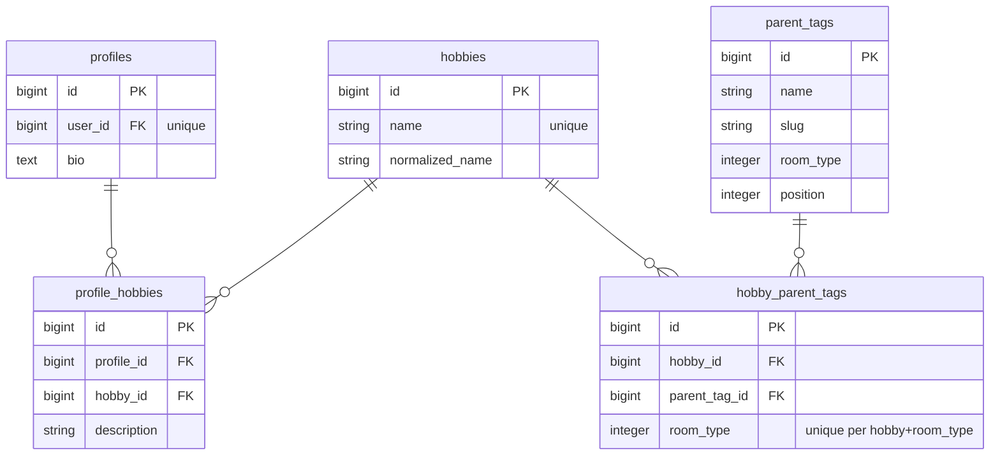
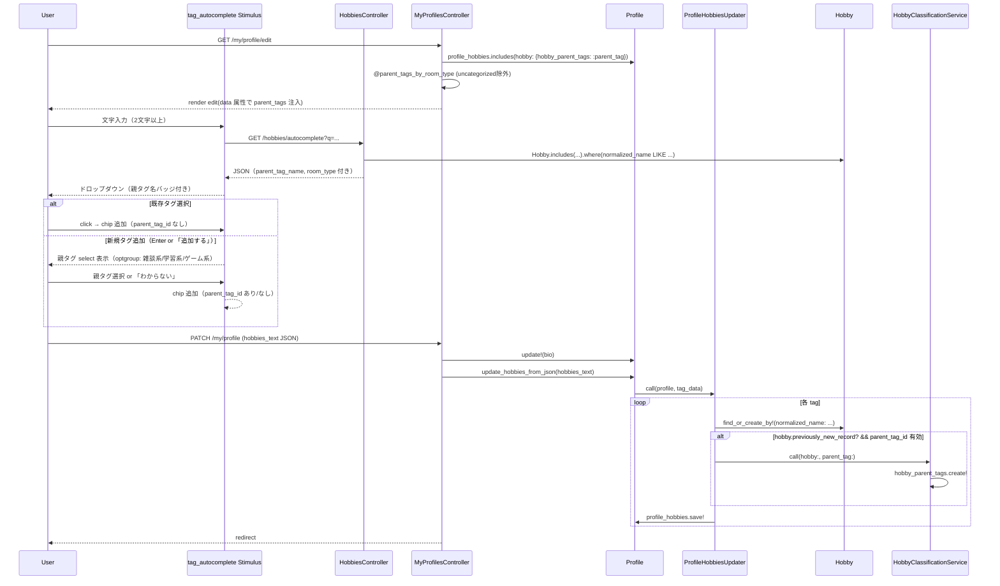

# 趣味タグUI改善（親タグ結びつき） 設計書

**日付:** 2026-04-20
**Issue:** #237
**ステータス:** 合意済み

---

## 1. この設計で作るもの

- autocomplete の候補 JSON に親タグバッジ情報を追加
- 新規タグ作成時に親タグ select を表示し、ユーザー提案を受け付ける
- **新規作成された Hobby のみ** その request 内で `HobbyParentTag` を作成（既存Hobbyは触らない）
- 登録済みチップに親タグ名バッジを表示
- 管理者は引き続き admin 画面で調整可能（既存機能維持）

---

## 2. 目的

- タグと部屋タイプの関係をユーザーに見せる
- 新規タグ作成時にユーザーが分類を提案できるようにする
- 管理者の分類負担を減らす（初期値をユーザー提案でカバー）

---

## 3. スコープ

### 含むもの
- `HobbiesController#autocomplete` の JSON 拡張 + 検索修正（case-insensitive化）
- `ProfileHobbiesUpdater` に `parent_tag_id` 処理を追加
- `My::ProfilesController#edit` で親タグ情報を `@hobbies_text` に含める
- `My::ProfilesController#new/create/edit/update` で `@parent_tags_by_room_type` をロード
- `tag_autocomplete_controller.js` の UI 拡張（バッジ + 新規タグ時の select）
- `my/profiles/_form.html.erb` のチップ表示改善・data 属性追加

### 含まないもの
- マイグレーション・DB変更
- 既存 Hobby の分類変更機能（admin 専用の既存挙動を維持）
- Phase 2（#247 ヘルプ導線）・Phase 3（#248 未分類タグ管理）

---

## 4. 設計方針

### 新規 Hobby 判定方式の比較

| 方式 | 安全性 | 複雑性 | リスク |
|---|---|---|---|
| A: `hobby_parent_tags.empty?` | △ | 低 | 「未分類の既存Hobby」を不特定ユーザーが分類できてしまう |
| **B: `hobby.previously_new_record?`** | ◎ | 低 | このrequestが作った新規Hobbyだけに限定できる |
| C: AかつB（両方） | ◎ | 中 | A は不要になる |

**採用理由:** 案B。`ProfileHobbiesUpdater` 内で `find_or_create_by!` の後に `previously_new_record?` が true の場合のみ分類する。これにより「本当に今このリクエストで作られた Hobby だけが分類対象」となり、未分類だが既存の Hobby にはユーザーが介入できない。

### バッジ表示は親タグ名（room_type ではなく）

| 箇所 | 表示 | 理由 |
|---|---|---|
| autocomplete ドロップダウン | 親タグ名（例: `プログラミング`） | 具体性・識別性が高い |
| 登録済みチップ | 親タグ名 | 同上 |
| 新規タグ select の optgroup | room_type ラベル（雑談系/学習系/ゲーム系） | 整理・組織化に適する |

### ユーザー向け select から "未分類" 親タグを除外

現 DB には `slug: 'uncategorized'` の親タグが各 room_type に1件ずつある。これは管理用途であり、ユーザーには「わからない」で代替する。

```ruby
ParentTag.where.not(slug: 'uncategorized').order(:room_type, :position)
```

### autocomplete 検索の case-insensitive 化

現在は `where("name LIKE ?", "#{q.downcase}%")` で PG の LIKE が case-sensitive のため不一致になる。`normalized_name` を使うことで解決する。

---

## 5. データ設計

**マイグレーション: なし**

### JSON フォーマット（load 時 vs. submit 時）

**load 時（edit 画面の `@hobbies_text`）:** 表示用フィールドを含む
```json
[
  {
    "name": "Rails",
    "description": "3年やってます",
    "parent_tag_name": "プログラミング",
    "room_type": "study"
  }
]
```

**submit 時（form からサーバーへ）:** `parent_tag_id` が新規タグにのみ含まれる
```json
[
  { "name": "Rails", "description": "3年やってます" },
  { "name": "ボードゲーム", "description": "", "parent_tag_id": 11 }
]
```

**サーバー側で見るフィールド:** `name`, `description`, `parent_tag_id`
その他は表示用で、サーバーは無視する（防衛的に）。

### ER 図



---

## 6. 画面・アクセス制御の流れ



---

## 7. アプリケーション設計

### ProfileHobbiesUpdater

```ruby
class ProfileHobbiesUpdater
  def self.call(profile, tag_data)
    # 省略: 既存のnormalize処理

    ApplicationRecord.transaction do
      # 省略: 既存のcleanup/preload処理

      normalized.each do |tag|
        hobby = existing_hobbies[tag[:name]] ||
                Hobby.find_or_create_by!(normalized_name: tag[:name]) { |h| h.name = tag[:name] }

        # 新規作成された Hobby のみ分類する
        classify_if_newly_created(hobby, tag[:parent_tag_id])

        ph = existing_phs[tag[:name]] || ProfileHobby.new(profile:, hobby:)
        ph.description = tag[:description]
        ph.save!
      end
    end
  end

  def self.classify_if_newly_created(hobby, parent_tag_id)
    return unless hobby.previously_new_record?
    return if parent_tag_id.blank?

    parent_tag = ParentTag.find_by(id: parent_tag_id)
    return unless parent_tag

    Admin::HobbyClassificationService.call(hobby:, parent_tag:)
  end
end
```

**設計意図:**
- `previously_new_record?` は Rails が追跡する「このrequestでレコードが新規作成されたか」のフラグ
- 既存の Hobby（未分類含む）には絶対に介入しない
- 不正な `parent_tag_id` は `find_by` で nil 返却 → skip

### HobbiesController#autocomplete

```ruby
def autocomplete
  q = params[:q].to_s.strip
  return render json: [] if q.length < 2

  hobbies = Hobby.where("normalized_name LIKE ?", "#{Hobby.normalize(q)}%")
                 .includes(hobby_parent_tags: :parent_tag)
                 .limit(10)

  render json: hobbies.map { |h| serialize_hobby(h) }
end

private

def serialize_hobby(hobby)
  primary = hobby.hobby_parent_tags.min_by { |hpt| HobbyParentTag.room_types[hpt.room_type] }
  {
    name: hobby.name,
    parent_tag_name: primary&.parent_tag&.name,
    room_type: primary&.room_type
  }
end
```

**設計意図:**
- `normalized_name` で検索することでケース非依存の一致が実現
- `includes(hobby_parent_tags: :parent_tag)` で N+1 回避
- `primary` は enum 値最小（chat → study → game 順）で決定

### My::ProfilesController

```ruby
before_action :set_parent_tags, only: %i[new create edit update]

def edit
  @hobbies_text = @profile.profile_hobbies
    .includes(hobby: { hobby_parent_tags: :parent_tag })
    .map { |ph| serialize_profile_hobby(ph) }
    .to_json
end

private

def serialize_profile_hobby(ph)
  primary = ph.hobby.hobby_parent_tags.min_by { |hpt| HobbyParentTag.room_types[hpt.room_type] }
  {
    name: ph.hobby.name,
    description: ph.description.to_s,
    parent_tag_name: primary&.parent_tag&.name,
    room_type: primary&.room_type
  }
end

def set_parent_tags
  @parent_tags_by_room_type = ParentTag.where.not(slug: 'uncategorized')
                                       .order(:room_type, :position)
                                       .group_by(&:room_type)
end
```

---

## 8. ルーティング設計

変更なし。既存の `GET /hobbies/autocomplete` と `PATCH /my/profile` を利用。

---

## 9. レイアウト / UI 設計

```
┌─────────────────────────────────────┐
│ 趣味タグ   [親タグとは？/Phase2]    │
├─────────────────────────────────────┤
│ ● Rails [プログラミング] ×          │  ← 親タグ名バッジ
│ ● Apex [FPS] ×                      │
│ ● 読書 ×                            │  ← 未分類（バッジなし）
├─────────────────────────────────────┤
│ [入力欄]                            │
│ ─── 候補 ───                        │
│   Rails   [プログラミング]          │  ← 親タグ名バッジ
│   Ruby    [プログラミング]          │
│ ─── または ───                      │
│ 「ボードゲーム」を新規追加           │
│ どの分類にしますか？                │
│ [ 選択してください ▼ ]              │  ← room_type で optgroup
│   ├ 雑談系                          │
│   │   アニメ・漫画                  │
│   │   音楽 …                         │
│   ├ 学習系                          │
│   │   プログラミング                │
│   │   英語 …                         │
│   └ ゲーム系                        │
│       FPS / RPG / MMO …              │
│ ☐ わからない                         │
│ [追加する]                          │
└─────────────────────────────────────┘
```

### room_type → 表示ラベル

| room_type | ラベル |
|---|---|
| chat | 雑談系 |
| study | 学習系 |
| game | ゲーム系 |

---

## 10. クエリ・性能面

| クエリ | 対策 |
|---|---|
| autocomplete 時の親タグ情報 | `includes(hobby_parent_tags: :parent_tag)` で N+1 回避 |
| edit 時の既存タグ + 親タグ | `includes(hobby: { hobby_parent_tags: :parent_tag })` |
| edit 時の select 用 parent_tags | `order(:room_type, :position)` 1クエリ、既存 index を利用 |

追加インデックス不要。

---

## 11. トランザクション / Service 分離

**トランザクション:** 既存 `ProfileHobbiesUpdater` のトランザクション内で処理。`HobbyClassificationService` の内部トランザクションは savepoint で nested。

**Service 分離:** 不要。`ProfileHobbiesUpdater` に1メソッド追加、`Admin::HobbyClassificationService` はそのまま流用。

---

## 12. 実装対象一覧

| # | 対象 | 内容 |
|---|---|---|
| 1 | `HobbiesController` | `autocomplete` を改修（N+1対策・JSON拡張・normalized_name検索） |
| 2 | `My::ProfilesController` | `set_parent_tags`, `serialize_profile_hobby` 追加 |
| 3 | `ProfileHobbiesUpdater` | `classify_if_newly_created` メソッド追加 |
| 4 | `my/profiles/_form.html.erb` | data 属性で parent_tags 渡す、チップ内のバッジ表示 |
| 5 | `tag_autocomplete_controller.js` | ドロップダウンにバッジ、新規タグ時の親タグ select UI、submit 時の parent_tag_id 含める |

---

## 13. 受入条件 + テスト戦略

### 受入条件

- [ ] autocomplete API が `{ name, parent_tag_name, room_type }` 形式で返す
- [ ] 分類済みタグは `parent_tag_name`/`room_type` が埋まる、未分類は null
- [ ] normalized_name 検索で大文字小文字を気にせずヒットする
- [ ] 既存タグをクリックで chip 追加 → バッジ表示・parent_tag_id は送られない
- [ ] 新規タグ入力時 → 親タグ select 表示 → 選択/スキップ可
- [ ] 「わからない」選択でも tag 追加可能、`hobby_parent_tags` は作成されない
- [ ] 親タグ選択時、保存で `HobbyParentTag` が作成される
- [ ] 既存（未分類含む）の Hobby の分類は変更されない
- [ ] 登録済み chip に親タグ名バッジが表示される
- [ ] 不正な `parent_tag_id` は無視される（400エラーにしない・静かに skip）
- [ ] 既存テスト全通過

### テスト戦略（RSpec）

| テスト対象 | タイプ | 主な観点 |
|---|---|---|
| `spec/requests/hobbies_spec.rb` | request | JSON 形式・N+1・normalized_name 検索 |
| `spec/services/profile_hobbies_updater_spec.rb` | unit | `parent_tag_id` 処理、`previously_new_record?` の分岐 |
| `spec/requests/my/profiles_spec.rb` | request | edit 時の JSON 内容、update 時の parent_tag_id 保存 |
| `spec/system/my/profile_tag_classification_spec.rb` | system | ブラウザで新規タグ作成 → 親タグ select → 保存 → DB確認 |

### テストで落としたい主要 RED

1. 新規タグ + parent_tag_id → HobbyParentTag 作成される
2. 既存（未分類）タグ + parent_tag_id → HobbyParentTag 作成されない
3. 既存（分類済み）タグ + 異なる parent_tag_id → 変更されない
4. 不正な parent_tag_id → 静かに無視、他の tag は保存される
5. `normalized_name` 前方一致で大文字小文字混在をヒット

---

## 14. この設計の結論

**マイグレーション不要・既存 Service 流用で最小変更。**
`previously_new_record?` による厳密な「新規作成のみ分類」の保証により、既存の admin フローを一切壊さない。autocomplete のバグ（ケース不一致）も同時に修正する。Phase 2 (#247)・Phase 3 (#248) とは独立して実装可能。
