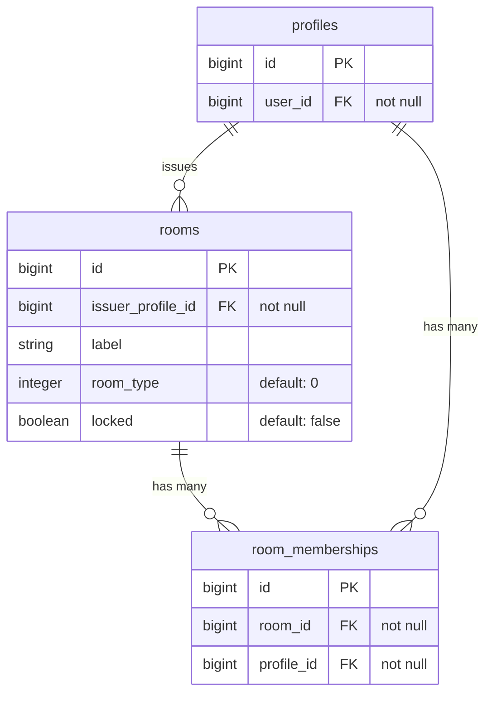
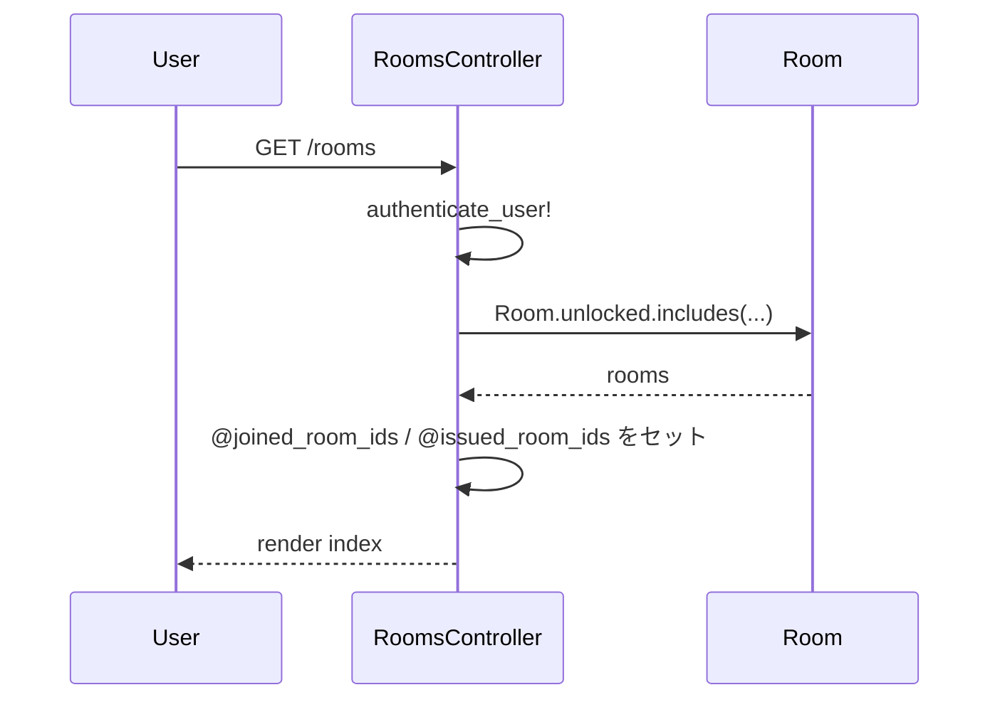
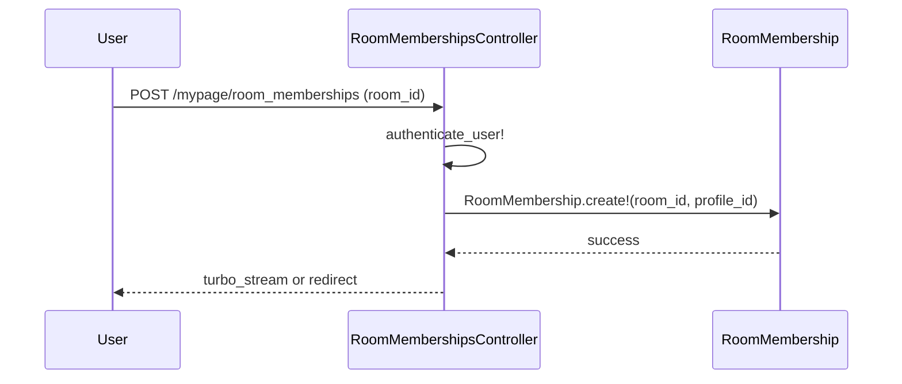

# 部屋一覧表示と参加機能 設計書

**日付:** 2026-04-20
**Issue:** #230
**ステータス:** 合意済み

---

## 1. この設計で作るもの
- `RoomsController#index`（`/rooms`）- 公開部屋一覧ページ（新規）
- `Mypage::RoomMembershipsController#create` - 部屋参加アクション（既存コントローラに追加）
- ビュー: `app/views/rooms/index.html.erb`
- 部分テンプレート: `app/views/rooms/_room.html.erb`

## 2. 目的
- 招待リンク以外の経路で公開部屋を発見・参加できるようにする
- 参加済み・作成済みバッジで状態を一目で把握できるようにする

## 3. スコープ

### 含むもの
- `locked: false` の部屋一覧表示
- 参加済み判定（「参加済み」バッジ）
- 作成者判定（「作成した部屋」バッジ）
- 参加ボタン（未参加のみ有効）

### 含まないもの
- 検索・フィルタ（別Issue）
- ページネーション（#232）

## 4. 設計方針

| 方式 | 実装コスト | 拡張性 | 現状との相性 |
|---|---|---|---|
| A: `/rooms` 新設 | 小 | 高 | ◎ 責務分離できる |
| B: `mypage/rooms` に追加 | 小 | 低 | △ コントローラ肥大 |

**採用理由:** 案A。「自分の部屋管理」と「公開部屋探索」は責務が異なるため分離する。

## 5. データ設計

**マイグレーション: なし**（`locked` カラムで公開/非公開は制御済み）

**設計意図:** `locked: false` = 公開、`locked: true` = 非公開。既存の意味をそのまま流用する。

### DB 制約
既存の制約で十分。追加なし。

### ER 図



## 6. 画面・アクセス制御の流れ

- 一覧閲覧: 認証必須（未ログインはログイン画面へ）
- 参加: 認証 + プロフィール必須（プロフィールなしはリダイレクト）

### シーケンス図（一覧表示）



### シーケンス図（参加）



## 7. アプリケーション設計

### RoomsController

```ruby
class RoomsController < ApplicationController
  before_action :authenticate_user!

  def index
    @rooms = Room.unlocked
                 .includes(issuer_profile: :user, room_memberships: :profile)
                 .order(created_at: :desc)
    profile = current_user.profile
    @joined_room_ids = profile&.room_memberships&.pluck(:room_id) || []
    @issued_room_ids = profile&.issued_rooms&.pluck(:id) || []
  end
end
```

### Mypage::RoomMembershipsController#create

```ruby
def create
  profile = current_user.profile
  return redirect_to rooms_path, alert: "プロフィールを作成してください" unless profile

  room = Room.unlocked.find(params[:room_id])
  RoomMembership.create!(room: room, profile: profile)

  respond_to do |format|
    format.turbo_stream { flash.now[:notice] = "部屋に参加しました" }
    format.html { redirect_to rooms_path, notice: "部屋に参加しました" }
  end
rescue ActiveRecord::RecordNotFound
  redirect_to rooms_path, alert: "部屋が見つかりません"
rescue ActiveRecord::RecordInvalid
  redirect_to rooms_path, alert: "すでに参加しています"
end
```

### Room モデル

`scope :unlocked` が未定義の場合は追加する。

## 8. ルーティング設計

```ruby
resources :rooms, only: [:index]

namespace :mypage do
  resources :room_memberships, only: [:create, :destroy]  # create を追加
end
```

## 9. レイアウト / UI 設計

各部屋カードに表示する情報：
- 部屋名・種別・作成者名・参加人数
- 自分が作成した部屋 → 「作成した部屋」バッジ
- 参加済み（作成者以外） → 「参加済み」バッジ
- 未参加 → 「参加する」ボタン（Turbo Stream）

## 10. クエリ・性能面

```ruby
Room.unlocked.includes(issuer_profile: :user, room_memberships: :profile)
```

- `issuer_profile: :user` で作成者名の N+1 を防止
- `room_memberships: :profile` でメンバー数表示の N+1 を防止
- `@joined_room_ids` / `@issued_room_ids` は `pluck` で ID のみ取得

## 11. トランザクション / Service 分離

**トランザクション:** 不要（1テーブルへの単一書き込み）
**Service 分離:** 不要（条件分岐・モデル跨ぎなし）

## 12. 実装対象一覧

| # | 対象 | 内容 |
|---|---|---|
| 1 | Model | `Room` に `scope :unlocked` 追加（未定義の場合） |
| 2 | Controller | `RoomsController#index` 新規作成 |
| 3 | Controller | `Mypage::RoomMembershipsController#create` 追加 |
| 4 | View | `app/views/rooms/index.html.erb` 新規作成 |
| 5 | View | `app/views/rooms/_room.html.erb` 新規作成 |
| 6 | Routes | `resources :rooms, only: [:index]` 追加 |
| 7 | Routes | `room_memberships` に `:create` 追加 |
| 8 | Spec | `spec/system/rooms_spec.rb` 新規作成 |
| 9 | Spec | `spec/requests/rooms_spec.rb` 新規作成 |

## 13. 受入条件

- [ ] `/rooms` で `locked: false` の部屋一覧が表示される
- [ ] 自分が作成した部屋には「作成した部屋」バッジが表示される
- [ ] 参加済み部屋（作成者以外）には「参加済み」バッジが表示される
- [ ] 未参加部屋には「参加する」ボタンが表示され、押すと参加できる
- [ ] `locked: true` の部屋は表示されない
- [ ] N+1クエリが発生しない

## 14. この設計の結論

`/rooms` を「公開部屋の発見ページ」として独立させ、既存の `mypage/rooms` は「自分の部屋管理」に集中させる。将来の検索・フィルタ・ページネーションも `/rooms` に自然に追加できる構成。
