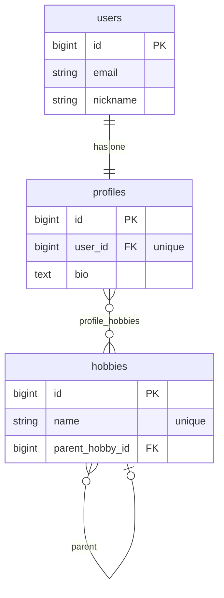
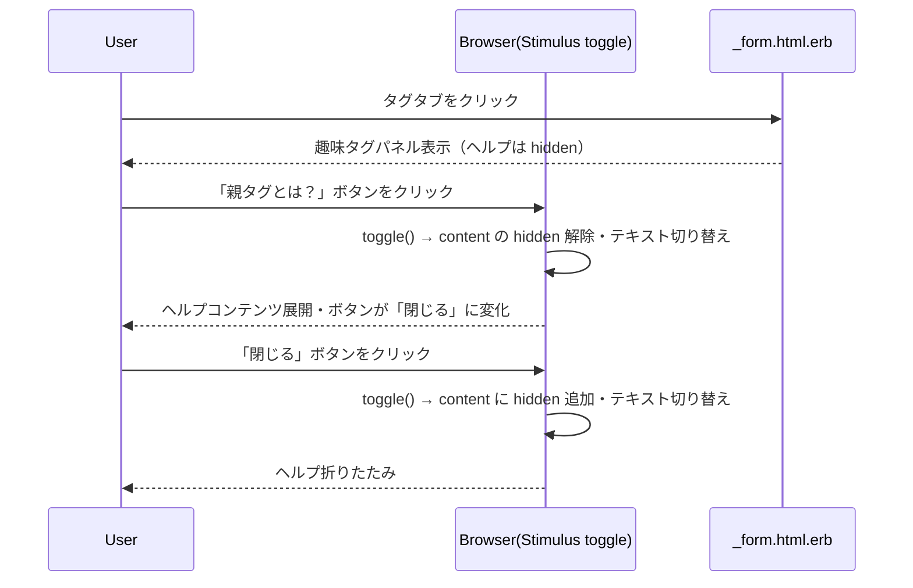

# プロフィール趣味タグセクション ヘルプ導線 設計書

**日付:** 2026-04-21
**Issue:** #247
**ステータス:** 合意済み

---

## 1. この設計で作るもの

- `app/views/my/profiles/_form.html.erb` の趣味タグ見出し横に「親タグとは？」トグルボタンを追加
- `toggle_controller.js`（既存流用）でインライン展開を制御
- ヘルプコンテンツ（親タグの説明・具体例・「わからない」誘導文）
- system spec：`spec/system/my/profile_tag_help_spec.rb`

## 2. 目的

親タグ機能が実装済みだがユーザーには概念が見えていない。「親タグとは何か」「どれを選べばよいか」を趣味タグセクション内で即座に確認できるようにする。

## 3. スコープ

### 含むもの

- `_form.html.erb` にトグルボタン＋インラインヘルプ追加
- system spec 1ファイル

### 含まないもの

- DB・モデル・コントローラ変更
- 親タグ選択 UI 自体の変更（#237 対応済み）
- モバイル固有の特別対応（インライン展開なのでスクロール不要）

## 4. 設計方針

### Stimulus コントローラの選択

| 方式 | コスト | 既存との整合 | 採用 |
|---|---|---|---|
| 既存 `toggle_controller` 流用 | 低（追加ファイルなし） | ✅ 同パターンあり | ✅ |
| 新規コントローラ作成 | 高（責務重複） | ❌ | ❌ |

**採用理由:** `toggle_controller` はすでに `content` / `openText` / `closeText` の3ターゲットを持ちインライン展開に必要な機能が揃っている。`rooms/index.html.erb` で同パターンが使われており実績がある。

### トグルボタンの配置

| 方式 | 見た目 | 実装 |
|---|---|---|
| A: h2 の右横（flex + gap） | 見出しと並んで自然 | ✅ シンプル |
| B: p タグの下（別行） | 説明文の補足に見える | 情報の流れが不自然 |

**採用理由:** 案A。見出し「趣味タグ」の右に「親タグとは？」が並ぶと、関連性が直感的に伝わる。

## 5. データ設計

**なし**（ビュー・JS のみ）

### ER 図



## 6. 画面・アクセス制御の流れ

### シーケンス図



## 7. アプリケーション設計

`_form.html.erb` の趣味タグ見出し周辺を以下の構造に変更する。

```erb
<%# toggle_controller をラップ。ヘルプボタン＋コンテンツを囲む %>
<div data-controller="toggle">
  <div class="mb-5 flex flex-col gap-3 md:flex-row md:items-end md:justify-between">
    <div>
      <%# 見出しとヘルプボタンを横並び %>
      <div class="flex items-center gap-2">
        <h2 class="text-sm font-semibold text-slate-200">趣味タグ</h2>
        <button type="button"
                data-action="click->toggle#toggle"
                data-testid="tag-help-toggle"
                class="text-xs text-blue-400 underline underline-offset-2 hover:text-blue-300 transition">
          <span data-toggle-target="openText">親タグとは？</span>
          <span data-toggle-target="closeText" class="hidden">閉じる</span>
        </button>
      </div>
      <p class="mt-1 text-sm leading-relaxed text-slate-400">
        まずは気軽に 2〜5 個ほど登録すると、プロフィールの雰囲気が伝わりやすくなります。
      </p>
    </div>
    <div data-tag-autocomplete-target="count" ...>0 / 10件</div>
  </div>

  <%# ヘルプコンテンツ（connect() で hidden が付与される）%>
  <div data-toggle-target="content"
       data-testid="tag-help-content"
       class="mb-4 rounded-xl border border-slate-700/50 bg-slate-900/60 p-4 text-sm text-slate-300 leading-relaxed">
    <p class="font-semibold text-slate-200 mb-2">親タグとは？</p>
    <p class="mb-3">趣味タグを大きなカテゴリでまとめるラベルです。登録したタグに合う親タグを選ぶと、どんな系統の趣味か一目で伝わりやすくなります。</p>
    <ul class="mb-3 space-y-1 list-none pl-0">
      <li>🗨️ <span class="font-medium text-slate-200">雑談系</span> — アニメ・マンガ・映画・料理 など</li>
      <li>📚 <span class="font-medium text-slate-200">学習系</span> — プログラミング・語学・資格 など</li>
      <li>🎮 <span class="font-medium text-slate-200">ゲーム系</span> — RPG・FPS・ボードゲーム など</li>
    </ul>
    <p class="text-slate-400">迷った場合は「わからない」を選んでも大丈夫です。あとから変更できます。</p>
  </div>
</div>
```

**設計意図:** `toggle_controller` のスコープを最小限（見出しブロック＋ヘルプコンテンツ）に絞ることで、同一パネル上の `tag-description` / `tag-autocomplete` コントローラと干渉しない。

## 8. ルーティング設計

変更なし。

## 9. レイアウト / UI 設計

- ボタン: テキストリンク風（`text-blue-400 underline`）— CTA より控えめにする
- コンテンツ枠: 既存ダーク系（`bg-slate-900/60 border-slate-700/50`）に統一
- 絵文字でカテゴリを視覚的に区別（雑談 🗨️ / 学習 📚 / ゲーム 🎮）

## 10. クエリ・性能面

追加クエリなし。フロントエンド完結。

## 11. トランザクション / Service 分離

**トランザクション:** 不要（DB変更なし）
**Service 分離:** 不要（ビューのみ）

## 12. 実装対象一覧

| # | 対象 | 内容 |
|---|---|---|
| 1 | `app/views/my/profiles/_form.html.erb` | 趣味タグ見出し横にトグルボタン＋ヘルプコンテンツ追加 |
| 2 | `spec/system/my/profile_tag_help_spec.rb` | ヘルプ展開・折りたたみ system spec |

## 13. 受入条件

- [ ] 趣味タグ見出し横に「親タグとは？」ボタンが表示される
- [ ] クリックするとインラインでヘルプコンテンツが展開される
- [ ] 親タグの説明・具体例（雑談系/学習系/ゲーム系）が含まれる
- [ ] 「迷った場合は『わからない』でよい」旨が含まれる
- [ ] 「閉じる」クリックで折りたたまれる
- [ ] system spec 全通過 / RuboCop 全通過

## 14. この設計の結論

フロントエンドのみの変更。既存 `toggle_controller.js` を流用し、ファイル2つ（ERB・spec）のみで完結する。将来的にヘルプコンテンツを DB から動的生成する場合は、このパーシャルを起点に拡張できる。
