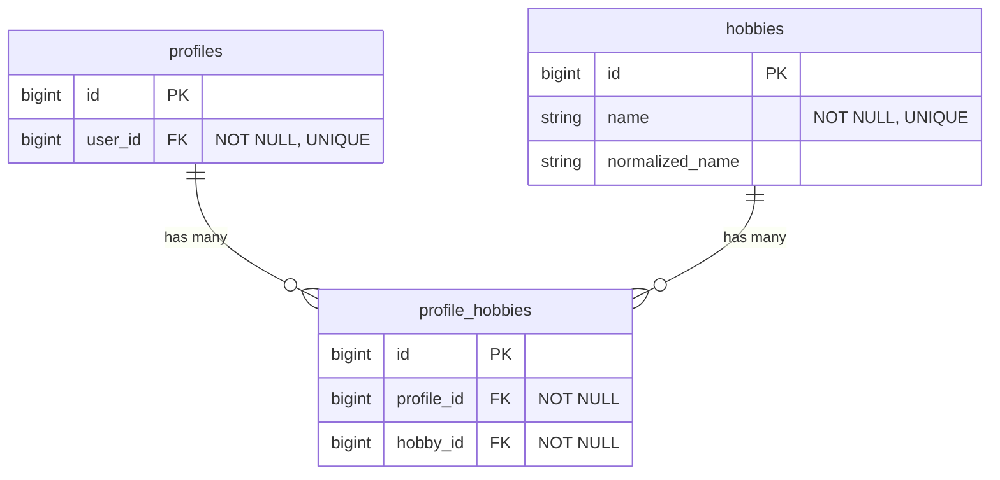
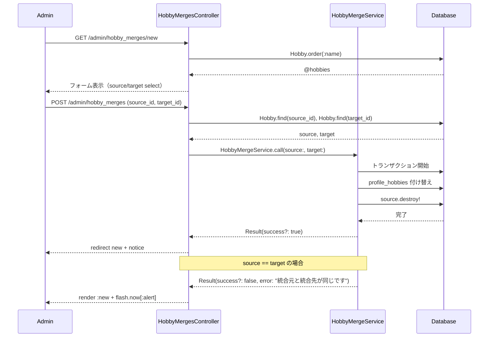

# 趣味タグ統合専用画面（Admin） 設計書

**日付:** 2026-04-22
**Issue:** #251
**ステータス:** 合意済み

---

## 1. この設計で作るもの

- `Admin::HobbyMergesController`（new / create）
- `app/views/admin/hobby_merges/new.html.erb`（統合フォーム）
- ルーティング追加: `resources :hobby_merges, only: [:new, :create]`
- request spec / system spec

## 2. 目的

- 表記ゆれのある趣味タグを管理者が安全に統合できる専用画面を提供する
- `Admin::HobbyMergeService`（既存）を再利用し、責務を明確に分離する

## 3. スコープ

### 含むもの

- `/admin/hobby_merges/new`：統合フォーム表示
- `POST /admin/hobby_merges`：統合実行 → リダイレクト
- 同じタグ選択時のエラー表示（flash alert）
- 管理者認証（`Admin::BaseController` 継承で自動適用）
- request spec・system spec

### 含まないもの

- バルク統合（将来 Issue で対応）
- `Admin::HobbyMergeService` の変更（そのまま再利用）
- 統合履歴の記録（スコープ外）

## 4. 設計方針

**ルーティング方式の比較:**

| 方式 | 実装コスト | URL の明確さ | 現状との相性 |
|---|---|---|---|
| A: 独立した `resources :hobby_merges` | 低 | `/admin/hobby_merges` で機能が明確 | ○ Issue 記載通り |
| B: `hobbies` にネスト | 中 | `/admin/hobbies/:id/merges` 等、直感的でない | × 統合は特定hobby起点でない |

**採用: 案A。** 統合操作はどちらか一方の hobby に紐づくものではなく、2タグ間の操作のため独立リソースが適切。

## 5. データ設計

**変更なし。** 新規テーブル・カラム・マイグレーションは不要。既存の `hobbies`・`profile_hobbies` テーブルをそのまま使う。

### DB 制約

追加なし。`Admin::HobbyMergeService` 内のトランザクションで整合性を保証済み。

### ER 図



## 6. 画面・アクセス制御の流れ

`Admin::BaseController` の `before_action :authenticate_user!` と `require_admin!` により、管理者以外は `/` にリダイレクト。

### シーケンス図



## 7. アプリケーション設計

```ruby
class Admin::HobbyMergesController < Admin::BaseController
  def new
    @hobbies = Hobby.order(:name)
  end

  def create
    source = Hobby.find(params[:source_hobby_id])
    target = Hobby.find(params[:target_hobby_id])
    result = Admin::HobbyMergeService.call(source:, target:)
    if result.success?
      redirect_to new_admin_hobby_merge_path,
                  notice: "「#{source.name}」を「#{target.name}」に統合しました"
    else
      @hobbies = Hobby.order(:name)
      flash.now[:alert] = result.error
      render :new, status: :unprocessable_entity
    end
  end
end
```

**設計意図:** `create` 失敗時は `render :new` で再描画し、flash.now で即時表示。サービスが `Result` オブジェクトを返すため、例外ではなく戻り値で分岐する。

## 8. ルーティング設計

```ruby
namespace :admin do
  resources :hobby_merges, only: %i[new create]   # 追加
end
```

URL: `GET /admin/hobby_merges/new` / `POST /admin/hobby_merges`

## 9. レイアウト / UI 設計

既存 Admin 画面（`unclassified_hobbies`）と統一したダークテーマのインラインスタイルを使用。

- 統合元 select（全タグ、`name` 昇順）
- 統合先 select（同上）
- 統合ボタンに `data: { turbo_confirm: "「〇〇」を「△△」に統合しますか？この操作は取り消せません。" }`
  → Turbo の標準 confirm ダイアログで確認

## 10. クエリ・性能面

- `Hobby.order(:name)` を1回発行するのみ（N+1 なし）
- 追加インデックス不要（`hobbies.name` / `profile_hobbies(hobby_id)` は既存）

## 11. トランザクション / Service 分離

**トランザクション:** `Admin::HobbyMergeService` 内で `ActiveRecord::Base.transaction` 済み。Controller 側では不要。
**Service 分離:** 既存 `Admin::HobbyMergeService` をそのまま再利用。変更なし。

## 12. 実装対象一覧

| # | 対象 | 内容 |
|---|---|---|
| 1 | Routes | `resources :hobby_merges, only: [:new, :create]` を admin に追加 |
| 2 | Controller | `Admin::HobbyMergesController` 新規作成（new / create） |
| 3 | View | `app/views/admin/hobby_merges/new.html.erb` 新規作成 |
| 4 | Request spec | `spec/requests/admin/hobby_merges_spec.rb` 新規作成 |
| 5 | System spec | `spec/system/admin/hobby_merges_spec.rb` 新規作成 |

## 13. 受入条件

- [ ] `/admin/hobby_merges/new` にアクセスできる
- [ ] 全タグから統合元・統合先を select で選択できる
- [ ] 統合後に `profile_hobbies` が統合先に付け替えられる
- [ ] 統合後に統合元タグが削除される
- [ ] 統合元と統合先が同じ場合は flash alert が表示される
- [ ] 管理者以外はアクセスできない（root にリダイレクト）
- [ ] RSpec / RuboCop 全通過

## 14. この設計の結論

既存の `Admin::HobbyMergeService` を完全再利用し、Controller + View + ルートの3点追加のみで完結する。最小コストで責務分離を実現できる設計。将来のバルク統合は Service を拡張するだけで対応可能。
