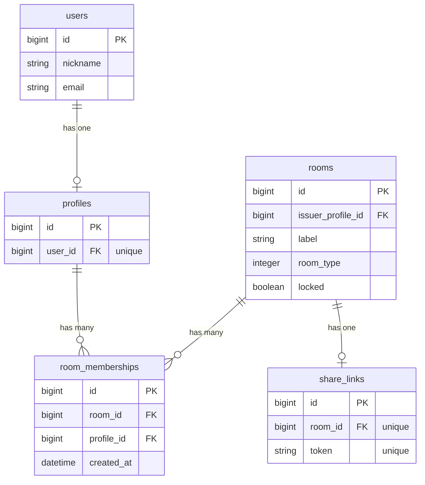
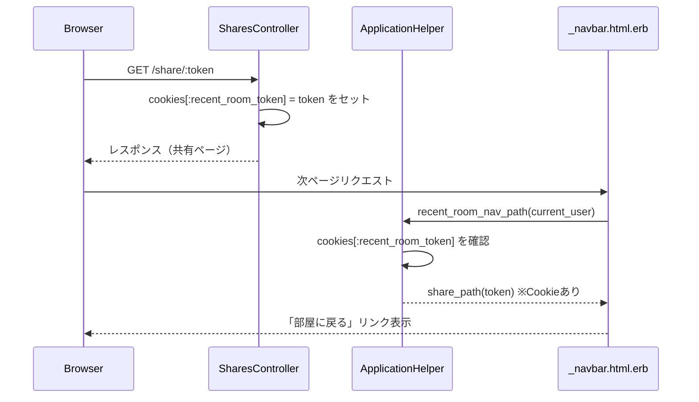
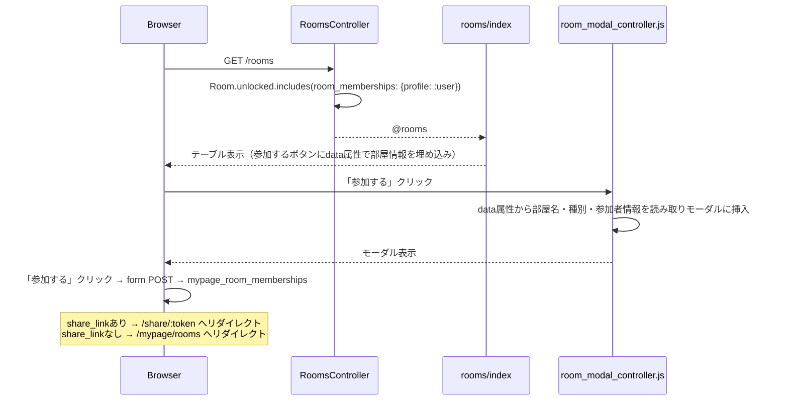

# UI微修正（3件） 設計書

**日付:** 2026-04-22
**Issue:** #254
**ステータス:** 変更済み

---

## 1. この設計で作るもの

- **修正①** 「部屋に戻る」リンクを「最後に開いた共有ページ」ベースに変更（Cookie方式）
- **修正②** プロフィール作成後のリダイレクト先を `mypage_root_path` に変更
- **修正③** 公開部屋一覧に「参加する」モーダルを追加（部屋詳細＋参加者一覧）

## 2. 目的

- ナビの「部屋に戻る」が「最後に参加した部屋」ではなく「最後に開いた共有ページ」を指すようにする
- プロフィール作成後、公開プロフィールではなくマイページに遷移させてUXを改善する
- 公開部屋一覧で参加前に部屋の詳細・参加者を確認できるようにする

## 3. スコープ

### 含むもの
- `SharesController#show` へのCookieセット
- `ApplicationHelper#recent_room_nav_path` のCookie優先ロジック
- `My::ProfilesController#create` のリダイレクト先変更
- `RoomsController#index` のincludes変更
- `room_modal_controller.js` 新規作成
- `rooms/index.html.erb` へのモーダルDOM追加
- `rooms/_room.html.erb` のボタン変更
- `Mypage::RoomMembershipsController#create` の参加後リダイレクト先変更

### 含まないもの
- 複数デバイス間での「最後に開いた部屋」同期（Cookie方式のため）
- モーダルのアニメーション（既存スタイルに合わせたシンプル表示）

## 4. 設計方針

### 修正①：Cookie方式

| 方式 | 実装コスト | DB変更 | 備考 |
|---|---|---|---|
| A: Cookie | 低 | 不要 | ブラウザ単位で追跡。既存のフォールバックも維持 |
| B: touch/updated_at | 中 | 不要（副作用あり） | `updated_at` に副作用 |

**採用:** 案A。`SharesController#show` でトークンをCookieに保存。`recent_room_nav_path` でCookieを優先参照し、なければ既存の `last_joined_room_with_share_link` にフォールバック。

### 修正③：モーダル実装方針

| 方式 | 実装コスト | DOM安全性 | 備考 |
|---|---|---|---|
| A: 部屋ごとにモーダルDOM（table外） | 中 | ◎ | `<tr>` 外にモーダルを置く |
| B: 共有モーダル＋新Stimulusコントローラ | 中 | ◎ | データをdata属性で渡しJS側で動的挿入 |

**採用:** 案B。1つの共有モーダルDOMを用意し、`room_modal_controller.js`（新規）でボタンクリック時に部屋データを挿入して表示。モーダルDOMが1つで済み、テーブル構造を壊さない。

## 5. データ設計

**変更なし**（マイグレーション不要）

ただし `RoomsController#index` のincludesを変更：

```ruby
# 変更前
.includes(issuer_profile: :user, room_memberships: :profile)

# 変更後（参加者の display_name 取得のため）
.includes(issuer_profile: :user, room_memberships: { profile: :user })
```

**設計意図:** `User#display_name` がモーダルの参加者一覧に必要なため。N+1防止としてincludesで対応。

### DB 制約

変更なし。

### ER 図



## 6. 画面・アクセス制御の流れ

### シーケンス図（修正①：Cookie）



### シーケンス図（修正③：モーダル）



## 7. アプリケーション設計

### 修正①：Cookie保存と参照

```ruby
# app/controllers/shares_controller.rb（showアクションに追加）
cookies[:recent_room_token] = { value: params[:token], expires: 1.year.from_now }
```

```ruby
# app/helpers/application_helper.rb
def recent_room_nav_path(user)
  token = cookies[:recent_room_token]
  return share_path(token) if token.present?

  # フォールバック（一度も共有ページを開いていない場合）
  profile = user&.profile
  return nil unless profile

  room = profile.last_joined_room_with_share_link
  return nil unless room

  room.shareable? ? share_path(room.share_link.token) : mypage_rooms_path
end
```

### 修正②：プロフィール作成後リダイレクト

```ruby
# app/controllers/my/profiles_controller.rb（createの1行変更）
redirect_to mypage_root_path, notice: "プロフィールを作成しました"
```

### 修正③：参加後リダイレクト（Mypage::RoomMembershipsController）

```ruby
# app/controllers/mypage/room_memberships_controller.rb
# createアクションのrespond_toブロックを削除し、以下に変更
RoomMembership.create!(room: @room, profile: profile)
redirect_to room_redirect_path(@room), notice: "部屋に参加しました"

# 追加プライベートメソッド
def room_redirect_path(room)
  return share_path(room.share_link.token) if room.shareable?

  mypage_rooms_path
end
```

**設計意図:** モーダルで参加確定後、そのまま共有ページ（マインドマップ画面）に遷移させることでUXを向上させる。share_linkがない場合はマイページの部屋一覧にフォールバック。Turbo Streamによるインライン更新より、ページ遷移のほうがユーザーの意図（部屋に入る）と合致する。

### 修正③：Stimulusコントローラ（新規）

```javascript
// app/javascript/controllers/room_modal_controller.js
import { Controller } from "@hotwired/stimulus"

export default class extends Controller {
  static targets = ["panel", "name", "badge", "creator", "memberCount", "membersList", "roomId"]

  open(event) {
    const btn = event.currentTarget
    this.nameTarget.textContent        = btn.dataset.roomName
    this.badgeTarget.textContent       = btn.dataset.roomBadge
    this.creatorTarget.textContent     = btn.dataset.roomCreator
    this.memberCountTarget.textContent = btn.dataset.roomMemberCount
    this.roomIdTarget.value            = btn.dataset.roomId
    this.membersListTarget.innerHTML   = JSON.parse(btn.dataset.roomMembers)
      .map(name => `<span>${name}</span>`).join("")
    this.panelTarget.classList.remove("hidden")
    document.body.classList.add("overflow-hidden")
  }

  close() {
    this.panelTarget.classList.add("hidden")
    document.body.classList.remove("overflow-hidden")
  }
}
```

## 8. ルーティング設計

変更なし。既存の `share_path(:token)`・`mypage_root_path`・`mypage_room_memberships_path` を利用。

## 9. レイアウト / UI 設計

- モーダルは全画面オーバーレイ（背景を暗くする）
- 参加者はアバター代替として名前を横並びのカード形式で表示
- 「参加する」は青ボタン（右）、「一覧に戻る」はグレーボタン（左）
- `×` ボタンでもモーダルを閉じられる

## 10. クエリ・性能面

**主要クエリ（修正③）:**
1. `rooms WHERE locked = false ORDER BY created_at DESC`
2. `profiles WHERE id IN (...)` (includes)
3. `users WHERE id IN (...)` (includes)
4. `room_memberships WHERE room_id IN (...)` (includes)

全て `includes` で N+1 を防止。追加インデックス不要。

## 11. トランザクション / Service 分離

**トランザクション:** 不要（修正①②はCookie操作・リダイレクト変更のみ。修正③の参加はMypage::RoomMembershipsControllerが既存で処理）
**Service 分離:** 不要

## 12. 実装対象一覧

| # | 対象 | 内容 |
|---|---|---|
| 1 | `app/controllers/shares_controller.rb` | `show` にCookieセットを追加 |
| 2 | `app/helpers/application_helper.rb` | `recent_room_nav_path` をCookie優先に変更 |
| 3 | `app/controllers/my/profiles_controller.rb` | `create` のリダイレクト先を `mypage_root_path` に変更 |
| 4 | `app/controllers/rooms_controller.rb` | `includes` を `room_memberships: { profile: :user }` に変更 |
| 5 | `app/javascript/controllers/room_modal_controller.js` | モーダル開閉＋動的コンテンツ挿入（新規） |
| 6 | `app/views/rooms/index.html.erb` | モーダルDOMを追加、`data-controller="room-modal"` |
| 7 | `app/views/rooms/_room.html.erb` | ボタンをモーダルトリガー（data属性付き）に変更 |
| 8 | `app/controllers/mypage/room_memberships_controller.rb` | 参加後リダイレクトをshare_path or mypage_rooms_pathに変更 |
| 9 | `spec/helpers/application_helper_spec.rb` | Cookieありの場合のテスト追加 |
| 10 | `spec/requests/shares_spec.rb` | Cookie設定のテスト追加 |
| 11 | `spec/requests/rooms_spec.rb` | 参加後リダイレクト先のリクエストスペック追加 |
| 12 | `spec/system/rooms_spec.rb` | モーダル表示・参加フローのシステムスペック |

## 13. 受入条件

- [ ] 共有ページ（`/share/:token`）を開くとCookieにトークンが保存される
- [ ] 次のページ遷移後、ナビの「部屋に戻る」が最後に開いた共有ページを指す
- [ ] Cookie未設定時は既存のフォールバック（最後に参加した部屋）が機能する
- [ ] プロフィール作成後、マイページ（`/mypage`）にリダイレクトされる
- [ ] 公開部屋一覧の「参加する」クリックでモーダルが開く
- [ ] モーダルに部屋名・種別・参加人数・作成者・参加者一覧が表示される
- [ ] モーダルの「参加する」で参加でき、share_linkありなら共有ページ・なければマイページ部屋一覧へ遷移する
- [ ] モーダルの「一覧に戻る」「×」でモーダルが閉じる
- [ ] N+1クエリが発生しない

## 14. この設計の結論

DBマイグレーション不要の3件の修正をまとめて実装する。Cookie方式で「最後に開いた共有ページ」を追跡し、共有モーダルでUIを改善。いずれも既存のアーキテクチャ（Stimulus・ActionController::Cookies・includesによるN+1対策）を踏襲した最小変更。
