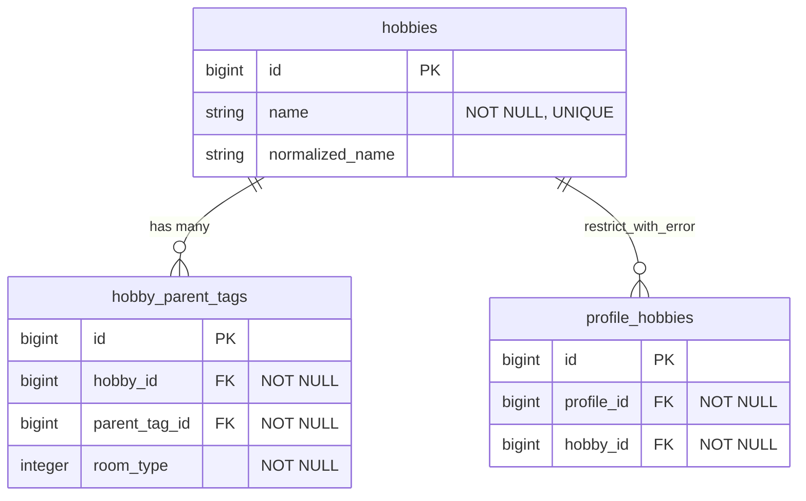
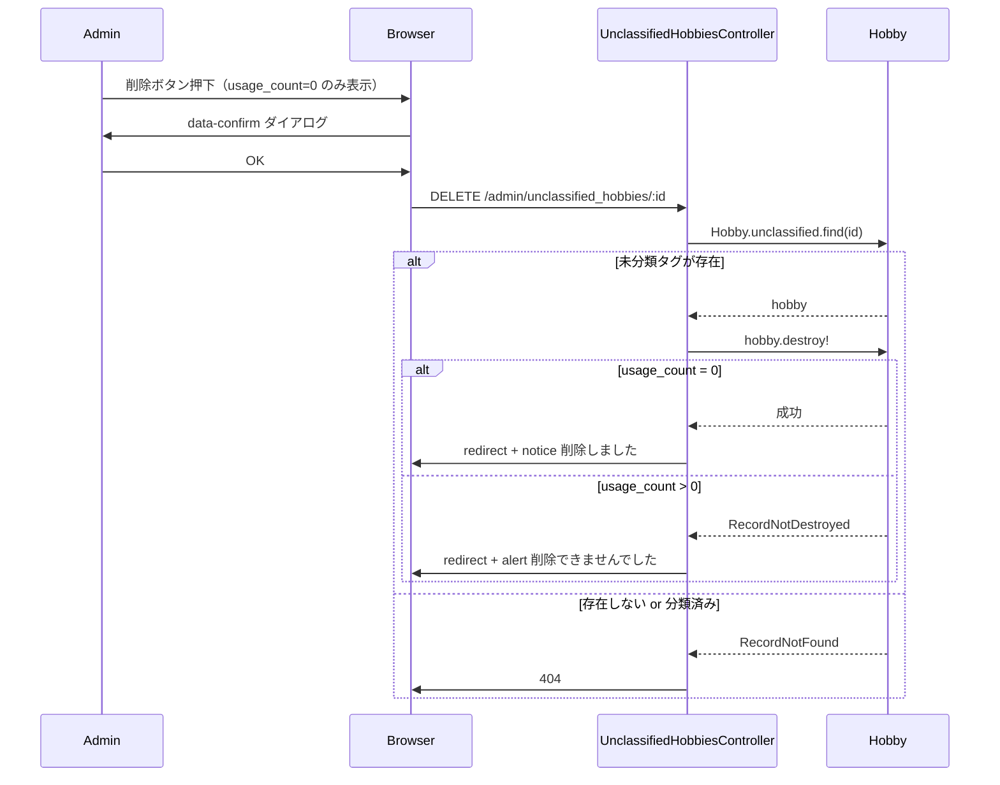

# 未分類タグ管理画面の改善（分類主役・削除条件限定） 設計書

**日付:** 2026-04-22
**Issue:** #248
**ステータス:** 合意済み

---

## 1. この設計で作るもの

- `Admin::UnclassifiedHobbiesController` に `destroy` アクションを追加
- 同コントローラから `merge` アクション・`build_all_hobbies_grouped` を削除
- ルーティングに `destroy` を追加、`merge` を削除
- ビューを改修（統合列削除・分類を主役化・条件付き削除ボタン追加）
- request spec / system spec を更新（統合テスト削除・削除テスト追加）

後続 Issue: 統合専用画面（別 Issue で対応）

## 2. 目的

1. 管理者の操作フローを「まず分類、不要なら削除」に整理する
2. 誰も使っていないゴミタグを安全に除去できる手段を提供する
3. 誤操作リスクの高い統合を未分類タグ管理画面から分離する

## 3. スコープ

### 含むもの
- `destroy` アクション追加（`Hobby.unclassified` スコープ経由のみ）
- `merge` アクション・ルート・`build_all_hobbies_grouped` の削除
- 分類フォームの主役化（ボタン拡大・色強調）
- `usage_count = 0` のときのみ削除ボタン表示（`data-confirm` 付き）
- spec 更新（統合テスト削除・削除テスト追加）

### 含まないもの
- `HobbyMergeService` の削除（将来の統合専用画面で再利用するため残す）
- マイグレーション（スキーマ変更なし）
- 分類済みタグの削除

## 4. 設計方針

削除の安全策を「UI制御のみ」か「モデル制約のみ」か「両方」かという論点がある。

| 方式 | 安全性 | コスト |
|---|---|---|
| A: UI で非表示のみ | 低（直接リクエストで削除可能） | 低 |
| B: モデルの `restrict_with_error` のみ | 中（エラー発生するが UX が雑） | 低 |
| C: UI 非表示 ＋ `restrict_with_error` を rescue | 高（二重防御） | 低 |

**採用理由:** 案C。UI で `usage_count = 0` のときのみ削除ボタンを表示しつつ、直接リクエストが来ても `restrict_with_error` が弾き、コントローラで rescue して alert にリダイレクトする。実装コストは低く、安全性が高い。

## 5. データ設計

**変更なし。** スキーマ・マイグレーションは不要。

`profile_hobbies` の `restrict_with_error` 制約がすでにDBレベルの守りとして機能する。

### ER 図



## 6. 画面・アクセス制御の流れ

### シーケンス図（削除フロー）



## 7. アプリケーション設計

**Controller（`destroy` 追加・`merge` 削除）**

```ruby
def destroy
  @hobby = Hobby.unclassified.find(params[:id])
  @hobby.destroy!
  redirect_to admin_unclassified_hobbies_path, notice: "削除しました"
rescue ActiveRecord::RecordNotDestroyed
  redirect_to admin_unclassified_hobbies_path, alert: "削除できませんでした（使用中のタグは削除できません）"
end
```

`index` アクションから `@all_hobbies_grouped` と `build_all_hobbies_grouped` も削除する。

**設計意図:** Service 分離不要。単一モデルへの操作のみで、トランザクションも不要。

## 8. ルーティング設計

```ruby
# 変更前
resources :unclassified_hobbies, only: [:index, :update] do
  member { post :merge }
end

# 変更後
resources :unclassified_hobbies, only: [:index, :update, :destroy]
```

**設計意図:** `merge` を除去し `destroy` を追加する最小変更。

## 9. レイアウト / UI 設計

現在の「分類」列と「統合」列を並べたレイアウトから変更する。

- **統合列を削除**
- **分類列を主役化:** select はそのまま、ボタンを青・やや大きめに
- **削除列を追加:** `usage_count == 0` のときのみ赤い削除ボタンを表示、`usage_count > 0` のときはグレーの「使用中」表示

## 10. クエリ・性能面

既存の `index` クエリは `COUNT(DISTINCT profile_hobbies.id) AS usage_count` を SQL 集計で取得済みのため、`hobby.usage_count` をビューで参照しても追加クエリは発生しない。N+1 なし。

`@all_hobbies_grouped`（統合用の全タグ一覧）を削除するため、index アクションのクエリ数が1つ減る（パフォーマンス改善）。

## 11. トランザクション / Service 分離

**トランザクション:** 不要（単一モデルへの `destroy` のみ）
**Service 分離:** 不要（複数モデル跨ぎなし、条件分岐も少ない）

## 12. 実装対象一覧

| # | 対象 | 内容 |
|---|---|---|
| 1 | Route | `destroy` 追加、`merge` メンバールート削除 |
| 2 | Controller | `destroy` 追加、`merge` / `build_all_hobbies_grouped` / `@all_hobbies_grouped` 削除 |
| 3 | View | 統合列削除・分類ボタン主役化・条件付き削除ボタン追加 |
| 4 | Request spec | 統合テスト削除、`DELETE` テスト追加 |
| 5 | System spec | 統合テスト削除、削除テスト追加 |

## 13. 受入条件

- [ ] 統合列・統合フォームが画面から消えている
- [ ] 分類ボタンが視覚的に主役として目立つ
- [ ] `usage_count = 0` のタグに削除ボタンが表示される
- [ ] `usage_count > 0` のタグに削除ボタンが表示されない（「使用中」表示）
- [ ] 削除ボタン押下時に確認ダイアログが出る
- [ ] 削除後に一覧から消え、`Hobby` レコードが削除されている
- [ ] 分類済みタグや存在しないタグへの `DELETE` は 404 を返す
- [ ] 使用中タグへの直接 `DELETE` リクエストは alert リダイレクトになる
- [ ] RSpec / RuboCop 全通過

## 14. この設計の結論

スキーマ変更なし・Service 不要・ルート1本追加のシンプルな実装。既存の `restrict_with_error` を活かした二重防御で安全性を確保しつつ、UI を「分類主役・削除条件限定」に整理する。将来の統合専用画面は `HobbyMergeService` をそのまま再利用できる。
