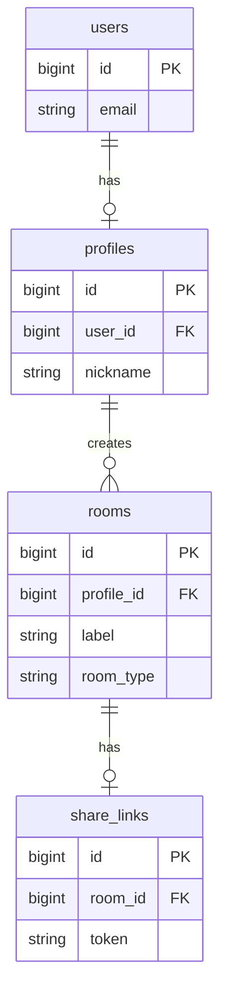
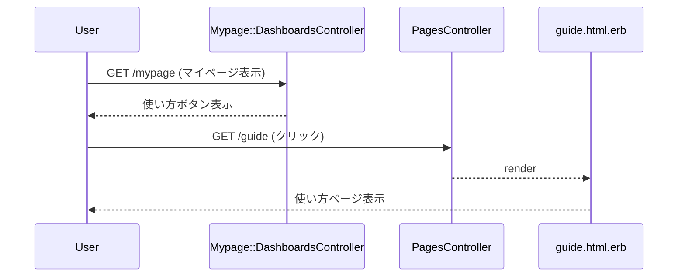

# 使い方ページ 設計書

**日付:** 2026-04-23
**Issue:** #TBD
**ステータス:** 合意済み

---

## 1. この設計で作るもの

- `GET /guide` ルーティングの追加
- `PagesController#guide` アクションの追加
- `app/views/pages/guide.html.erb`（使い方ページ）の新規作成
- マイページ（`mypage/dashboards/show.html.erb`）に「使い方」ボタン追加

## 2. 目的

ログイン済みユーザーが「共有ページのマインドマップを表示させるまでの流れ」をいつでも参照できるようにする。

## 3. スコープ

### 含むもの
- `/guide` への静的ページ（認証不要）
- マイページのメニューグリッドへの「使い方」ボタン追加

### 含まないもの
- ナビゲーションバーへのリンク追加（将来対応）
- 多言語対応・管理画面からの編集機能

## 4. 設計方針

| 方式 | 実装コスト | 拡張性 | 既存との相性 |
|---|---|---|---|
| PagesController に追加 | 低 | 中（静的HTMLのみ） | ◎ terms/privacy と同パターン |
| CMS的な仕組み（DB管理） | 高 | 高 | △ 過剰 |

**採用理由:** 既存の `terms` / `privacy` と同じパターンで最小実装。文章変更はビュー編集で対応できる。

## 5. データ設計

**変更なし。** マイグレーション・モデル変更は一切不要。

### ER 図



## 6. 画面・アクセス制御の流れ

認証チェック：**なし**（`terms` / `privacy` と同様）

### シーケンス図



## 7. アプリケーション設計

```ruby
# app/controllers/pages_controller.rb
class PagesController < ApplicationController
  def terms; end
  def privacy; end
  def guide; end  # 追加
end
```

## 8. ルーティング設計

```ruby
get "guide", to: "pages#guide"
```

`terms` / `privacy` と同じ位置（認証不要）に追加。

## 9. レイアウト / UI 設計

### 使い方ページ（guide.html.erb）

`terms.html.erb` と同スタイル（`max-width: 48rem`、ダーク系カード）。STEP カード形式。

**ページ内容：**

```
STEP 1 アカウント登録・ログイン
・メール or SNSで登録

STEP 2 趣味プロフィール作成
・タグを選択
・好きなジャンルを登録

STEP 3 部屋を作成して共有する
・新しく部屋を作る
・または公開部屋に参加
・共有リンクを発行する
・URLをコピーして送る

STEP 4 マインドマップ表示
・共有ページにアクセス
・共通の趣味が可視化される
```

### マイページボタン配置

3カラム×2行のグリッドに統一（現在の「2カラム1行目＋3カラム2行目」から変更）：

| 1行目 | 趣味プロフィール | プロフィール一覧 | 使い方 |
|---|---|---|---|
| **2行目** | 部屋管理 | 公開部屋一覧 | 設定 |

## 10. クエリ・性能面

クエリなし。静的ビューのみ。

## 11. トランザクション / Service 分離

**トランザクション:** 不要
**Service 分離:** 不要（ロジックなし）

## 12. 実装対象一覧

| # | 対象 | 内容 |
|---|---|---|
| 1 | config/routes.rb | `get "guide", to: "pages#guide"` 追加 |
| 2 | app/controllers/pages_controller.rb | `guide` アクション追加 |
| 3 | app/views/pages/guide.html.erb | 使い方ページ新規作成 |
| 4 | app/views/mypage/dashboards/show.html.erb | グリッドを3×2に変更し「使い方」ボタン追加 |

## 13. 受入条件

- [ ] `/guide` にアクセスすると使い方ページが表示される
- [ ] ログイン前・ログイン後どちらでもアクセス可能
- [ ] マイページに「使い方」ボタン（アイコン付き）が表示される（3×2グリッド）
- [ ] ページ内容にSTEP1〜4の流れが記載されている

## 14. この設計の結論

DB変更なし・Service不要の最小実装。TDD省略条件（ビューのみ・ロジックなし）に該当するため、テスト省略・rubocop必須で進める。
