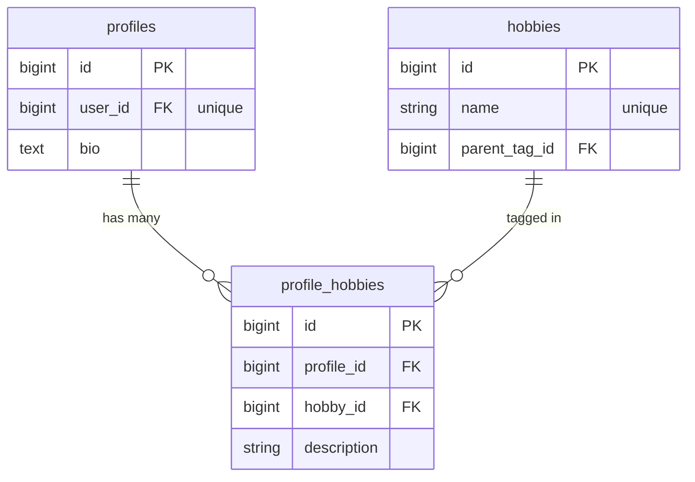
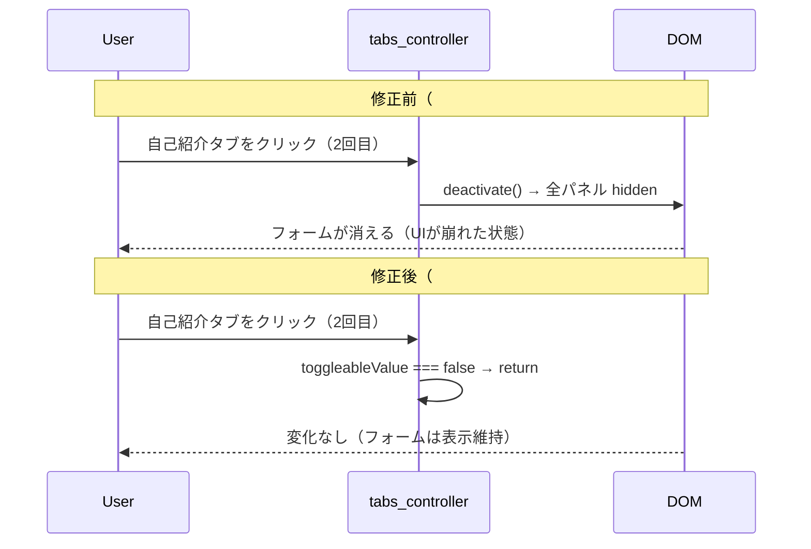

# プロフィール編集レイアウト安定化 設計書

**日付:** 2026-04-23
**Issue:** #257（関連: #258）
**ステータス:** 合意済み

---

## 1. この設計で作るもの

- プロフィール編集・作成ページの「カードが上にずれる」レイアウト崩れ修正（#257）
- タブを2回クリックするとパネルが消える不具合修正（#258）

> #258 も同じファイル群に起因するため、このIssueで合わせて対処する。

## 2. 目的

- カードが動的に高さ変化しても、画面上の位置が上にずれないようにする（下方向にのみ伸びる）
- 自己紹介・タグタブを2回クリックしても、パネルが消えないようにする

## 3. スコープ

### 含むもの

- `tabs_controller.js` に `toggleable` value を追加
- プロフィール編集フォームの `data-tabs-toggleable-value="false"` 設定
- `edit.html.erb` / `new.html.erb` への `content_for(:no_center)` と `mx-auto` 追加

### 含まないもの

- `profiles/show.html.erb` の tabs（閲覧用でパネルが消えても大きな支障なし。別Issueで検討）
- `rooms/members/show.html.erb` の tabs（折りたたみ動作は意図的なため変更しない）
- その他ページのレイアウト調整

## 4. 設計方針

### #257（レイアウトずれ）

| 方式 | 実装コスト | 副作用 |
|---|---|---|
| `content_for(:no_center)` を追加 | 低（2ファイルで1行ずつ） | なし（既存パターン） |
| グローバルに `items-center` → `items-start` | 低 | 全ページに影響 |
| パネルに `min-height` を設定 | 中 | 空状態で余白が生じる |

**採用理由:** `content_for(:no_center)` は既にコードベース内 8 ページで使われている確立パターン。最も影響範囲が小さい。

### #258（二重クリックでパネル消失）

| 方式 | 実装コスト | 副作用 |
|---|---|---|
| `toggleable` value を追加（default: true） | 低 | なし（後方互換） |
| `deactivate()` 呼び出しを削除 | 低 | `rooms/members/show.html.erb` の折りたたみ機能が壊れる |

**採用理由:** `rooms/members/show.html.erb` が意図的に折りたたみ動作（`default-open-value="false"`）を使用しているため、グローバル変更は不可。`toggleable` value でオプトアウトする。

## 5. データ設計

なし（DB変更なし）

### ER 図



## 6. 画面・アクセス制御の流れ



## 7. アプリケーション設計

### tabs_controller.js の変更

```js
static values = {
  defaultOpen: { type: Boolean, default: true },
  toggleable: { type: Boolean, default: true }  // 追加
}

switch(event) {
  const index = this.tabTargets.indexOf(event.currentTarget)
  if (index === -1) return
  if (this.activeIndex === index) {
    if (this.toggleableValue) this.deactivate()  // toggleable な場合のみ閉じる
    return
  }
  this.activate(index)
}
```

### _form.html.erb の変更

```html
<div data-controller="tabs"
     data-tabs-toggleable-value="false"
     class="space-y-6">
```

### edit.html.erb の変更

```html
<%# flexの垂直中央寄せを無効にする（カードが上にずれる問題の修正） %>
<% content_for :no_center, true %>

<div class="w-full max-w-4xl space-y-6 mx-auto">
```

### new.html.erb の変更

```html
<% content_for :no_center, true %>

<div class="w-full max-w-4xl mx-auto">
```

## 8. ルーティング設計

なし

## 9. レイアウト / UI 設計

`content_for(:no_center)` 適用後のmain class:
- **変更前:** `container mx-auto py-8 px-5 flex items-center justify-center`
- **変更後:** `container mx-auto py-8 px-5`

flexが外れることで水平中央寄せも解除されるため、カードwrapperに `mx-auto` を追加して水平中央寄せを維持する。

## 10. クエリ・性能面

なし（JSとCSSの修正のみ）

## 11. トランザクション / Service 分離

**トランザクション:** 不要
**Service 分離:** 不要

## 12. 実装対象一覧

| # | 対象ファイル | 内容 |
|---|---|---|
| 1 | `app/javascript/controllers/tabs_controller.js` | `toggleable` value 追加、`switch()` を条件分岐 |
| 2 | `app/views/my/profiles/_form.html.erb` | `data-tabs-toggleable-value="false"` 追加 |
| 3 | `app/views/my/profiles/edit.html.erb` | `content_for(:no_center)` + `mx-auto` 追加 |
| 4 | `app/views/my/profiles/new.html.erb` | 同上 |

## 13. 受入条件

- [ ] プロフィール編集画面でタグを追加・削除してもカードが上方向に動かない（下に伸びる）
- [ ] タブを切り替えてもカードが上方向に動かない
- [ ] 自己紹介タブを2回クリックしてもパネルが消えない
- [ ] タグタブを2回クリックしてもパネルが消えない
- [ ] プロフィール作成画面（new）でも同様に動作する
- [ ] `rooms/members/show.html.erb` の折りたたみタブ動作が壊れていない

## 14. この設計の結論

`content_for(:no_center)` で垂直中央寄せを無効化し、`tabs_controller` に `toggleable` value を追加する2点の修正で、最小限の影響範囲に収める。どちらも既存パターンの活用であり、後方互換性を保つ。
