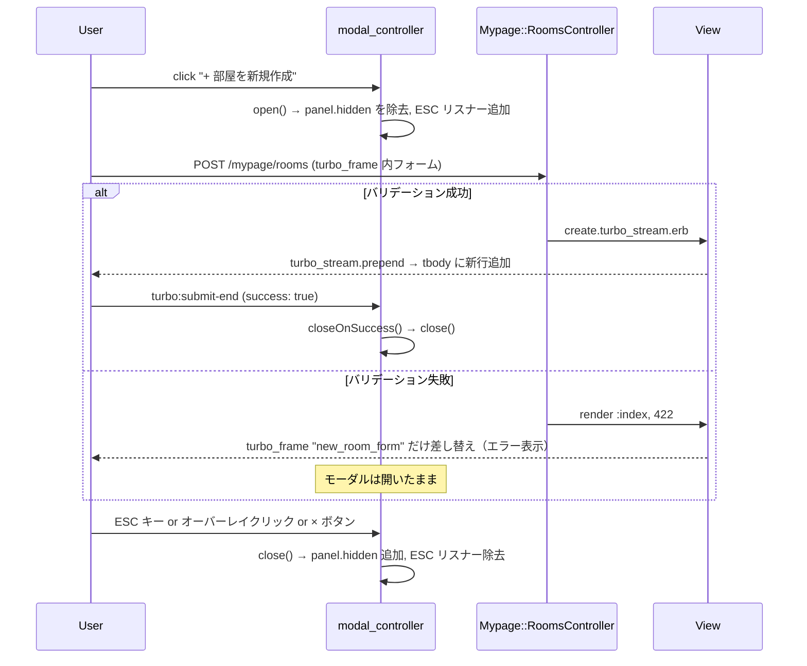

# 部屋新規作成モーダル 設計書

**日付:** 2026-04-23
**Issue:** #TBD
**ステータス:** 合意済み

---

## 1. この設計で作るもの

- `modal_controller.js` に ESC キー対応・`closeOnSuccess` メソッドを追加
- `index.html.erb` の折りたたみフォームをモーダルに置き換え
- モーダル内フォームを `turbo_frame_tag "new_room_form"` で囲み、バリデーションエラーをモーダル内でインライン表示

## 2. 目的

- 作成フォームをモーダルで提示し、テーブル一覧との分離を明確にする
- バリデーションエラー時もモーダルが閉じず、エラーがインライン表示される UX を実現する

## 3. スコープ

### 含むもの
- `modal_controller.js` への ESC キー・`closeOnSuccess` 追加
- `index.html.erb` のモーダル構造への置き換え

### 含まないもの
- コントローラ変更（不要）
- DB・ルーティング変更（不要）
- フォーカストラップ（将来対応）

## 4. 設計方針

**バリデーションエラーをモーダル内で表示する方法：**

| 方式 | 実装コスト | UX | 既存コードとの相性 |
|---|---|---|---|
| A: turbo_frame でフォームを囲む | 低 | エラー時モーダルが開いたまま ✓ | コントローラ変更不要 |
| B: エラー専用 turbo_stream を追加 | 中 | 同上 | コントローラ修正が必要 |
| C: data-turbo=false（従来型） | 低 | ページ全体リロード → モーダル閉じる ✗ | 最も単純だが UX 最悪 |

**採用: A案** — `<turbo-frame id="new_room_form">` で囲むことで、422 応答時に Turbo がフレームだけ差し替え、モーダルは開いたまま。成功時は `turbo:submit-end` イベントで `closeOnSuccess` を呼んで閉じる。コントローラ変更不要。

## 5. データ設計

変更なし（DB・モデル変更不要）

## 6. 画面・アクセス制御の流れ



## 7. アプリケーション設計

**`modal_controller.js` 変更点:**

```js
connect() {
  this.boundHandleKeydown = this.handleKeydown.bind(this)
}

open() {
  this.panelTarget.classList.remove("hidden")
  document.body.classList.add("overflow-hidden")
  document.addEventListener("keydown", this.boundHandleKeydown)
}

close() {
  this.panelTarget.classList.add("hidden")
  document.body.classList.remove("overflow-hidden")
  document.removeEventListener("keydown", this.boundHandleKeydown)
}

closeOnSuccess(event) {
  if (event.detail.success) this.close()
}

handleKeydown(event) {
  if (event.key === "Escape") this.close()
}
```

## 8. ルーティング設計

変更なし

## 9. レイアウト / UI 設計

- モーダル背景：`rgba(0,0,0,0.6)` オーバーレイ
- モーダル本体：既存 rooms/_room.html.erb のモーダルと同一スタイル（`background: #1f2937`）
- ボタンスタイル・フォームフィールドは既存のものを流用

## 10. クエリ・性能面

変更なし（コントローラ・クエリ変更なし）

## 11. トランザクション / Service 分離

- トランザクション: 不要
- Service 分離: 不要

## 12. 実装対象一覧

| # | 対象 | 内容 |
|---|---|---|
| 1 | `app/javascript/controllers/modal_controller.js` | ESC キー・`closeOnSuccess`・`handleKeydown` 追加 |
| 2 | `app/views/mypage/rooms/index.html.erb` | 折りたたみ → モーダル構造に置き換え |

## 13. 受入条件

- [ ] 「+ 部屋を新規作成」を押すとモーダルが開く
- [ ] オーバーレイクリック・ESC キー・× ボタンでモーダルが閉じる
- [ ] バリデーションエラー時はモーダルが開いたままエラーが表示される
- [ ] 部屋作成成功後、モーダルが閉じてテーブルに新行が追加される
- [ ] RSpec 全通過・RuboCop 全通過

## 14. この設計の結論

DB・コントローラ変更なし。`turbo_frame` + `turbo:submit-end` の組み合わせで、エラー時のインライン表示と成功時のモーダル自動クローズを最小コストで実現する。`modal_controller.js` に ESC キー対応を追加することで、他の画面のモーダルも恩恵を受ける。
