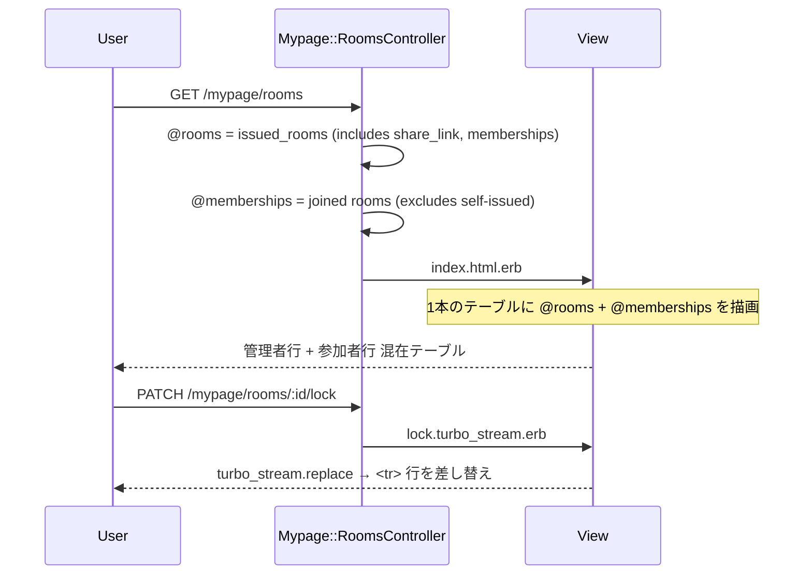

# mypage/rooms テーブルレイアウト統合 設計書

**日付:** 2026-04-23
**Issue:** #TBD
**ステータス:** 合意済み

---

## 1. この設計で作るもの

- `mypage/rooms` の「管理中の部屋」「参加中の部屋」を1本のテーブルに統合
- カードグリッド → テーブル行（`<tr>`）へ切り替え
- 既存の Turbo Stream を新しい行パーシャルに対応させる

## 2. 目的

一覧性の向上と、複数部屋を管理する際の視認性改善

## 3. スコープ

### 含むもの
- `index.html.erb` のレイアウト変更（グリッド → テーブル）
- `_room.html.erb`・`_joined_room.html.erb` のパーシャル変更（`<div>` → `<tr>`）
- Turbo Stream 系テンプレートの対応修正
- 編集をフルページナビゲーションに変更

### 含まないもの
- DB変更・マイグレーション（なし）
- ソート・フィルタ機能（将来対応）
- モバイル対応の別表示（今回はテーブルのまま、スクロール対応のみ）

## 4. 設計方針

**turbo_frame をテーブル行に使えない問題：**

`<turbo-frame>` を `<tbody>` の直接の子要素にすると HTML が不正になります。

| 方式 | 実装コスト | UX |
|---|---|---|
| A: turbo_frame を行に残す（不正HTML） | 低 | 動くが壊れやすい |
| B: turbo_frame を外し Turbo Drive でフルページ遷移 | 低 | シンプル・安定 |
| C: モーダルで編集 | 高 | リッチだが過剰 |

**採用: B案** — 編集リンクに `data: { turbo_frame: "_top" }` を付与してフルページ遷移。ロック/アンロック/再発行は `turbo_stream.replace` で `<tr>` を差し替え。

## 5. データ設計

変更なし（DB・モデル変更不要）

## 6. 画面・アクセス制御の流れ



## 7. アプリケーション設計

**コントローラ変更なし** — `@rooms`・`@memberships` はそのまま。ビューで1テーブルに統合。

**パーシャル変更：**

`_room.html.erb`（管理者行）:
```html
<tr id="<%= dom_id(room) %>">
  <td>部屋名</td>
  <td>タイプバッジ</td>
  <td>管理者バッジ</td>
  <td>ロック状態</td>
  <td>リンク状態 + Copyボタン</td>
  <td>参加人数</td>
  <td>部屋を見る | 編集 | ドロップダウン（再発行/ロック/削除）</td>
</tr>
```

`_joined_room.html.erb`（参加者行）:
```html
<tr id="<%= dom_id(membership) %>">
  <td>部屋名</td>
  <td>タイプバッジ</td>
  <td>参加者バッジ</td>
  <td>―</td>
  <td>―</td>
  <td>参加人数</td>
  <td>部屋を見る | 退出</td>
</tr>
```

**テーブルヘッダー:** 部屋名 | タイプ | 役割 | ロック | リンク | 人数 | 操作

## 8. ルーティング設計

変更なし

## 9. レイアウト / UI 設計

- テーブル外側に `overflow-x: auto` でスマホスクロール対応
- 行の背景は `hover` でわずかにハイライト（既存ダークテーマに合わせて `rgba(255,255,255,0.03)`）
- 役割バッジ：管理者 = 青系、参加者 = グレー系
- Copyボタンはリンク列セル内に小さく配置

## 10. クエリ・性能面

**N+1対策**（現状のまま継続）:
- `@rooms`: `.includes(:share_link, :room_memberships)`
- `@memberships`: `.includes(room: [{ issuer_profile: :user }, :room_memberships, :share_link])`

変更なし。追加インデックス不要。

## 11. トランザクション / Service 分離

- トランザクション: 不要（UIのみの変更）
- Service分離: 不要

## 12. 実装対象一覧

| # | 対象 | 内容 |
|---|---|---|
| 1 | `index.html.erb` | グリッド2段 → 統合テーブル1本 |
| 2 | `_room.html.erb` | カード div → `<tr>` 行（turbo_frame削除） |
| 3 | `_joined_room.html.erb` | カード div → `<tr>` 行 |
| 4 | `create.turbo_stream.erb` | prepend先を `rooms_tbody` に変更 |
| 5 | `destroy.turbo_stream.erb` | 変更なし（dom_id targeting 継続） |
| 6 | `lock/unlock/regenerate_share_link.turbo_stream.erb` | `_room` の新 `<tr>` パーシャルを参照 |
| 7 | `update.turbo_stream.erb` | 同上 |
| 8 | `edit.html.erb` | ページラッパー追加（フルページ遷移対応） |
| 9 | `room_memberships/destroy.turbo_stream.erb` | 変更なし |

## 13. 受入条件

- [ ] `mypage/rooms` にアクセスすると管理中・参加中の部屋が1本のテーブルで表示される
- [ ] 「役割」列で管理者・参加者が区別できる
- [ ] 管理者行：編集・ロック・削除・リンク再発行が動作する
- [ ] 参加者行：退出が動作する
- [ ] 部屋作成後、Turbo Stream で新行がテーブル先頭に追加される
- [ ] ロック/アンロック/再発行後、該当行が Turbo Stream で差し替えられる
- [ ] 部屋削除・退出後、該当行が Turbo Stream で削除される
- [ ] RSpec 全通過・RuboCop 全通過

## 14. この設計の結論

DB変更なし・UIのみの変更。`<turbo-frame>` をテーブルから除去し、行単位の `turbo_stream.replace` で動的更新を維持する。編集はフルページナビゲーションに切り替えてシンプルに保つ。
