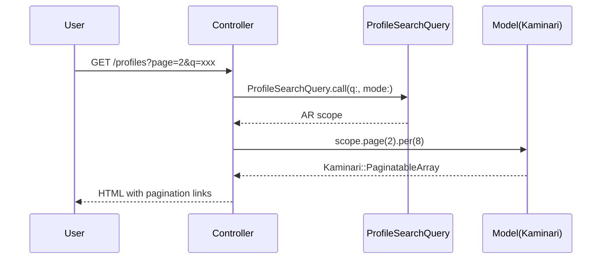

# ページネーション 設計書

**日付:** 2026-04-24
**Issue:** #232
**ステータス:** 合意済み

---

## 1. この設計で作るもの

- Kaminari gem 導入
- 5ページに対するページネーション実装
- Kaminari ビューのカスタマイズ（Tailwindスタイル）

## 2. 目的

- 件数増加時の表示パフォーマンス改善
- UX向上（大量データ時のスクロール削減）

## 3. スコープ

### 含むもの

- `Gemfile` への Kaminari 追加
- 各コントローラの `index` に `.page.per` 追加
- 各ビューにページネーションリンク追加
- Kaminariビューをカスタム（Tailwind対応）

### 含まないもの

- 無限スクロール・Ajax読み込み（将来対応）
- 件数選択UIや並び順変更（将来対応）

## 4. 設計方針

**mypage/rooms の特殊性：** 現在 `@rooms`（管理中）と `@memberships`（参加中）が同一 `<tbody>` に混在しています。これを別々にページネーションするには、**セクションを分割**する必要があります。

| 方式 | 実装コスト | UX | 現状との相性 |
|---|---|---|---|
| A. 管理中/参加中を別セクションに分割 | 低 | 明確で分かりやすい | セクション分割が必要 |
| B. SQL UNION で1コレクション化 | 高 | シームレス | 既存クエリ全面変更が必要 |

**採用理由:** 案Aを採用。実装コストが低く、管理中/参加中の意味が明確になるためUX的にも優れる。

**admin/parent_tags の特殊性：** 部屋タイプごとに10件のため、`params[:chat_page]` `params[:study_page]` `params[:game_page]` のように部屋タイプ別のページパラメータを使う。

**プロフィール一覧のturbo_frame対応：** 検索フォームがturbo_frameで動作しているため、ページネーションリンクにも `q` `mode` パラメータを引き継ぐ必要がある。Kaminariの `paginate` ヘルパーは `params` オプションで追加パラメータを渡せるため対応可能。

## 5. データ設計

マイグレーション **なし**。Kaminariはアプリケーション層のみで完結。

## 6. 画面・アクセス制御の流れ



## 7. アプリケーション設計

### コントローラ変更方針

```ruby
# profiles_controller.rb
@profiles = ProfileSearchQuery.call(q: params[:q], mode: params[:mode])
            .page(params[:page]).per(8)

# rooms_controller.rb
@rooms = Room.unlocked
         .includes(...).order(...)
         .page(params[:page]).per(10)

# mypage/rooms_controller.rb（セクション分割）
@rooms = profile.issued_rooms.includes(...).order(...)
         .page(params[:rooms_page]).per(10)
@memberships = profile.room_memberships.joins(...).includes(...).order(...)
               .page(params[:memberships_page]).per(10)

# admin/unclassified_hobbies_controller.rb
@hobbies = scope.page(params[:page]).per(10)

# admin/parent_tags_controller.rb（部屋タイプ別）
@paginated_parent_tags_by_room_type = ParentTag.room_types.keys.each_with_object({}) do |rt, h|
  h[rt] = scope.where(room_type: rt).page(params[:"#{rt}_page"]).per(10)
end
```

### ビュー変更方針

```erb
<%# プロフィール一覧：検索パラメータを引き継ぐ %>
<%= paginate @profiles, params: { q: params[:q], mode: params[:mode] } %>

<%# mypage/rooms：管理中・参加中を別セクションに分割し各々にpaginateを追加 %>
<%= paginate @rooms, param_name: :rooms_page %>
<%= paginate @memberships, param_name: :memberships_page %>
```

### Kaminariビューのカスタマイズ

```bash
docker compose exec web bundle exec rails generate kaminari:views default
```

生成されたビュー（`app/views/kaminari/`）をTailwindスタイルに書き換える。

## 8. ルーティング設計

変更なし。`page` パラメータはクエリパラメータとして渡されるため。

## 9. レイアウト / UI 設計

- ページネーションリンクはダークテーマに合わせたスタイル
- 現在ページはハイライト表示
- 前へ / 次へ ボタンを含む

## 10. クエリ・性能面

- 既存の `includes` はそのまま維持 → N+1なし
- Kaminariは `LIMIT/OFFSET` を使用 → 件数が増えても最大10件しか取得しない
- `admin/unclassified_hobbies` の `GROUP BY` クエリはKaminariがサブクエリでCOUNTを行うため正常動作する

## 11. トランザクション / Service 分離

**トランザクション:** 不要（読み取りのみ）
**Service 分離:** 不要（`.page.per` の追加のみ）

## 12. 実装対象一覧

| # | 対象 | 内容 |
|---|---|---|
| 1 | Gemfile | kaminari 追加 |
| 2 | `ProfilesController#index` | `.page(params[:page]).per(8)` 追加 |
| 3 | `RoomsController#index` | `.page(params[:page]).per(10)` 追加 |
| 4 | `Mypage::RoomsController#index` | `@rooms`/`@memberships` 別々にページネーション・セクション分割 |
| 5 | `Admin::UnclassifiedHobbiesController#index` | `.page(params[:page]).per(10)` 追加 |
| 6 | `Admin::ParentTagsController#index` | 部屋タイプ別ページネーション |
| 7 | `app/views/kaminari/` | Tailwindスタイルのカスタムビュー生成 |
| 8 | 各ビュー（5ファイル） | `paginate` ヘルパー追加 |
| 9 | `spec/system/` | ページネーション動作のシステムスペック |

## 13. 受入条件

- [ ] Kaminariが導入されbundle installが通る
- [ ] プロフィール一覧が8件ごとに分割表示される
- [ ] 公開部屋一覧が10件ごとに分割表示される
- [ ] マイページ部屋一覧（管理中/参加中）が10件ごとに分割表示される
- [ ] 管理：未分類タグが10件ごとに分割表示される
- [ ] 管理：親タグ一覧が部屋タイプごとに10件ずつ分割表示される
- [ ] 検索・フィルタとページネーションを組み合わせても正しく動作する
- [ ] RSpec / RuboCop 全通過

## 14. この設計の結論

Kaminariをアプリケーション層に追加し、既存のARスコープに `.page.per` を追加するシンプルな実装。mypage/roomsは管理中/参加中を別セクションに分割することで、2コレクション問題をクリーンに解決する。
